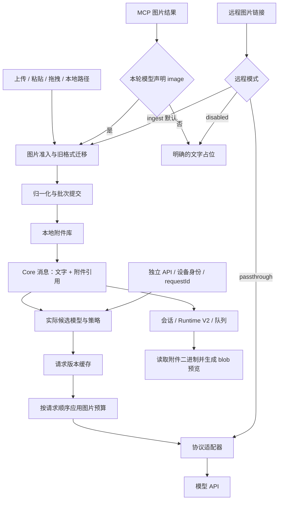

# API识图功能设计方案

版本：2.0（按已实现接口修订）

核对日期：2026-09-13

适用项目：MyAgent Developer

依据：改造前的仓库实现、当前工作区实现、《多模态 DSH 对齐改造方案_v2》及本地 DSH 源码参考。

本文依据当前代码描述已实现行为。上一版列为 B–E 阶段的显式准入、远程图入库、运行质量与独立识图服务已继续实现。协议示例说明本仓库适配器的映射方式；真实供应商是否正确消费图片仍需用实际模型验收。默认远程图片进入附件库，显式选择 passthrough 时保留供应商直读 URL 的兼容行为。

## 1. 设计目标与范围

API识图是把用户或工具提供的图片，转换成当前模型接口能够消费的视觉输入，并把模型的分析结果交回对话流程。它包含图片输入、存储、请求投影、能力判断和结果展示，不等同于图片生成，也不意味着平台自行完成了 OCR 或目标检测。

目标如下：

1. 用户可以上传、粘贴、拖入图片，也可以提供服务端可读的本地图片路径。
2. 支持图片直链兼容输入，并明确“识别链接”和“成功读取图片”是两个步骤。
3. MCP 工具返回图片时，保留文字与图片的顺序，使具备视觉能力的模型能够继续分析。
4. 业务消息保存稳定附件引用，避免把图片 base64 长期写入会话、事件、队列和常规日志。
5. 统一图片准入、归一化、请求版本和预算，避免不同入口重复实现图片处理。
6. 对 Chat Completions、Responses、Anthropic 分别适配，保留各协议的工具调用关联关系。
7. 纯文本模型、图片超限、坏图和缓存损坏都有可解释的处理方式。
8. 保持旧会话和用户输入习惯可用，并把兼容代码限制在入口或适配层。

范围不包含图片生成、完整视频识别改造、专业 OCR 引擎、供应商 Files API 上传或跨工作区全局去重。独立附件/识图接口复用远程设备身份实现访问授权；整个 Agent 应用仍是共享工作区工具，不能把这项授权描述成全站多租户沙箱。

## 2. 新增、替换和保留的功能

### 2.1 已新增或补齐

| 功能 | 改造后的行为 | 主要实现 |
| --- | --- | --- |
| 持久附件引用 | 使用归一化内容的 SHA-256 标识图片；消息保存引用 | `app/attachments/types.py`、`local.py` |
| 图片统一准入 | 校验格式、声明 MIME、完整解码、单图/批次大小、数量、像素和边长 | `normalization.py`、`encoding.py`、`local.py` |
| 图片归一化 | EXIF 方向修正、8 位 RGB/RGBA、色彩处理、去元数据、缩放、质量阶梯 | `normalization.py`、`encoding.py` |
| 请求图片版本 | 按模型请求策略生成和缓存缩略版本；缓存校验失败后重建 | `request_image.py` |
| 请求总预算 | 按 base64 表示长度和图片数量计算，从最旧图片开始确定性省略 | `request_budget.py` |
| 模型可读句柄 | 含附件身份、请求尺寸、只读副本路径和编辑前复制说明 | `messages_text.py` |
| MCP 图片结果 | 具备 image 能力时准入图片并保留结构化结果；失败时提供占位 | `app/agent_mcp.py` |
| 工具消息多模态 | `ToolMessage.content` 支持字符串或有序内容数组 | `app/agent_messages.py` |
| 三协议工具图片映射 | Chat 抽取到后续 user；Responses/Anthropic 使用原生工具结果内容 | `app/llm/transport.py` |
| 上传回执与图片读取 | 上传返回附件引用，新增按附件 ID 返回二进制图片的端点 | `app/webui.py` |
| 队列、历史、工具预览 | 保存引用、按需取图、创建临时 blob URL、节点移除后释放 | `frontend/src/app/modules/workspace-media.js` 等 |
| 子代理图片传递 | 接收附件引用或旧路径，传递引用与执行环境中的只读路径 | `app/agent_subagent.py` |
| 历史和微压缩适配 | 迁移旧内容，保留图片引用；文本裁剪只处理文本块 | Runtime V2、`agent_memory.py`、`agent_tokenizer.py` |
| 日志与事件防泄漏 | 已覆盖的入口、消息和事件路径先迁移或脱敏，再序列化 | `attachments/content.py`、`logging.py` |
| 模型级图片策略 | profile 的 `image_request_policy` 单独配置图片尺寸与预算 | `app/model_profiles.py`、`agent_harness.py` |
| 远程图片入库 | 自动识别 URL 后受限下载；可切换直传或关闭 | `attachments/remote.py`、`admission.py` |
| 独立识图服务 | 持久幂等、查询、SSE 续接、取消、JSON Schema 校验 | `app/vision_api.py` |
| 设备级附件授权 | 复用已有远程设备身份与 scopes，按设备授予附件 | `attachments/access.py`、`registry.py` |
| 附件生命周期 | 对象/缓存配额、queue/request pins、租约、GC、ZIP 备份恢复 | `attachments/lifecycle.py`、`api.py` |
| 预览与运行性能 | 跨容器复用、进程锁、验证缓存、指标和冷/热基准 | `locking.py`、`validation.py`、`metrics.py` |

粘贴、拖拽、文件上传、远程链接识别和模型能力配置原来已有；本次主要是改变它们的图片处理路径，不能把这些入口全部称为从零新增。

### 2.2 已移除或替换的旧实现

| 旧实现 | 处理结果 | 用户可见影响 |
| --- | --- | --- |
| 本地图片在请求阶段直接 `read_bytes → base64` | 替换为先入库、后投影 | 原文件变化不再改变已入库图片 |
| `_annotate_local_media_paths` 及其独立图片路径正则 | 删除 | 使用统一附件句柄，避免重复注解 |
| 旧 `_IMAGE_MIME` 图片扩展名映射等废弃辅助逻辑 | 删除被替代部分 | 图片格式由解码及归一化链路确定 |
| MCP 图片统一返回 `[image content omitted]` | 替换为能力门控与附件准入 | 视觉模型可以实际收到工具图片 |
| 工具内容一律 `str(content)` | 改造模型、历史、微压缩等关键路径 | 图片结构不会被变成 Python 字典字符串 |
| 对图片统一注入“交给 task 子代理识别”的 fallback 指令 | 图片分支移除；非图片分支保留并改名 | 纯文本路由明确省略图片，不再强制委派 |
| MCP 日志先 dump/repr 全部结果再截断 | 替换为先去除图片载荷再输出 | 截断前不会先把整块图像数据写入日志文本 |
| 消息/事件构造时隐式读写图片 | 移至明确准入与仓库边界 | 只创建消息对象不会访问图片文件或网络 |
| 旧独立 URL 图片展开函数 | 合并到统一 admission 的模式处理 | 链接入口保留，行为由远程模式决定 |
| 全局请求图片锁 | 换为每版本锁和提交锁 | 不同图片无需在整个编码过程排队 |
| 每节点独立下载、blob 和观察器 | 换为按附件 ID 共享、按引用释放 | 重复展示减少下载，移除最后节点后释放 |
| 原前端构建出的主 JS 文件 | 用新构建产物替换 | 这是产物更新，不是删除业务功能 |

“不再强制委派图片”不等于删除 task 工具。显式传图给子代理仍然支持。

### 2.3 明确保留的兼容能力

| 能力 | 当前状态 |
| --- | --- |
| 用户文本中的本地图片路径 | 默认启用，通过 `MULTIMODAL_TEXT_PATH_SCAN=off` 关闭自动扫描 |
| 旧 `local_file` 内容块 | 可读图片在入口懒迁移；非图片和不可读路径由原有逻辑继续处理 |
| 旧 data URL / 原始图片内容块 | 支持识别的图片形式在入口或历史恢复时转成附件 |
| 远程图片直链 | 默认下载入库；`MULTIMODAL_REMOTE_IMAGE_MODE=passthrough` 恢复供应商直读 URL |
| 音频、视频和普通文件 | 保留原有处理；本次没有宣称它们已完成 DSH 全面对齐 |
| `MULTIMODAL_INLINE_MAX_BYTES` | 保留弃用别名，语义改为请求总图片预算；发出弃用提醒 |
| 子代理附件路径 | 继续接受路径，同时支持图片附件引用 |
| 设置页面的静态路径选择脚本 | 仍被页面使用，不能因前端 vendor 中也有脚本就直接删除 |

## 3. 代码是否保持干净

图片处理集中在 `app/attachments/`，独立识图编排位于 `app/vision_api.py`，协议差异留在 transport。已删除消息构造时的图片 I/O、旧 URL 展开函数、全局请求图串行锁及逐节点重复下载逻辑。兼容入口通过 `durable_content` 调用统一准入服务；保留兼容并不表示并存两套编码器。工程仍包含原有动态消息和大型 harness/webui 模块，不能称为整个项目已完全重构。

### 3.1 已完成的结构整理

- 准入、编码、内容寻址、请求版本、预算、文案分别有独立模块。
- 预算算法采用纯投影，避免直接删除历史图片。
- `map_text_parts` 集中处理多模态内容中的文本变换，减少强制字符串转换。
- 上传、MCP、旧路径最终复用相同的本地图片规范化和存储实现。
- 原图片路径注解和被替代函数已经清除；没有为新版再复制一套相同的图片编码器。
- 现有工作区还包含其他任务的重试提示和性能改动，以及 `ttft-probe/`；它们不是本次功能清单的一部分。本方案不把整个未提交 diff 都归因于识图改造。

### 3.2 本轮落实的结构收敛

| 原问题 | 当前实现 |
| --- | --- |
| 消息构造触发图片读写 | UserMessage、ToolMessage、RuntimeEvent 是纯数据对象；准入发生在用户入口、序列化兼容边界或事件仓库边界 |
| 环境依赖隐蔽 | AdmissionContext 显式携带 store/远程策略；应用启动配置默认工作区，删除通过 sys.modules 反查 harness 的依赖 |
| 引用类型全字段可选 | attachmentId、mediaType、bytes、width、height 必填；CoreContent 有文字/图片联合类型，旧格式在入口兼容 |
| Store 契约不完整 | Protocol 覆盖实际依赖的同步/异步读写、路径转换、校验、引用读取和占用统计 |
| 嵌套输入分次提交 | admit_content 遍历整棵内容树，汇总新图片与已有引用的数量/字节，统一提交并回填位置 |
| 子代理逐路径保存 | 显式文件图片与 prompt 图片统一在子代理启动前准入；失败不启动模型调用 |
| 并发与缓存 | 每个请求版本使用线程和进程锁；提交/GC 使用 catalog 锁；命中缓存先校验内容摘要，复用有界验证结果 |
| 生命周期缺口 | 磁盘配额、缓存淘汰、queue/request pins、宽限租约、dry-run GC、ZIP 导出和恢复已接入 |
| UI 重复下载 | 同一附件共享 fetch/blob；一个观察器维护引用，最后一个节点离开后取消下载并释放 URL |

`durable_content` 是旧调用方兼容门面；应用层仍允许非图片媒体块和旧 content dict，所以 TypedDict 不等于运行时对整个 Agent 消息体系做了封闭 schema 强制校验。图片引用和独立 HTTP 请求的关键边界另有运行时校验。

## 4. 用户操作与识别规则

### 4.1 建议的用户操作

优先上传图片、粘贴截图或拖入图片，然后描述问题，例如“识别报错并解释原因”“比较这两张图的布局差异”“提取图中的表格”。上传后使用的附件来自归一化副本，不依赖用户稍后是否移动或修改原文件。

默认准入支持 PNG、JPEG、WebP、GIF；GIF 等动画输入取首帧。旧本地 BMP 在进入严格准入前转换。HEIC、TIFF、SVG 等不能直接作为当前已支持的栅格识图格式承诺。

剪贴板同时带有可用文本和图片时，现有前端优先粘贴文本，避免把 Office 文本附带的位图预览误上传。要发送该图时可使用拖拽或上传入口。

### 4.2 路径和链接矩阵

| 输入 | 是否自动视作图片 | 条件 |
| --- | --- | --- |
| 上传、粘贴、拖入图片 | 是 | 上传完成且准入成功 |
| `请分析 "D:\图片\截图.png"` | 默认是 | 路径必须对服务端进程可读；带空格建议加引号 |
| `/workspace/demo.jpg`、`./demo.png` | 默认是 | 由服务端当前路径环境解析，不是浏览器客户端路径 |
| `https://example.com/demo.png` | 是 | 根据图片扩展名识别，可带查询参数/片段 |
| `` | 是 | Markdown 图片写法可显式标明无后缀 URL |
| `https://example.com/image?id=123` | 通常否 | 无扩展名也无图片标记时只作为普通文本 |
| `[截图](https://example.com/view?id=123)` | 否 | 普通链接不是 Markdown 图片标记 |
| 网盘分享页、文章页面 | 否 | 需要另行获取实际图片，而非把 HTML 当图片 |
| `http://127.0.0.1:.../image.png` | 能识别 URL，但默认拒绝下载 | 仅在管理员显式允许目标主机时接入；旧 passthrough 模式仍取决于供应商网络 |

默认下载器和供应商直读 URL 模式都不会自动继承浏览器登录态。签名过期、防盗链、响应不是图片或网络不可达会导致失败；系统不会解析任意网页中的图片，也不会绕过来源站点的访问要求。

## 5. 总体架构



两个重要边界：

1. Core 内容与请求体分开。Core 中的图片保持附件引用；请求体中的 base64 是一次请求的临时表示。
2. 图片能力和预算以实际请求候选模型为准。切换备用模型后重新从 Core 内容投影，不能复用主模型已经裁剪过的请求作为历史事实。

模块职责：入口层负责显式准入和旧格式迁移；附件层负责保存和读取；编排层负责选模型；协议层负责 wire 格式；UI 层负责展示。消息构造本身不读取文件或网络。RuntimeEvent.to_dict 只做内存脱敏，历史图片迁移在 event_log 的读写边界执行。

## 6. 数据模型与身份

### 6.1 Core 图片内容块

下例省略的散列只是文档占位，实际必须是 `sha256:` 加 64 位小写十六进制字符。

```json
{
  "type": "image",
  "attachment": {
    "attachmentId": "sha256:<64位小写十六进制摘要>",
    "mediaType": "image/jpeg",
    "bytes": 185430,
    "width": 1600,
    "height": 900,
    "name": "screenshot.png",
    "originalDimensions": {"width": 3200, "height": 1800}
  }
}
```

| 字段 | 契约 | 说明 |
| --- | --- | --- |
| `attachmentId` | 必填 | 对归一化后实际图片字节求 SHA-256 |
| `mediaType` | 必填 | 保存副本的格式，通常为 JPEG 或 WebP |
| `bytes` | 必填正整数 | 保存副本的字节数，不是源文件字节数 |
| `width`、`height` | 必填正整数 | 保存副本的尺寸 |
| `name` | 可选 | 展示来源名；扩展名可能与副本格式不同 |
| `originalDimensions` | 可选 | 当前归一化代码在尺寸发生变化时返回；尺寸记录位于 EXIF 方向修正之后 |

`image.json` 保存规范身份和尺寸，不保存引用级的 `name`、`originalDimensions`、`source`。远程准入回执可带 `source={kind:"remote",host:"example.com"}`；不保存完整签名 URL、查询参数或 URL 凭证。只凭 ID 再取引用时这些可选来源字段可能不存在。这样同一内容的不同来源不会相互覆盖。

### 6.2 消息结构

```text
UserMessage.content = str | [TextPart | ImagePart | 兼容内容块, ...]
ToolMessage.content = str | [TextPart | ImagePart | 兼容内容块, ...]
```

顺序具有语义。例如“修改前文字 → 修改前图片 → 修改后文字 → 修改后图片”不能按类型分组。文本清理、微压缩和历史复制必须保留图片位置；只对 `type=text` 的内容应用截断函数。

`CoreContent` 声明文字/图片核心联合类型；旧 local_file、image_url、MCP/Anthropic 图片源由准入层转换。文字块可带内部标记 imagesAdmitted，防止同一条消息的远程链接被重复扫描；发送给供应商时只保留协议要求的字段。

### 6.3 请求版本

请求版本包含 `variant_id`、原附件引用、图片字节、MIME、请求宽高、位深/色彩空间和透明通道状态。它是可重建缓存，不是新的会话身份。缓存键由变换版本、Pillow 版本、附件 ID、请求策略和质量阶梯组成。

同一图片重复出现只保存一个对象，但每次出现在请求里都占一次图片预算。存储去重不意味着请求计费或数量自动去重。

## 7. 接入与准入服务

### 7.1 当前入口

1. Web 上传：限制流式接收大小，暂存文件，收集图片后调用 `save_images`，成功后删除上传暂存图片，返回附件引用及只读副本路径。
2. 用户本地路径：默认扫描用户字符串；存在且扩展名受支持时，通过 `prepare_path` 后入库。
3. 显式 `local_file`：不依赖文本扫描开关，按图片类型懒迁移。
4. data URL：严格解码并入库；支持的原始图片块和 Anthropic base64 source 也可迁移。
5. MCP：工具结果声明 `type=image` 时，先检查当前模型能力，再校验 MIME/base64/图片并成批保存。
6. task：已有引用验证后直接传递；路径输入归一化后传递引用和只读路径。

目前扫描只在相应用户输入入口开启，不应把 system/tool 的任意路径文字都当成图片请求。关闭自动扫描不会关闭显式附件上传或已有引用。

### 7.2 准入默认限制

| 限制 | 默认值 | 性质 |
| --- | --- | --- |
| 单张源图片编码大小 | 20 MiB | 硬限制 |
| 单次图片批次数量 | 20 | 硬限制 |
| 单次图片批次源字节合计 | 200 MiB | 硬限制 |
| 单图像素数 | 64,000,000 | 硬限制 |
| 单图最大边长 | 8192 px | 硬限制 |
| 归一化面积 | 2048 × 2048 像素 | 处理目标上限；不是强制正方形 |
| 归一化最大边长 | 8192 px | 与面积共同约束 |
| 归一化编码大小 | 4 MiB | 质量阶梯软目标 |

必须同时考虑压缩文件大小和解码后的像素资源。不能因为某张 PNG 只有几百 KiB 就跳过像素数检查。

严格 MIME 准入接受 PNG/JPEG/WebP/GIF；声明与实际解码格式不符时拒绝。MCP 不把 BMP 当作支持 MIME；本地 BMP 走预转换。Web 上传也复用本地 BMP 转换分支。原始 base64 要求标准字符、填充有效，且重新编码后与输入完全一致。

### 7.3 批次事务的实际边界

`admit_content(content, AdmissionContext(store), strict=True)` 先遍历嵌套数组，汇总原始图片和已有引用，统一校验整条消息的数量/字节。随后 `save_images_sync` 完成全部归一化，再在 catalog 锁内提交，成功后按原位置填入引用。

任意一张失败时，strict 模式抛出稳定 AttachmentError；兼容模式保留普通文字，将整个图片批次替换成失败占位。写入失败会回滚本批新建文件，既有对象保持不变。子代理在获得运行占位前执行准入，避免坏图留下一个永远运行中的任务。

文件系统批次回滚覆盖可捕获的写入失败，不承诺进程被强杀时有跨文件 ACID 事务。每个单文件使用临时文件加原子替换；残留未引用对象可在宽限期后通过 GC 清理。规范对象提交与 GC 使用同一跨进程 catalog 锁。

## 8. 归一化与内容寻址

归一化顺序：

1. 识别图片格式，检查声明 MIME、源字节数、像素数和边长，完整加载首帧。
2. 应用 EXIF 方向修正。
3. 有 ICC 时尝试转到 sRGB；无 ICC 时转换为 RGB/RGBA。16 位灰度按比例转换为 8 位。
4. 按像素面积和最大边长等比缩小，不放大。
5. 缩放后确认透明通道是否仍有效；全不透明则转 RGB。
6. 清理元数据，有效透明使用 WebP，否则使用 JPEG。
7. 按 90、80、70、60、50、40 的质量阶梯编码，选择第一个符合软大小目标的结果；没有任何结果符合时选择实际最小文件，不能假定最低质量一定最小。
8. 重新解码验证格式、宽高、RGB/RGBA、单帧以及无 EXIF/ICC。
9. 对最终编码字节计算 SHA-256，提交只读副本及元数据。

缩放公式：

```text
r = min(1, sqrt(maxPixels / (width × height)), maxDimension / max(width, height))
newWidth  = max(1, floor(width × r))
newHeight = max(1, floor(height × r))
```

同样视觉内容不保证有同样 ID；身份取决于规范化后的实际字节。编码库版本变化也可能影响重新入库的结果。旧附件仍按原字节及原 ID 读取，不做隐式批量重编码。

无 ICC 的图片缺少完整来源色彩信息，不能承诺与专业色彩管理软件逐像素一致。自动缩放和有损编码也意味着归一化副本不是原图档案；精细 OCR、颜色测量或局部小字场景需要后续原图保留/裁切策略。

目录布局：

```text
{WORK_DIR}/.sugaragent/
  attachments/v1/
    <hash前两位>/<64位hash>/
      image.jpg 或 image.webp
      image.json
  cache/attachments/request-images/
    <variant前两位>/<64位variant>
    <variant前两位>/<64位variant>.sha256
```

写入采用短 UUID 临时文件和 `os.replace`，避免把长目标文件名再次拼进临时路径；这也解决了 Windows 下长路径造成的部分写入问题。只读标记用于防止误改，不是对拥有文件系统权限进程的安全隔离。

## 9. 请求版本与预算

### 9.1 按实际候选模型生成

每个候选模型读取自己的 `image_request_policy`。支持图片时，按附件 ID 在该次投影中复用请求版本；不支持图片时直接输出文字占位，不读取或生成图片请求缓存。

缓存键包含变换版本 v2、Pillow 版本、附件 ID、策略和编码质量阶梯。命中时先读实际字节并校验摘要，再检查格式/尺寸；同一内容摘要与验证参数使用最多 1024 项的内存验证缓存，避免反复解码。缓存命中发生在缩放之前。旧 sidecar 或损坏缓存会重新生成；源文件每次仍校验字节数和摘要，不能靠修改 mtime 绕过完整性校验。

归一化副本已符合请求尺寸和大小时可直接复用其字节。请求缩放后透明通道失效时可转 JPEG。增加请求 `maxPixels` 不会恢复此前归一化阶段已经丢失的细节。

### 9.2 默认请求预算

| 策略 | 默认值 |
| --- | --- |
| 单图请求面积 `maxPixels` | 4,194,304 px |
| 单图请求编码软目标 `maxBytes` | 4,194,304 bytes |
| 全请求图片表示长度 `maxInlineRequestImageBytes` | 20,971,520 bytes |
| 全请求图片数量 `maxImagesPerRequest` | 未设置时不限 |
| 字节移除步长 `byteQuantum` | 10,485,760 bytes |
| 数量移除步长 `countQuantum` | 20 |

20 张是输入批次准入限制，不是默认的历史请求图片数量上限。请求可能包含多轮历史图片，必须区分这两个维度。

### 9.3 DSH 对齐的省略算法

对每一图片出现位置，以请求顺序和嵌套块顺序收集请求版本字节数 `n`。base64 预算使用 `4 × ceil(n / 3)`，不包括 data URL 前缀、JSON 字段、文本和工具 schema。它是图片负载预算，不是供应商整个 HTTP 请求大小保证。

```text
excessCount = max(0, imageCount - maxImages)       # 未设置数量上限则为 0
excessBytes = max(0, totalImageBytes - maxBytes)
countTarget = ceil(excessCount / countQuantum) × countQuantum
byteTarget  = ceil(excessBytes / byteQuantum) × byteQuantum

从最旧图片开始移除，直到：
  removedCount >= countTarget
  且字节条件满足：
    byteTarget == 0，或
    byteQuantum == 1 时 removedBytes >= byteTarget，或
    byteQuantum > 1 时 removedBytes > byteTarget
```

最后一个严格大于条件是当前 DSH 对齐行为，不能当作 off-by-one 随意改成大于等于。若遍历完所有图片仍未达到步长目标，则全部图片被省略。

例如：3 张图片各占 6 MiB，预算为 10 MiB，字节步长为 10 MiB。超出 8 MiB，目标向上取整为 10 MiB，需移除最旧两张共 12 MiB，留下最新一张。数量超限时也可能一次省略 20 张，这是确定性步长策略，不是最少移除策略。

省略会生成文字占位，附完整 SHA-256、只读路径和副本说明；只修改本次请求投影，不删除图片文件、不覆盖 Core 历史。当前没有“最新一张必须保留”的特殊保证；若产品需要，应作为新策略设计，不能暗改 DSH 行为。

## 10. 三种模型协议的映射

以下 `<base64>` 和 `<句柄>` 为示意占位。适配器负责真实填充；应用调用方不应把这种 wire 结构持久化到 Core 历史。

### 10.1 Chat Completions

用户图片就地映射为文字句柄加 `image_url`。本项目为兼容工具字符串结果的服务，将工具图片抽取到连续工具结果批次之后的 user 消息。必须先完成所有关联 `tool_call_id` 的工具消息，避免在工具调用和结果之间插入 user。

```json
[
  {"role": "tool", "tool_call_id": "call_1", "content": "截图完成"},
  {"role": "tool", "tool_call_id": "call_2", "content": "检查完成"},
  {"role": "user", "content": [
    {"type": "text", "text": "Attached image(s) from tool result:"},
    {"type": "text", "text": "<图片身份、请求尺寸、只读路径句柄>"},
    {"type": "image_url", "image_url": {"url": "data:image/jpeg;base64,<base64>"}}
  ]}
]
```

完整请求在这些消息前还应有相应 assistant `tool_calls`。这里展示的是结果片段。跨协议转换产生的合成 user 消息属于请求投影，不应追加到持久化用户历史中。

### 10.2 Responses

工具结果的 `output` 使用内容数组；图片映射为 `input_image`，文字映射为 `input_text`，工具关联使用 `call_id`。

```json
{
  "type": "function_call_output",
  "call_id": "call_1",
  "output": [
    {"type": "input_text", "text": "截图完成"},
    {"type": "input_text", "text": "<图片句柄>"},
    {"type": "input_image", "image_url": "data:image/jpeg;base64,<base64>"}
  ]
}
```

### 10.3 Anthropic

工具结果置于 user 消息中的 `tool_result`，图片原生嵌入其 `content`，通过 `tool_use_id` 关联工具调用。

```json
{
  "role": "user",
  "content": [{
    "type": "tool_result",
    "tool_use_id": "call_1",
    "content": [
      {"type": "text", "text": "截图完成"},
      {"type": "text", "text": "<图片句柄>"},
      {"type": "image", "source": {
        "type": "base64", "media_type": "image/jpeg", "data": "<base64>"
      }}
    ]
  }]
}
```

远程 URL 兼容分支对应 `source.type=url`；Responses 对应 URL 形式的 `input_image`；Chat 保持 URL 形式 `image_url`。这些映射说明“如何发送”，不替代供应商连通性及能力验证。

## 11. 模型能力、回退与提示文案

当前沿用模型档案的模态声明和既有模型表推断，不根据模型名称里是否带有 vision 一词盲猜。是否送图以执行候选的 `input_modalities` 是否包含 `image` 为依据。

| 场景 | 当前行为 |
| --- | --- |
| 支持 image 且图片在预算内 | 发送句柄和请求版图片 |
| 支持 image 但超出请求预算 | 按顺序换成带路径的预算占位 |
| 当前候选仅支持文本 | 不准备请求图片版本，输出附件省略占位 |
| MCP 返回图片而本轮模型未声明 image | 不解码入库，保留明确文字说明 |
| 供应商拒绝媒体输入 | 交给既有能力失败记录与回退链；图片不再触发强制 task 委派提示 |
| 主模型失败后切换备用模型 | 从原始 Core 内容按备用模型策略重新投影 |

文字示例：

```text
[图片已省略，因为此模型不接受图片输入；附件 sha256:abcd1234]
[image omitted because this model accepts text only; attachment sha256:abcd1234]
```

图片在请求内时的句柄应包括完整身份、请求预览尺寸、归一化副本尺寸和路径，并解释副本只读、可能有损或缩放、编辑前先复制。文字占位不等于图片已经被模型读取，也不能承诺本轮会自动切换到某个视觉模型完成任务。

当前图像门控与音视频旧回退逻辑并存；如果同一请求混合多种模态，不应声称所有部分回退情形都已经实现最细粒度的“只移除不支持的那个模态”。这属于后续路由细化验收项。

## 12. 当前 Web API 契约

### 12.1 上传图片

`POST /api/upload-chat-files`，`multipart/form-data`，一个或多个 `files` 字段。上传入口也接受普通文件，图片会进入附件库；这不是新增的供应商 Files API。

成功回执示例：

```json
{
  "ok": true,
  "files": [{
    "name": "screenshot.png",
    "path": "<WORK_DIR>/.sugaragent/attachments/v1/<前缀>/<摘要>/image.jpg",
    "rel": ".sugaragent/attachments/v1/<前缀>/<摘要>/image.jpg",
    "size": 185430,
    "url": "/api/attachments/sha256:<摘要>",
    "attachment": {
      "attachmentId": "sha256:<摘要>",
      "mediaType": "image/jpeg", "bytes": 185430,
      "width": 1600, "height": 900, "name": "screenshot.png"
    }
  }]
}
```

客户端保存 `attachment`，避免以临时 blob URL 或源文件路径作为唯一身份。`size` 对图片表示保存副本大小。已有通用上传大小错误会返回 413；附件准入错误当前返回 400，带稳定 `code`。不应把所有大小错误都描述成同一种 HTTP 状态。

### 12.2 读取图片

`GET /api/attachments/{attachment_id}` 返回经身份、长度和图片解码检查的二进制副本。

- 成功为图片 MIME，并设置 `private, max-age=31536000, immutable`、ETag 和 `nosniff`。
- 未授权、无效、缺失或损坏附件统一返回 404，避免用错误差异枚举其他设备的附件。
- 本机直接 loopback 请求使用本地管理员身份；远程请求复用已配对设备 Bearer/cookie 和 read/write/admin scopes。
- `If-None-Match` 匹配时返回 304；先完成鉴权和对象校验，因此不是零文件 I/O 的快捷路径。

### 12.3 发起识图对话

沿用 `POST /chat` 的表单和流式对话接口。`attachments` 是 JSON 字符串，数组项可带上传回执中的 `attachment`；旧的 `path` 输入继续兼容。例如该字段的值：

```json
[{"attachment": {"attachmentId": "sha256:<摘要>"}}]
```

服务端会按 ID 重新读取规范引用，不信任客户端伪造的尺寸和字节元数据。最终模型内容为“问题文字 + 图片内容块”。此示例只展示附件字段，不是 `/chat` 所有可选表单参数的完整定义。

独立识图使用已实现的 `POST /api/vision/analyze`，契约见第 17 节。它复用模型 profile、图片预算与 transport，不创建完整 Agent 会话，也不调用工具。

## 13. 事件、历史、队列与前端

### 13.1 持久化约束

入库图片在 User/Tool 消息中使用引用；用户提交、模型工具结果和历史替换等 Runtime V2 路径保留内容数组。已有旧图片载荷需要先迁移再脱敏，否则重放时可能把唯一的历史图片数据直接丢弃。

迁移采取懒迁移，不破坏性批量重写旧 JSONL。不是所有未被读取的旧文件都会在升级时自动消除 base64。备份、外部日志和未经覆盖的第三方扩展数据也不能仅凭主链路测试就宣称绝对不存在图片载荷。

事件/UI 使用 `attachments` 传递图片引用；普通用户消息、追加/打断消息和工具结果预览各有对应接入点。UI 展示文本与模型结构化内容是两种投影，不能用展示摘要覆盖模型内容。

### 13.2 blob 预览生命周期

```text
持久附件引用 → GET 二进制 → Blob → createObjectURL → img.src
图片节点移除 → revokeObjectURL → 断开观察器
```

按附件 ID 跨容器复用下载和 blob URL，一个观察器维护所有节点。最后一个使用者移除时触发 AbortController、释放 URL；下载完成前已移除的节点不会创建 blob。选择 passthrough 的远程链接仍走兼容展示。

队列持久化/恢复会调用 POST /api/attachments/references 保存服务端 pin；scope 由持久浏览器 ID 和 session ID 组成，同 scope 更新串行发送，避免旧请求覆盖新状态。清空队列发送空引用集。离线时本地队列保留，重新加载时重试同步；刚上传图片另有 7 天租约。未同步成功的浏览器本地引用无法被服务端 GC 自动发现，离线超过租约时应先恢复队列再执行清理。

## 14. 配置与优先级

| 环境变量 | 默认值 | 含义 |
| --- | --- | --- |
| `ATTACHMENT_MAX_IMAGE_BYTES` | 20971520 | 单图准入字节 |
| `ATTACHMENT_MAX_IMAGES_PER_MESSAGE` | 20 | 单批次图片准入数量 |
| `ATTACHMENT_MAX_MESSAGE_IMAGE_BYTES` | 209715200 | 单批次源字节总量 |
| `ATTACHMENT_MAX_IMAGE_PIXELS` | 64000000 | 原始图像素 |
| `ATTACHMENT_MAX_IMAGE_DIMENSION` | 8192 | 原始图边长 |
| `ATTACHMENT_NORMALIZATION_MAX_PIXELS` | 4194304 | 归一化面积 |
| `ATTACHMENT_NORMALIZATION_MAX_DIMENSION` | 8192 | 归一化边长 |
| `ATTACHMENT_NORMALIZATION_MAX_BYTES` | 4194304 | 归一化编码软目标 |
| `MULTIMODAL_REQUEST_IMAGE_MAX_PIXELS` | 4194304 | 请求版面积 |
| `MULTIMODAL_REQUEST_IMAGE_MAX_BYTES` | 4194304 | 请求版编码软目标 |
| `MULTIMODAL_MAX_INLINE_REQUEST_IMAGE_BYTES` | 20971520 | 请求图片表示字节总量 |
| `MULTIMODAL_MAX_IMAGES_PER_REQUEST` | 未设置 | 请求图片数量上限 |
| `MULTIMODAL_IMAGE_BYTE_QUANTUM` | 10485760 | 字节省略步长 |
| `MULTIMODAL_IMAGE_COUNT_QUANTUM` | 20 | 数量省略步长 |
| `MULTIMODAL_TEXT_PATH_SCAN` | `on` | 用户文本本地图片路径扫描 |
| `MULTIMODAL_INLINE_MAX_BYTES` | 未设置 | 请求总图片预算的旧别名 |
| `MULTIMODAL_NON_IMAGE_MAX_BYTES` | 10485760 | 保留音视频/非图片内联路径的独立大小限制 |

模型 profile 示例：

```json
{
  "image_request_policy": {
    "maxPixels": 4194304,
    "maxBytes": 4194304,
    "maxInlineRequestImageBytes": 20971520,
    "maxImagesPerRequest": 8,
    "byteQuantum": 10485760,
    "countQuantum": 20
  }
}
```

优先级：模型 profile 对应字段 > 新环境变量 > 兼容别名（仅适用总字节预算）> 默认值。总预算及数量允许 0；面积、编码软目标和步长必须为正整数。profile 不接受未知字段，变更策略会改变客户端缓存键。

本例 `maxImagesPerRequest=8` 与 `countQuantum=20` 会产生较大批次省略；如业务需要每次只移除必要的图片，可显式将数量步长设置为 1，但这改变的是配置策略，不是默认 DSH 算法。

## 15. 错误设计与识图结果语义

| 错误码 | 当前含义 | 调用方行为 |
| --- | --- | --- |
| `UNSUPPORTED_IMAGE_TYPE` | 格式不支持、MIME 不符、base64 不规范或无法解码 | 提示换用支持格式或重新上传 |
| `IMAGES_TOO_LARGE` | 单图/批次字节、像素或边长超限 | 压缩、缩小或拆分后重试 |
| `TOO_MANY_IMAGES` | 准入图片数量超限 | 分批提交 |
| `INVALID_ATTACHMENT_REF` | ID 或必要引用字段无效 | 不继续拼接任意磁盘路径 |
| `ATTACHMENT_CORRUPT` | 对象缺失、散列/尺寸不一致或编码验证失败 | 缓存可重建；源对象损坏需恢复或重传 |
| `ATTACHMENT_WRITE_FAILED` | 归一化或文件提交失败 | 保留文字和错误上下文，检查存储环境 |

预算省略和纯文本模型占位不是以上准入错误，不应混为“图片上传失败”。同样，模型回答不准确、OCR 漏字和链接失效属于不同层次的问题。

独立 API 在响应/SSE 中区分 prepared、sent、omitted_budget、omitted_capability；请求顶层区分 accepted、running、completed、failed、cancelled。sent 表示供应商流已返回事件且该图片在请求中，不能据此证明模型对图片内容理解正确。若所有图片均被省略，返回 VISION_NO_IMAGES，避免把纯文本回答冒充识图成功。

## 16. 远程图片统一接入

### 16.1 模式和兼容性

`MULTIMODAL_REMOTE_IMAGE_MODE` 支持：

| 值 | 行为 |
| --- | --- |
| `ingest`（默认） | 服务端下载，统一校验/归一化/保存，后续历史与请求使用引用 |
| `passthrough` | 保留供应商直接读取 URL 的旧行为；不享受本地图片冻结、去重、缓存和字节预算 |
| `disabled` | 自动识别到的链接作为文字保留，不发出图片下载或图片请求 |

有图片扩展名的 URL 和 Markdown 图片会自动识别。无后缀裸 URL 仍按普通文本；用 `` 明确标记，或调用显式 `/api/attachments/ingest`。

### 16.2 下载规则

仅允许 HTTP(S)，拒绝 URL 用户名/密码。对初始 URL 和每个重定向重新解析 DNS；未显式允许的目标，其所有地址都必须是公网地址。连接固定到已经校验的 IP，HTTPS 仍以原主机名验证证书，防止检查后再次 DNS 解析造成绕过。

默认总下载期限 20 秒，DNS 有独立受限线程位，连接/读取使用剩余期限，socket 定时器中断慢响应。最多重定向 3 次。Content-Length 和流式实际字节双重受限，再按 MIME 和完整解码验证图片。不会附带浏览器 cookie、供应商 key 或环境代理的凭证。

`ATTACHMENT_REMOTE_ALLOWED_HOSTS` 是逗号分隔的精确主机名列表，显式允许其中的内网目标；默认空。下载失败给出 REMOTE_IMAGE_BLOCKED、REMOTE_IMAGE_TIMEOUT、REMOTE_IMAGE_UNAVAILABLE 等稳定错误，不会静默切回 passthrough。

### 16.3 显式 URL 准入

`POST /api/attachments/ingest`，需要 write scope：

```json
{"urls":["https://example.com/image?id=123"]}
```

响应为 `{ok:true,images:[ImageAttachmentRef,...]}`。最多 20 张，整个数组准入失败时不提交任何新图。此端点明确要求入库，在 passthrough 模式下也会入库；disabled 模式拒绝调用。记录远程 host 来源，不保存完整签名 URL。

## 17. 独立识图 API 契约

### 17.1 创建与响应

`POST /api/vision/analyze`，需要 write scope；JSON 请求体最多 256 KiB。

```json
{
  "requestId":"caller-generated-id",
  "modelProfileId":"vision-profile-id",
  "prompt":"提取图片中的表格，并标出不确定的单元格",
  "images":[{"attachmentId":"sha256:<64位摘要>"}],
  "stream":false,
  "output":{"format":"text"}
}
```

先通过现有 `/api/upload-chat-files` 上传，或通过 `/api/attachments/ingest` 接入 URL，再传 ID。服务端依据当前设备授权读取规范引用，不信任客户端传入的尺寸和字节数。解析 modelProfileId 后应用该模型的能力、尺寸和预算，使用已有三种协议 transport。

`requestId` 为 1–128 个 ASCII 字母、数字、点、下划线或连字符。owner + requestId 是幂等键；请求体除 stream 外计算指纹。相同请求复用原作业/结果，不重新解析模型或调用供应商；不同输入使用同一 ID 返回 409。主动删除该请求历史后此 ID 才能重新使用，此时属于新的调用。

```json
{
  "requestId":"caller-generated-id",
  "status":"completed",
  "modelProfileId":"vision-profile-id",
  "answer":"模型实际返回的分析文字",
  "images":[{"attachmentId":"sha256:<64位摘要>","state":"sent","requestWidth":1600,"requestHeight":900}],
  "usage":null
}
```

usage 为供应商返回的规范计量；没有提供时为 null，不推算虚构 token。images 按出现顺序报告状态，重复引用仍分别占预算。顶层 failed 携带 `{code,message}`；已成功准备但供应商失败的图片可停留 prepared，不能改标 sent。

### 17.2 流式事件与查询

stream=true 返回 `text/event-stream`，每个事件有递增 id、event 名和 JSON data。事件序列为 accepted、image_prepared/image_omitted、answer_delta，最后 completed/failed/cancelled。事件与结果存放于 `.sugaragent/vision/requests.sqlite3`，不含图片 base64。

| 接口 | 行为 |
| --- | --- |
| `GET /api/vision/requests/{id}` | 返回自己的请求状态和已保存结果 |
| `GET /api/vision/requests/{id}/events?after=N` | 读取序号 N 之后的事件，可用于断线续接 |
| `DELETE /api/vision/requests/{id}` | 请求取消，返回 cancellationRequested 和当前状态 |
| `DELETE /api/vision/requests/{id}/history` | 删除已结束请求及事件，释放请求附件 pin；运行中返回 409 |

断开 HTTP/SSE 不自动取消后台任务，调用方可继续查询同一 requestId。非流式创建等待终态，断线后后台仍继续。运行中每 10 秒更新心跳；超过 180 秒未更新的遗留作业标记 VISION_INTERRUPTED，避免自动重发造成重复计费。

取消是协作式的：在准备前后和流事件边界检查取消标记；实际结束后才标 cancelled，并关闭本次流。网络读取传入最多 30 秒的 timeout；任务默认 120 秒预算在事件边界检查。SDK 重试、阻塞调用和不可中断的图片编码可能延后结束，因此 cancellationRequested 不等于供应商立刻停止，也不能撤销已经产生的费用。

### 17.3 JSON Schema 输出

output 可改为：

```json
{"format":"json_schema","schema":{"type":"object","properties":{"text":{"type":"string"}},"required":["text"],"additionalProperties":false}}
```

先按 JSON Schema Draft 2020-12 校验 schema，仅允许本地 `$ref`/`$dynamicRef`，拒绝外部引用。将 schema 附到提示中，再对模型最终文本执行 JSON 解析和 schema 校验；成功返回 structured 字段，失败返回 VISION_OUTPUT_INVALID。流式 answer_delta 是尚未校验的中间文本，调用方须等 completed 后使用 structured。

这是服务端输出校验，不宣称对三个协议都开启了供应商原生 constrained decoding。语法/schema 合格也不能代替识图内容准确性检查。

### 17.4 限额与错误

默认最多 4 个运行请求，超限返回 429；最多保留 10000 个请求记录，达到上限返回 507，需清理已结束历史。输出 token 上限及 reasoning_effort 继承模型 profile（未提供时 max_tokens 为 8192），最终文本另外限制在 256 Ki 字符以内。输入与模型错误通过顶层状态区分，不以 HTTP 200 作为识图成功的唯一判断。

| 错误 | 含义 |
| --- | --- |
| VISION_NO_IMAGES | 模型能力或预算导致没有任何图片送入请求 |
| VISION_EMPTY_RESPONSE | 模型没有返回非空答案 |
| VISION_OUTPUT_INVALID | 不是合法 JSON 或不符合 schema |
| VISION_OUTPUT_TOO_LARGE | 输出超过服务端结果上限 |
| VISION_TIMEOUT | 在流事件边界超过执行期限 |
| VISION_PROVIDER_FAILED | 供应商调用失败；不向外暴露凭证、请求体或完整异常 |
| VISION_INTERRUPTED | 作业心跳失效，需使用新 ID 明确重试 |

## 18. 认证、容量、备份与生命周期

### 18.1 身份与授权边界

附件和独立识图接口复用 remote_control 的设备身份；远程调用可使用 `Authorization: Bearer <设备令牌>` 或现有 cookie。校验 Origin，拒绝未允许的跨站请求。直接本机 loopback 是本地管理员，携带转发身份头的请求不会因此自动获得管理员身份。

上传/URL 准入为当前设备写入附件 grant。非管理员只可读取已授予的附件及自己的 vision 请求；未授权 ID 返回 404。`POST /api/attachments/grants` 仅管理员使用，格式为 `{deviceId,attachmentIds:[...]}`。`/chat` 的结构化附件 ID 同样检查授权。

这些检查覆盖新附件 API 和识图作业；旧工作区文件、会话、工具执行等能力仍是原项目的共享工作区设计，不能据此向不可信租户开放整个 Agent 服务。路径准入仍服从执行进程的文件权限，不是额外的文件沙箱。

### 18.2 容量与缓存

归一化图片和普通附件对象共用默认 10 GiB 的存储字节配额；提交在 catalog 锁内计算占用并拒绝超量。请求图缓存独立默认 512 MiB，写入前按文件时间淘汰旧版本，保留当前写入目标。锁文件不参与缓存淘汰。对象/缓存配额统计图片或附件文件字节，不包括 SQLite/目录等文件系统元数据。

来源、归一化、请求版本是不同的容量边界；缓存可重建，归一化对象不允许为了腾空间随意删除。

### 18.3 可达引用与 GC

`POST /api/vision/gc` 仅管理员，默认 `{dryRun:true}`。扫描工作区 sessions 下 JSON/JSONL/Markdown/文本中所有附件 ID，包含历史、分支和子代理；任何文件读错误会停止清理。再合并 registry 中的队列/request pins 和未过期租约。

`POST /api/attachments/references` 接收 `{scope,attachmentIds:[...]}`，为当前设备替换该 scope 的 queue pin；空数组释放。请求作业完成后保留 vision pin，只有删除作业历史时释放。新上传和被授权读取的对象另有 7 天租约；GC 默认 7 天宽限，HTTP 最低允许 1 天。

dry-run 返回候选 ID、字节和保护数量；`dryRun:false` 才执行删除。GC 只删除经过身份/路径校验的图片文件与 image.json，不递归删除调用方目录。删除会话不会立刻删图。遗留离线浏览器队列应先恢复同步；服务端无法枚举未同步的 localStorage。

### 18.4 备份与恢复

会话 ZIP 导出已加入 `attachments/manifest.json` 和该会话引用的规范图片。独立附件导出：`POST /api/attachments/export`，请求 `{attachmentIds:[...]}`；返回 ZIP。恢复：将 ZIP 原始字节作为 `application/zip` 发送给 `POST /api/attachments/import`。两者仅管理员可用，导入压缩包最多 512 MiB（也受对象库配额限制）。

导入逐图验证并暂存磁盘，全部清单条目、固定 ZIP 路径、图片格式/尺寸/摘要/字节通过后再提交对象；避免把整个归档解压到内存。拒绝路径穿越、重复 ID 和损坏图片。出错回滚新写文件，已有对象保持不变。导入恢复图片对象；会话 JSON/JSONL 仍按原项目的历史恢复方式处理。缓存不必备份；归一化对象丢失不能只靠 SHA-256 恢复。

## 19. 观测、配置与性能

`GET /api/vision/metrics` 仅管理员：返回当前进程的计数和累计耗时，包括归一化、请求图准备、缓存命中/未命中/淘汰、远程下载字节、请求图片数/预算省略数、作业完成/失败/取消与耗时。计数不按 URL/用户/附件生成动态标签，不保存图片、完整签名 URL 或认证头；重启后计数归零。

在第 14 节已有配置之外，本轮新增：

| 环境变量 | 默认值 | 用途 |
| --- | --- | --- |
| MULTIMODAL_REMOTE_IMAGE_MODE | ingest | 远程自动识图策略 |
| ATTACHMENT_REMOTE_TIMEOUT_SECONDS | 20 | 单图下载期限 |
| ATTACHMENT_REMOTE_MAX_REDIRECTS | 3 | 重定向次数 |
| ATTACHMENT_REMOTE_ALLOWED_HOSTS | 空 | 允许下载的内网精确主机名 |
| ATTACHMENT_STORE_MAX_BYTES | 10737418240 | 规范对象与普通附件配额 |
| ATTACHMENT_CACHE_MAX_BYTES | 536870912 | 可重建请求图缓存配额 |
| VISION_MAX_CONCURRENT_REQUESTS | 4 | 运行作业总数 |
| VISION_MAX_STORED_REQUESTS | 10000 | 请求历史数量上限 |
| VISION_REQUEST_TIMEOUT_SECONDS | 120 | 独立作业事件边界执行期限 |

性能实现保留每次磁盘读取的内容摘要校验，缓存已验证的解码结论；不以牺牲完整性换取缓存命中。按版本键实现线程/进程去重，图片解码/编码位于 catalog 提交锁之外，不同图片可并行准备。前端跨容器共享下载和预览 URL。

本地基准脚本 `scripts/benchmark_attachments.py` 使用 1/5/20 张合成图片测量冷/热请求图准备；它不含供应商推理延迟，不是生产 SLO。基准结果及本轮测试记录见下节。


本机合成 RGB/RGBA 基准记录（1600×1200，请求面积上限 512×512，热缓存取三次中位数）：

| 图片数 | 准入/归一化 ms | 冷缓存准备 ms | 热缓存准备 ms |
| --- | --- | --- | --- |
| 1 | 29.06 | 55.97 | 2.31 |
| 5 | 3852.53 | 1560.78 | 6.97 |
| 20 | 18905.36 | 8063.29 | 25.42 |

透明图 WebP 首次编码仍可能较慢；表中是本地合成样本，不是供应商延迟或任意图片的性能保证。

## 20. 测试与验收

### 20.1 验证范围

Python 全量、前端附件测试、生产构建与 dist 同步检查在本轮变更后重新运行；最终数字以本节验收记录为准。此前 1553 passed 的记录只属于上一轮，不自动继承到新代码。

本轮最终结果：Python **1587 passed，4 skipped**（117.66 秒）；前端附件 **6 passed**；Vite 生产构建、dist 同步检查、Python compileall 和 `git diff --check` 均通过。附件/API 定向回归为 **65 passed**。

| 维度 | 覆盖 |
| --- | --- |
| 准入与归一化 | RGB/RGBA、尺寸、MIME、坏图、严格 base64、嵌套批次回滚、纯消息对象 |
| 缓存与预算 | 同图并发、损坏重建、容量淘汰、锁文件保护、DSH quanta、纯文本不生成请求图 |
| 多进程 | 独立 Python 进程并发更新同一受锁文件，无丢失更新 |
| 远程图片 | 实际本地 HTTP 下载/重定向、大小/MIME限制、私网及混合 DNS 拒绝、DNS 超时、重定向再校验、重放不下载 |
| 独立 API | 并发幂等、输入冲突、设备隔离、容量上限、取消、SSE 续接、schema 成败、空图片候选不调用供应商 |
| 生命周期 | queue/request pin、dry-run/实际回收、ZIP 恢复与路径穿越拒绝 |
| 前端 | 跨容器复用、最后使用者释放、下载取消、队列恢复及服务端 pin 更新顺序 |
| 既有功能 | 完整 pytest 回归，覆盖原有模型路由、历史、任务、UI 与工具逻辑 |

三协议及独立 API 的模型调用使用本地适配测试和模拟 transport；没有把模拟通过当作每家真实供应商都已完成视觉联调。外部验收需用确定文字/颜色/多图差异样本检查实际模型结果，不能仅看 HTTP 200 或流里有文字。

### 20.2 可复现命令

```powershell
python/python.exe -X utf8 -m pytest -q --disable-warnings
node --test tests/frontend/dsh-attachments.test.cjs
cd frontend
npm run build
cd ..
python/python.exe -X utf8 scripts/check_frontend_dist_sync.py
python/python.exe -X utf8 scripts/benchmark_attachments.py
git diff --check
```

## 21. 交付范围核对

| 原阶段 | 本轮结果 |
| --- | --- |
| A：主链路 | 持久附件、三协议映射、请求预算、历史与 UI 已完成 |
| B：代码收敛 | 显式准入、纯消息/事件对象、必填引用类型、完整 Store Protocol、嵌套消息批次已实现 |
| C：远程图片 | ingest/passthrough/disabled、受限下载、来源主机元数据、历史冻结已实现 |
| D：运行质量 | 进程锁、缓存/预览复用、指标、配额、pins、GC、备份恢复已实现 |
| E：服务化 | 独立识图 API、设备授权、持久幂等、查询/SSE/取消、schema 校验已实现 |

没有继续把上述代码功能留成“下一阶段”。剩余边界是实际供应商联调、生产负载实测，以及本方案范围外的整站多租户隔离、专业 OCR 和原始图片档案保留。修改后需重启后端，使新增路由和默认远程模式生效。

## 22. 源码依据与审查索引

| 路径 | 关注点 |
| --- | --- |
| `workspace/DSH多模态对齐方案/多模态DSH对齐改造方案_v2.md` | 本次改造目标、D1/D2/D4 决策和验收约束 |
| `app/attachments/` | 类型、配置、准入、存储、编码、请求版本、预算、句柄、脱敏 |
| `app/agent_messages.py` | 无 I/O 的 User/Tool 数据对象 |
| `app/agent_openai.py` | 本地/远程兼容、Core 序列化、媒体回退 |
| `app/agent_mcp.py` | 工具图片准入及日志处理 |
| `app/llm/transport.py` | 三协议的模型请求格式 |
| `app/agent_harness.py`、`app/model_profiles.py` | 实际候选策略、能力和档案缓存 |
| `app/agent_loop.py`、`app/agent_subagent.py` | 工具结果、用户事件和子代理传图 |
| `app/runtime_v2/` | 事件迁移、模型历史、用户 UI 投影 |
| `app/agent_memory.py`、`app/agent_tokenizer.py` | 微压缩和消息清理保留图片引用 |
| `app/webui.py` | 上传、附件读取、chat 附件入口 |
| `frontend/src/vendor/myagent_path_picker.js` | 粘贴、拖拽、上传回执及引用保留 |
| `frontend/src/app/modules/workspace-media.js` | blob 预览和释放 |
| `frontend/src/app/modules/{sse-handling,event-dispatch,message-rendering}.js` | 队列、追加消息、历史和工具展示 |
| `tests/test_dsh_attachments.py`、`tests/test_vision_api.py`、`tests/frontend/dsh-attachments.test.cjs` | 附件、独立 API、生命周期和前端回归 |
| `scripts/benchmark_attachments.py` | 合成图片冷/热缓存基准 |
| `tests/test_multimodal_fallback.py`、`tests/test_media_path_annotation.py` | 保留兼容及旧逻辑替换回归 |
| `README.md`、`SPEC.md` | 当前配置和工程行为说明 |

改造前行为通过上述文件的 Git HEAD 版本与工作区 diff 核对。DSH 参考使用本地 `Deepseek Harness/deepseek-harness` 源码中的 attachment、attachment-local、LLM content/adapter 和 MCP 实现。本方案描述的是 Python/Pillow 与本项目运行时的对应设计，不声称与 DSH 的图像编码结果逐字节相同。
