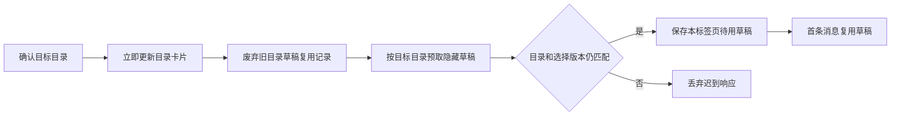

# 会话、档案与技能面板 · 功能方案设计（UseCase 清单）

- 版本：2026-10-07 v13（覆盖至：当前工作区；新建会话入口、草稿工作目录与目录图标；侧栏会话列表改版：视觉与字号自适应、标记微交互、刷新节拍与增量渲染、视图缺省、目录组配额·拖拽·重命名、时间分桶与自动归档 30 天）
- 用途：逐条审查（四字段格式）。
- 适用实现：`modules/message-rendering.js`、`app/folder-icons.js`、`vendor/myagent_path_picker.js`、`frontend/index.html`、`frontend/src/styles/app.css`、`frontend/src/app/modules/layout-panels.js`、`modules/session-management.js`、`modules/model-profiles.js`、`modules/settings.js`、`modules/skill-picker.js`、`modules/i18n.js`、`state/session-selectors.js`、`state/session-renderers.js`、对应后端 API（含 `agent_harness.py` 自动归档）。
- 上级：`00-WebUI对话界面整体设计.md`

---

## 1. 功能定位

围绕对话的三个"管理面"：会话列表、模型档案、技能与设置（含 i18n/主题）。

## 2. UseCase

### UC-5F1 会话管理
- **触发**：新建/切换/归档/删除会话。
- **预期现象**：列表即时更新（含运行中标记/未读标记）；删除有确认且安全中断其运行；归档可恢复；会话列表分区及时间/工作目录分组的展开收起带统一过渡。
- **规则与边界**：改名/归档/置顶/待办的"提交后不回退"由快照版本协议保证——独立成篇，见 10·UC-5J1~5J6；视图选项缺省（隐藏已归档 / 详细模式）见 UC-5F20，时间分桶与 30 天自动归档见 UC-5F23。
- **依据**：`session-management.js`、sessions API、`recover_sessions`。

### UC-5F2 模型档案管理
- **触发**：新增/编辑/删除/排序/启停档案；发起探测。
- **预期现象**：保存立即生效（无需重启）；**排序 = 候选链优先级**（提示用户）；启停改变可用性；探测给出结论/原因；高级配置可选择 system prompt 的 `auto / merge / preserve` 兼容策略。
- **规则与边界**：`auto` 对 Qwen Chat Completions 自动使用开头唯一 system；该选项只改变请求副本，不改写会话历史。完整语义见 `../01-LLM接入/09-SystemPrompt能力投影与Qwen兼容方案设计-UseCase清单.md`。
- **依据**：`model-profiles.js`、`app/templates/static/settings/sections_basic.js`、`get/save/reorder/delete_model_profile`、`discover/probe`。

### UC-5F3 技能面板
- **触发**：查看/开关技能。
- **预期现象**：技能列表与工作区 skills 目录同步（新技能自动出现）；开关状态持久（重启保持）；坏技能有提示；分类分组展开收起带统一过渡，折叠后内容不进入键盘焦点与辅助技术可见树。
- **规则与边界**：会话列表和技能组的折叠动效、时长与减少动态效果规则见 [15《展开/收起统一过渡动效》](15-展开收起统一过渡动效方案设计-UseCase清单.md)·UC-5P1、UC-5P2、UC-5P4；会话搜索框仍通过 `hidden` 控制显隐，不参与高度过渡。
- **依据**：`list_registered_skills / set_registered_skill_enabled`。

### UC-5F4 设置：i18n 与主题
- **触发**：切换语言 / 明暗主题。
- **预期现象**：界面文案与主题即时切换；设置持久化（下次启动保持）。
- **依据**：`i18n.js / settings.js`、前端样式变量。

### UC-5F5 扩展相关设置
- **触发**：查看扩展信任/启用状态（与 ../06 联动）。
- **预期现象**：设置页可看到扩展项与信任状态；变更即时反映到工具/面板可见性。
- **依据**：`get_security_extensions / trust_security_extension`。

### UC-5F6 对话区模型选择器（切换使用）
- **触发**：在右下角模型选择器点选档案。
- **预期现象**：选择器跟随**当前打开的会话**（含经寻址打开的子代理会话）；切换立即写会话绑定与选择纪元——**主会话**：清空本 run 熔断记录（同 run 内失败过的目标档案立即重试）、不打断当前请求、下一次模型调用生效；**子代理会话**：走子代理切换链路（数据动作全保留、不打断）。成功后选择器即时刷新；失败给出可见错误。
- **规则与边界**：连续切换以后者为准（选择纪元守卫）；档案排序仍是候选链优先级（见 UC-5F2）。语义细则见 ../01-LLM接入/05·UC-1E1/1E2/1E4。
- **依据**：`model-profiles.js`（`setCurrentSessionModelProfile` / `refreshModelProfileSelector`）、`session-management.js`（切会话刷新选择器）、`webui.set_session_model_profile`。

### UC-5F7 新会话预取与隐藏草稿
- **触发**：在无会话态点击"新会话"（含刷新后重新进入草稿态）。
- **预期现象**：点击即启动后台预取——服务端创建**隐藏草稿会话**（目录、元数据与索引照常落盘，但首条 user 事件落盘前不出现在会话列表）；发送首条消息时复用该草稿，在途预取等待同一次请求完成，预取失败后回退为发送时即时创建；首条真实 user 事件落盘即"转正"进入列表并广播状态；刷新后按**本标签页 `sessionStorage`** 记录复用同一草稿（旧版 `localStorage` 记录读取时自动迁移，避免多标签页把独立消息发给同一草稿）。
- **规则与边界**：草稿不进入侧栏、远程控制列表与导出；页面内重复点击"新会话"仅复用目标目录一致的预取；已完成的后台物化不再占用发送时的创建等待。目录变化时按 UC-5F13 重建待用草稿；启动重建时若发现草稿已有已提交的首条 user 消息，自动修复元数据并转正（覆盖提交与转正之间的进程退出窗口）。
- **依据**：`session-management.js::ensurePrefetchedNewSession / prefetchNewSessionInner`（`PENDING_NEW_SESSION_KEY`，`sessionStorage` + 旧记录迁移）、`webui.py::create_session`（`prefetch=true`，不失效 `/sessions/state`）、`agent_harness.py::get_or_create_session(draft=…)` / `_first_committed_draft_user_event`（`metadata.draft`、首条 user 事件转正、列表过滤、启动重建修复）。

### UC-5F8 上下文探测失败原因透出

- **触发**：在「高级设置 → 模型配置」或首次配置向导点击「获取模型上下文」，探测未成功（鉴权被拒/模型不存在/端点不可达/400 无可解析窗口）。
- **预期现象**：状态栏显示真实原因——「上下文探测失败，已使用列表/默认窗口：HTTP 401 Unauthorized: {响应体片段}」；网络异常显示 `异常类名: 消息`；响应体折叠空白并截断 400 字符；响应非 JSON 时显示「HTTP <码>（响应无法解析为 JSON）」。服务端同落 `warning` 日志（`model=%s detail=%s`，不含 API Key）。成功或未发起探测时 `probe_error` 为空串，界面行为不变。
- **规则与边界**：只影响失败提示与日志，不改变探测本身（3M token 探针、8s 超时、从 400 报错提取窗口）与"探测结果只作建议、不自动改写档案"；原 `probe_context_window_from_error` 保留为兼容包装。
- **依据**：`model_profiles.py::probe_context_window_from_error_detail / probe_model_context（probe_error）`、`webui.py::probe_model_profile` 日志、`app/templates/static/settings/sections_basic.js / first_time_config.html` 状态栏（复用既有 i18n 规则）；回归 `tests/test_model_profiles.py`。

### UC-5F9 会话级推理强度与模型绑定跟随
- **触发**：在模型选择器调整推理强度（low/medium/high/xhigh/max）；或 fallback 接管改写了会话绑定。
- **预期现象**：强度随会话独立保存（新会话创建即带上、切换会话读取各自值）；请求按协议转换——Responses 原生 reasoning 字段、兼容接口保留 thinking 参数、Anthropic 自适应思考或受输出上限约束的思考预算（旧模型不支持的强度映射到支持值）。fallback 接管改写绑定后，服务端推送 `model_profile_bound`（ephemeral）轻量事件，选择器静默重取并跟随，不再依赖用户点开菜单才刷新。菜单为两级结构——先「模型」/「推理强度」，点入后选择具体值：当前项带勾、方向键移动、Escape 返回上一层再按一次关闭，保存成功后关闭；触发按钮显示「模型 · 强度」。
- **规则与边界**：强度枚举以 `model_profiles.REASONING_EFFORTS` 为准；模型列表 30s TTL + 并发合并，打开菜单/改配置/发现新档案时强制更新；绑定通知只走当前事件流与重连快照、不进持久历史。
- **依据**：`model-profiles.js::noteModelBindingChanged`、`sse-handling.js`（model_profile_bound 分支）、`session-management.js`（新会话 reasoning_effort）、`agent_loop.py::_model_profile_bound_event`、`agent_harness.py`（reasoning extra body 语义）、`llm/transport.py::_apply_anthropic_reasoning`、`model_profiles.py::REASONING_EFFORTS`；回归 `tests/js/model_reasoning_effort_runtime.cjs`、`tests/test_anthropic_reasoning_controls.py`、`tests/test_model_settings_controls.py`。

### UC-5F10 会话侧栏宽度首帧恢复
- **触发**：用户拖动会话侧栏改变宽度并刷新页面。
- **预期现象**：首个可见页面帧直接采用上次保存的宽度，不先显示默认宽度再跳变；从未保存有效宽度时使用 220px 默认值。
- **规则与边界**：原先宽度只在前端模块启动后读取，可能晚于浏览器首次绘制。现在 HTML `<head>` 中的同步初始化脚本在页面解析阶段读取 `sidebar-width-px`，按运行时相同规则限制为 `120px` 至 `min(480px, floor(viewport width × 0.5))`，并写入根元素 `--sidebar-width-px`；`.sidebar` 首帧消费该变量。`initSidebarSash` 仍负责拖动和 mouseup 持久化，拖动值继续使用同一范围。
- **依据**：`frontend/index.html`（首帧前读取并设置 CSS 变量）、`frontend/src/styles/app.css`（`.sidebar` 宽度）、`frontend/src/app/modules/layout-panels.js`（拖动、限幅与 `localStorage` 保存）；生产页面及样式由 Vite 构建至 `app/templates/dist/`。

### UC-5F11 新建会话主按钮与两项菜单

- **触发**：直接点击左上角「新建会话」，或点击右侧箭头展开菜单。
- **预期现象**：菜单只有「在当前工作目录新建会话」和「在新工作目录新建会话」两项。主按钮与第一项共用当前目录入口；第二项先选目录，确认后进入该目录的新会话草稿。
- **规则与边界**：已有会话时，「当前」取当前打开会话的 `work_dir`；已经在草稿态时，主按钮保留草稿已选目录；初始未选目录时采用全局默认目录。在新目录入口取消选择则保持原状态。工作目录只作用于新会话，不改写已有会话目录。
- **依据**：`session-management.js::startNewSessionInCurrentDir / startNewSessionInFolder / startNewSessionInDir / createNewSession`、`frontend/src/shell-body.html` 的 `new-session-btn / new-session-menu`。

### UC-5F12 欢迎页选择会话目录

- **触发**：新会话草稿的欢迎页，点击下方「会话工作目录」卡片中的「选择」。
- **预期现象**：卡片展示目录名、完整路径与目录图标；默认目录显示「默认工作目录」。确认选择后立即更新卡片，并按该目录预取隐藏草稿；输入框中已写内容保留。
- **规则与边界**：卡片只在无活动会话的草稿态出现；取消选择不改目录。选择器初始路径优先取当前会话目录，其次取草稿目标目录，最后取默认目录。系统选择器不可用时提供绝对路径手填兜底，行为见 [UC-4F5](../04-工作区/06-打开协议与路径选择器方案设计-UseCase清单.md)。目录名与路径按原文展示，不参与界面翻译。
- **依据**：`message-rendering.js::WELCOME_HTML / syncWelcomeSessionDirectory`、`session-management.js::bindWelcomeSessionDirectoryPickerOnce / pickNewSessionWorkDir / applyNewSessionWorkDir`；`tests/js/new_session_lifecycle_runtime.cjs`。

### UC-5F13 目录选择、隐藏草稿与创建请求一致

- **触发**：草稿已预取后换目录，或默认目录的预取请求仍在途时选择新目录。
- **预期现象**：目录卡片、`POST /sessions` 的 `work_dir` 和后端保存的会话目录一致；首条消息复用新目录的隐藏草稿，预取失败后的即时创建也携带该目录。
- **规则与边界**：会话目录创建后固定，换目录必须废弃旧草稿的复用记录并创建新草稿。前端同时校验目标目录和选择版本；旧请求迟到时不能覆盖新选择。恢复草稿时校验服务端 `draft` 与实际 `work_dir`，目录不匹配则重新创建。待用记录按标签页保存在 `sessionStorage`，含 `session_id / work_dir`；Windows 路径比较统一分隔符并忽略大小写。正式会话接管草稿后清空待用目标，下一次主按钮从该正式会话读取当前目录。
- **依据**：`session-management.js::collectNewSessionCreateOptions / ensurePrefetchedNewSession / prefetchNewSessionInner / sessionWorkDirMatchesTarget / materializeNewSessionInner`；后端目录契约见 [UC-4A7](../04-工作区/01-路径模型与安全解析方案设计-UseCase清单.md)；`tests/js/new_session_lifecycle_runtime.cjs`。

### UC-5F14 按会话工作目录分组与目录动作

- **触发**：把侧栏分组切换为工作目录，或在目录分组头执行新建、复制路径、打开目录。
- **预期现象**：同一工作目录的会话归到同一组，分组提供完整路径提示；组内新建使用该组目录。复制与打开动作使用该目录的完整路径。
- **规则与边界**：`work_dir / work_dir_label / work_dir_is_default` 来自会话投影；分组只改变列表组织方式，会话库继续集中保存。默认目录组与其他目录组区分，折叠状态按组保存；目录分组不把隐藏草稿提前加入列表。目录组的默认前 5 与分级展开见 UC-5F21；拖拽排序与重命名（含默认组）见 UC-5F22。
- **依据**：`state/session-selectors.js`、`state/session-renderers.js`、`session-management.js::buildSessionGroupActions / computeSessionListLayoutKey`、`agent_harness.py::session_work_dir_projection`。

### UC-5F15 目录与附件图标按实际功能统一

- **触发**：查看欢迎页目录卡片、目录分组、工作区文件树，或使用打开目录、新目录新建、附加文件动作。
- **预期现象**：主聊天界面复用同一套 SVG 图形、描边与语义；相同功能使用同一图标。
- **规则与边界**：图标只表达动作或条目类型，不代替按钮文字、路径提示和可访问名称。图标对应关系见下表。
- **依据**：`frontend/src/app/folder-icons.js::svg / mount`、`frontend/src/main.js` 的加载顺序；`session-management.js`、`message-rendering.js`、`dock/embedder/right-column.js`、`vendor/myagent_path_picker.js`。

| 图标 | 用途 | 典型位置 |
|---|---|---|
| `folder` | 表示目录或工作目录 | 欢迎页目录卡片、工作区文件树 |
| `folder-open` | 打开或浏览目录 | 详情栏打开文件所在目录、路径浏览动作 |
| `folder-plus` | 在指定或新选目录新建会话 | 侧栏目录入口、目录分组的新建动作 |
| `file` | 表示文件条目 | 文件相关入口与条目 |
| `paperclip` | 附加本地文件 | 聊天输入区文件附件入口 |

### UC-5F16 会话列表视觉改版与字号自适应
- **触发**：打开/刷新页面查看会话列表；在视图选项或设置中调整字号、列表模式。
- **预期现象**：列表为改版形态——行内「标题 + 摘要」两行、行尾相对时间；列表头顶部为固定头（会话计数、搜索、视图选项、在新文件夹新建）；列表支持「紧凑 / 详细」两种模式；行高、图标、胶囊等全部尺寸随设置字号成比例缩放，且切换字号/模式后列表即时重排。
- **规则与边界**：字号、主题与列表模式在页面 `<head>` 的同步脚本中于解析阶段应用（首帧即最终态，无"先默认后跳变"）；控件尺寸使用 rem 令牌（`--ui-text-*`）随根字号缩放；行规格、右基准与内缩参照 dsh 侧栏。视觉改动仅限「新建会话按钮及其以下」区域，品牌区不动。
- **依据**：`frontend/index.html`（首帧脚本）、`session-management.js`、`state/session-renderers.js`、`styles/app.css`；改版来源与逐轮适配记录见 [`../../../workspace/patch_20261006/分析报告.md`](../../../workspace/patch_20261006/分析报告.md) 与《应用记录》§1–§11。

### UC-5F17 会话行标记与微交互（胶囊 / 待处理徽标 / 置顶钮）
- **触发**：会话处于草稿/待办/审查/待处理状态；悬停会话行；点击行内置顶按钮。
- **预期现象**：行尾按状态显示胶囊（草稿/待办/审查）与 ?/! 黄色待处理徽标；悬停行尾浮出「置顶、⋯」动作；点「置顶」= 置顶/取消置顶并**切入该会话**（已是当前会话则只切换置顶不切换）。
- **规则与边界**：胶囊与徽标随字号缩放；?/! 字形用 600 字重（原 800 在 0.62rem 小字号下笔画糊连、观感"压扁"）；指针刚进行不足 220ms 时的图标点击视为"点整行"（切换会话、不触发图标动作）；⋯ 菜单内的「置顶会话」保持纯置顶、不切换会话。
- **依据**：`human-interactions.js::updateHumanInteractionSessionBadge`、`session-management.js`（行内指示同步、防误点委托、置顶按钮 handler）、`styles/app.css::.session-human-badge`；实测见《应用记录》§4/§14/§18/§23。

### UC-5F18 侧栏时间刷新与统一节拍
- **触发**：长时间停留页面；窗口聚焦/恢复可见。
- **预期现象**：行尾相对时间最长约 30 秒内自动校正（分钟/小时/天粒度）；恢复可见或聚焦时立即校正；页脚运行时状态保持自身节拍。
- **规则与边界**：由单一"节拍调度器"统一驱动周期任务——运行时心跳 5s（含隐藏时运行，保障"服务端拉起窗口/自动接管"）、时间文案 30s（仅可见时运行、隐藏不空转、恢复可见立即补拍）；行时间更新为纯文本级、不重排列表；周期取值遵循 dsh `useRelativeClock`（30s：半分钟节拍与分/时/天粒度一致）。
- **依据**：`message-rendering.js::formatSessionListRelativeTimeFromTs`、`session-management.js::refreshSessionListTimes / registerSidebarRefreshTask`（`window.__sidebarRefreshDebug` 只读任务表）；整理与实测见 [`../../../workspace/patch_20261006/侧栏刷新机制整理.md`](../../../workspace/patch_20261006/侧栏刷新机制整理.md)。

### UC-5F19 列表增量渲染（内容变化不整表重建）
- **触发**：会话数据变化（改名、活动时间、摘要、置顶、归档、新建/删除）。
- **预期现象**：纯内容变化只替换受影响的行（单行级，秒级无感）；结构/顺序变化（新建/删除/排序变化/分组变化/展开收起）才整表重建。
- **规则与边界**：渲染键拆为「布局键（筛选/分组 + 有序的区块·分组·会话序列 + 归档计数）」与「内容键（每会话可见字段指纹）」；内容变化 ≤24 行时行级替换、超过则整表重建（退化保护）；指示器全量同步按帧合并（同一帧多次调用只跑一次）；名称截断归一化改为"先读后写"以消除强制重排。
- **依据**：`session-management.js::computeSessionListLayoutKey / computeSessionListContentMap / patchSessionListRows / syncSessionListIndicatorClasses`、`state/session-renderers.js::normalizeTruncatedSessionNames`；实测（整表 90–106ms → 59–72ms、内容流单行替换）见《侧栏刷新机制整理.md》§3/§4。

### UC-5F20 视图选项默认值与筛选
- **触发**：首次打开（无历史偏好）；使用视图选项菜单。
- **预期现象**：缺省为「筛选会话＝隐藏已归档」「列表模式＝详细」；菜单可切换分组方式（按时间/按工作目录）、列表模式（紧凑/详细）、筛选会话（显示归档/隐藏归档/只看归档）。
- **规则与边界**：缺省仅在没有已保存偏好时生效，已保存偏好优先；归档筛选缺省由"显示"改为"隐藏"（三个选项仍都在）；"按工作目录"缺省不启用的新目录由目录分组规则排布（见 UC-5F22）。
- **依据**：`state/session-selectors.js::getSessionArchiveFilter`、`settings.js::getStoredSessionListMode / applySessionListMode`、`frontend/index.html`（首帧）、`app/templates/static/settings/sections_basic.js`（设置中心同键）。

### UC-5F21 工作目录分组：默认前 5 与分级展开
- **触发**：工作目录分组中某组会话数超过配额；点击组内「显示更多」；折叠后重新展开该组。
- **预期现象**：每组默认只显示前 5 个（运行中/子代理运行中的行免配额、始终显示）；组底出现「显示更多（N）」→ 点击显示 10 个（按钮变「展开全部（N）」）→ 再点显示全部；每次从折叠态重新展开，配额从"前 5"重新生效。
- **规则与边界**：档位取 0/1/2（5 / 10 / 全部，内存态、刷新重置）；搜索态不限额、空组不渲染；记录仅"可见集合"进渲染键，展开/收起触发列表重建；配额取值参照 dsh `COLLAPSED_SESSION_LIMIT = 5`。
- **依据**：`state/session-selectors.js::sessionGroupSessionsVisible / advanceSessionGroupReveal / resetSessionGroupReveal`、`state/session-renderers.js::appendSessionGroupBlock`；实测见《应用记录》§19–§21。

### UC-5F22 工作目录分组：拖拽排序·重命名·组头动作
- **触发**：拖拽组头；在组 ⋯ 菜单选择「重命名」；悬停组头。
- **预期现象**：拖拽组头调整分组顺序（拖动中半透明、目标位置显示插入线），松手即保存、立即生效并跨刷新保持；「重命名」编辑组显示名（含默认工作目录组；留空恢复原名），只改侧栏显示、不动磁盘目录，搜索按显示名匹配；悬停时组头右侧浮出「在此目录新建」「⋯」，长组名以省略号让位——动作浮出前后行高不变、按钮恒靠右、零重叠。
- **规则与边界**：顺序存 `myagent-workdir-order`（分组 key 数组；默认组同样参与；未列出的新目录按活动倒序殿后）；自定义名存 `myagent-workdir-labels`（分组 key → 显示名）；拖拽移动阈值 5px（原地点击仍然是折叠/展开）；默认组永不自动归档（见 UC-5F23）。
- **依据**：`session-management.js::bindSessionGroupDrag / renameWorkDirGroup / buildSessionGroupActions`、`state/session-selectors.js::getWorkDirOrder / getWorkDirCustomLabel`、`styles/app.css`（组头/动作/插入线）；实测见《应用记录》§19–§21。

### UC-5F23 时间分桶与自动归档（30 天）
- **触发**：分组方式为「按时间」；会话活动时间跨越桶边界；后端维护扫描。
- **预期现象**：分桶为 置顶目录 → 今天 → 昨天 → 近三天 → 近7天 → 近半月(15天) → 近一月(30天)；置顶会话单独成组、恒排最前；超过 30 天的会话不再落入分桶，由后端自动归档（进入「归档目录」，默认筛选下不显示）。
- **规则与边界**：今天/昨天按本地日历边界（昨日 00:00–今日 00:00），其余为滚动窗口（3/7/15/30 天）；空桶不渲染；自动归档阈值 `AUTO_ARCHIVE_AFTER_DAYS = 30`（原 14），按 `last_activity_at / updated_at / created_at` 判定、**跳过置顶与已归档**、约 300 秒节流扫描（harness 重启后生效）；旧 14 天规则期间已自动归档的会话不自动回滚（可在「归档目录」手动取消归档）。
- **依据**：`state/session-selectors.js::selectNormalSessionTimeGroups`、`app/agent_harness.py::_auto_archive_stale_sessions`；实测与复算见《应用记录》§22。

## 3. 边界

- 会话工作目录、工具/安全/审计根和集中存储的关系见 [04/01 · UC-4A7](../04-工作区/01-路径模型与安全解析方案设计-UseCase清单.md)；选择目录的权限边界见 [04/02](../04-工作区/02-越界审批与授权目录方案设计-UseCase清单.md)。
- 当前工作区文件浏览与媒体接口仍按全局默认目录解析；选择会话目录后，这些面板尚未随会话切根。该限制不影响新会话请求与工具执行根的目录选择。
- 档案的**业务语义**（协议/能力/切换）见 ../01-LLM接入；
- 技能装载细节见 ../06-能力扩展加载/05。

## 4. 依据映射

UC-5F1~5F10 的代码依据见各用例；本次新增映射如下。

| 用例 | 主要代码依据 |
|---|---|
| UC-5F11~5F12 | 新建入口与欢迎页委托事件；`message-rendering.js::syncWelcomeSessionDirectory` |
| UC-5F13 | 目标目录、选择版本、预取复用校验与 `work_dir` 创建参数；后端 `webui.create_session` |
| UC-5F14 | 会话目录投影、分组选择与渲染、目录分组动作 |
| UC-5F15 | `app/folder-icons.js` 与四处调用方 |
| UC-5F16~5F17 | 改版渲染与首帧脚本；行内指示/防误点/置顶按钮 handler |
| UC-5F18~5F19 | 节拍调度器、rAF 合并指示器、布局/内容键与行级替换 |
| UC-5F20 | 归档筛选与列表模式缺省（首帧/主模块/菜单/设置中心四端一致） |
| UC-5F21~5F22 | 目录组配额/分级展开；拖拽排序与显示名（localStorage 持久化） |
| UC-5F23 | 时间分桶选择器与后端自动归档阈值 30 天 |

目录选择的状态流如下；取消选择不进入此链路。

### 4.1 验证与手工验收

- `tests/js/new_session_lifecycle_runtime.cjs` 覆盖新目录创建参数、待用草稿目标、卡片点击和路径显示；相关 pytest 与 Node 回归结果见 [总览验证记录](../00-总览与导航.md)。
- 2026-10-07 页面联测：菜单选择 `tests`，再由卡片选择 `frontend`，两次显示路径、真实 `POST /sessions` 和 `GET /sessions/{id}` 的保存路径均一致；输入草稿保留，页面错误为 0，三个测试草稿已删除。联测中的 `/api/pick-path` 返回值做了模拟；Windows 原生结果读取另由 [UC-4F4](../04-工作区/06-打开协议与路径选择器方案设计-UseCase清单.md) 的 COM 回归覆盖。
- 真实系统对话框的人工验收：在默认目录下单击一个子文件夹后直接确认；菜单和卡片两个入口都应显示并创建到所选子目录。再检查取消选择、刷新恢复草稿、在已有自定义目录会话中直接点主按钮。此次未记录人工点击系统对话框的验收结果。
- 2026-10-07 侧栏改版联测（Playwright 真机）：首帧防闪零跳变；设置字号 13↔20 双向联动；胶囊/徽标逐字号实测；时间自动刷新 29.5s 节拍翻转与聚焦即时校正；内容流单行替换 vs 整表重建 59–72ms；目录组配额 6→11→59 与"重开重置"；默认组拖拽/重命名往返；时间分桶复算（各桶逐条核对）。证据：`workspace/patch_20261006/icon_audit/*.json` 与《应用记录》§12–§23。

## 5. 版本记录

- 2026-10-07 v13：新增 UC-5F16~5F23——侧栏会话列表改版落地：视觉与字号自适应（含首帧防闪）、行标记微交互与点置顶切入会话、侧栏时间刷新与统一节拍、列表增量渲染、视图选项缺省（隐藏已归档/详细）、目录组默认前 5 与分级展开·拖拽排序·重命名（含默认组）、时间分桶（置顶/今天/昨天/近三天/近7天/近半月/近一月）与自动归档 30 天；UC-5F1/5F14 补交叉引用；补录联测证据。

- 2026-10-07 v12：新增 UC-5F11~5F15，明确主按钮默认目录、两项菜单、目录卡片、隐藏草稿重建与迟到响应守卫、按目录分组和图标语义；校正 UC-5F7 的在途预取等待语义，补录联测与人工验收边界。

- 2026-10-07 v11：UC-5F1 与 UC-5F3 补充到 15《展开/收起统一过渡动效》的交叉索引；会话搜索框显隐边界也明确记录为保留 `hidden` 语义。
- 2026-10-07 v10：新增 UC-5F10《会话侧栏宽度首帧恢复》——在 HTML head 同步读取保存宽度并通过 CSS 自定义属性参与首次布局，避免默认 220px 到用户宽度的刷新跳变；拖动保存及限幅保持一致。
- 2026-10-07 v9：同步 15《展开/收起统一过渡动效》——会话分区/分组及技能分类组复用 220ms 高度与透明度过渡；技能组折叠内容同步 `aria-hidden` / `inert`。会话搜索框保留原生 `hidden` 显隐语义。
- 2026-10-04 v8：UC-5F9 补记两级菜单交互（模型／推理强度分层面板、当前项带勾、方向键与 Escape 层级返回、保存即关闭；实现见 10-04 提交）。

- 2026-10-03 v7：新增 UC-5F9《会话级推理强度与模型绑定跟随》——强度随会话独立保存并按三协议转换；fallback 接管后选择器即时跟随（`model_profile_bound`）；档案管理入口迁至设置中心 sections_basic。

- 2026-10-02 v6：新增 UC-5F8《上下文探测失败原因透出》——探测失败保留原始原因（HTTP 状态/响应体片段/异常文本），状态栏显示真实报错、服务端落 warning 日志；成功路径与探测语义不变。

- 2026-09-26 v5：新增 UC-5F7《新会话预取与隐藏草稿》——点"新会话"后台创建隐藏草稿（`metadata.draft`），发送时复用并在首条 user 事件"转正"；待用记录存每标签页 `sessionStorage`（旧 `localStorage` 迁移），失败回退即时创建；启动重建可修复已提交首条消息的草稿。
- 2026-09-20 v4：UC-5F1 补交叉引用——会话列表状态一致性契约（快照 `state_revision`、写入围栏、仅失败才回滚）见 10《会话列表状态一致性与快照版本》。
- 2026-09-13 v1：拆分首版（承接 UC-509/506 与设置面板条目）。
- 2026-09-18 v2：新增 UC-5F6（对话区模型选择器）——选择器跟随当前会话；主会话清熔断即时重试、子代理会话按数据动作切换（不打断，见 04·UC-5D15）。
- 2026-09-20 v3：UC-5F2 补入 system prompt `auto/merge/preserve` 档案设置及其“只投影请求、不改写历史”边界。
