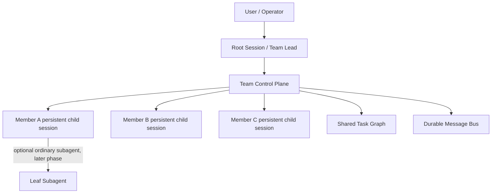
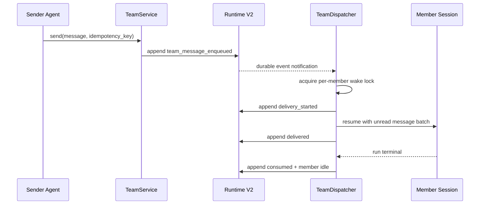

# SugarAgent Agent Team 功能分析与适配方案

## 1. 结论

SugarAgent 不需要重写一套新的多 Agent 执行内核。当前仓库已经具备独立子会话、后台运行、续接、中断、嵌套树、结果收集、Runtime V2 事件、SSE 和子 Agent 详情 UI。适配 Agent Team 的正确方向是：

1. 保留现有 `task` 工具，继续负责一次性、树状、结果回传型委派。
2. 在现有 subagent 执行能力之上新增一层“团队控制面”，负责团队、成员、共享任务图、成员消息、权限转交和生命周期。
3. 团队成员使用持久子会话。一次执行结束不代表成员退出，而是从 `working` 进入 `idle`；新消息或新任务通过现有 resume 能力再次唤醒它。
4. 团队状态只写入根会话的 Runtime V2 事件日志，快照和索引均为可重建投影；不要照搬 Claude Code 的多个可变 JSON 文件作为事实源。
5. 首版采用“一个根会话最多一个团队、团队 roster 扁平、默认最多 4 个成员、共享工作区串行写入”的保守模型。并行修改文件必须等路径作用域或 Git worktree 隔离完成后再开放。

两个参考实现的能力并不相同：

- OpenClaw 没有 Claude Code 意义上的一等 Agent Team。它提供的是多 Agent 路由、树状 subagent、会话间通信与可靠结果回传，适合借鉴运行控制和安全边界。
- Claude Code 提供一等团队实体、扁平成员、共享任务列表、成员邮箱、空闲/唤醒和权限转交，适合借鉴协作语义。

因此推荐组合为：

> OpenClaw 的执行可靠性与边界控制 + Claude Code 的团队协作模型 + SugarAgent Runtime V2 的事件事实源。

### 1.1 当前实现状态（2026-07-17）

本方案的首版已进入仓库实现：

- `AGENT_TEAM_ENABLED` 默认 `0`，可从主设置页或 `/api/features/agent-team` 动态启停。
- `app/agent_team/` 已实现领域校验、Runtime V2 原子存储、共享任务、邮箱、一次性权限、生命周期、HTTP API、模型 `team` 工具和成员执行策略。
- 团队成员复用现有 subagent 子会话；`spawn_member` 绑定一次，后续 `dispatch` 始终通过 `resume` 唤醒同一个会话。
- `RuntimeProjector` 已投影 Team 事件；发布快照采用集合/行级 copy-on-write，避免邮箱增长时整棵 Team 状态深拷贝。
- 团队成员的写工具按根团队串行；删除、下载和放宽工作区限制的 shell 需要 lead/API 产生一次性授权。
- Web 设置中已加入功能开关和当前会话 Team 管理面板。

操作说明、配置项和 API 入口见 `docs/agent_team.md`。

## 2. 分析基线与范围

本方案基于以下本地代码快照：

- OpenClaw：Git `4f00b3b534f2`，重点检查 `docs/tools/subagents.md`、`docs/concepts/multi-agent.md`、`src/agents/subagent-*`、`src/agents/tools/sessions-*`。
- Claude Code：本地 `claude-code-main` 源码归档，无 Git 元数据，重点检查 `TeamCreateTool`、`AgentTool`、`Task*Tool`、`SendMessageTool`、`utils/swarm`、`teammateMailbox`。
- SugarAgent：Git `26608d3b951b`，并结合当前工作区中的 Runtime V2、Remote Control 和模型配置未提交改动分析。

Claude Code 本地目录属于源码归档，不应把其中的内部 API、环境变量或文件格式当成稳定公开协议。本方案只提炼其协作语义和工程模式。

分析范围是本机单实例中的 Agent Team。以下内容不是首版目标：

- 跨机器团队或云端 swarm。
- 多租户团队权限和组织 ACL。
- tmux、iTerm2 分屏后端。
- OpenClaw 的多消息渠道入站路由。
- 自动进行多轮 agent-to-agent ping-pong。
- 自动合并多个 Git worktree 的复杂冲突。

## 3. OpenClaw 的多 Agent 能力

### 3.1 两套不同概念

OpenClaw 把多 Agent 分成两类：

1. **多 Agent 路由**：一个 Gateway 托管多个完全隔离的 Agent。每个 Agent 有独立 workspace、`agentDir`、认证配置和 session store，外部消息通过 binding 路由到指定 Agent。
2. **Sub-agent 委派**：某个会话通过 `sessions_spawn` 启动独立子会话，子会话结束后把结果 announce 回直接父会话。

前者解决“多个独立人格/租户如何共存”，后者解决“一个任务如何树状拆分”。它们都没有共享 roster、共享任务图或持久 idle 成员，因此不等同于 Claude Code Agent Team。

### 3.2 Sub-agent 执行模型

OpenClaw 的 subagent 具有以下特征：

- 子会话 key 带父子层级，运行上下文彼此隔离。
- `sessions_spawn` 始终非阻塞，立即返回 `accepted`、`runId` 和子会话 key。
- 支持一次性 `run` 和 thread-bound `session` 两种模式。
- 支持模型、thinking、超时、cleanup、sandbox 要求和目标 Agent allowlist。
- 默认禁止 subagent 使用 session 系统工具；只有被配置为 orchestrator 的层级才能继续 spawn 和管理直接子节点。
- 同时限制最大深度、每个父会话的活动子节点数和全局 subagent 并发数。
- 停止父节点时向下级联；父节点只能控制自己的直接后代。
- registry 持久化运行记录，保存 run、父会话、子会话、结果、结束原因、清理和 announce 重试状态。

这套模型的核心价值是“能力与层级绑定”，而不是仅凭 session key 推测权限。

### 3.3 结果回传和会话通信

OpenClaw 把完成回传设计为独立 announce 步骤：

- 子运行结束后冻结最终结果和运行统计。
- 顶层子 Agent 向用户所在会话回传；嵌套子 Agent只向直接父 orchestrator 注入内部消息。
- 回传带幂等键，并有直接投递、队列回退和有限重试。
- 父 Agent收到的是内部编排上下文，需要重新组织成自然语言，而不是直接把内部元数据转给用户。
- `sessions_send` 支持向既有会话发送消息；可选的 A2A 流程允许有限轮次往返，并通过 `REPLY_SKIP`/`ANNOUNCE_SKIP` 停止。
- `steer` 会中止目标当前 run、清理旧队列，再在相同会话启动新的 run。

### 3.4 值得复用的设计

- spawn 非阻塞，状态通过事件和 registry 观察。
- 父子控制权显式记录，不能越权控制任意会话。
- 全局并发、单父 fan-out、最大深度三层限流。
- runtime outcome 决定 success/error/timeout/killed，不依赖模型自述。
- 结果回传带幂等、冻结结果和重试状态。
- sandbox、工具策略、认证和目标 allowlist 在 spawn 时校验。
- 父日志只保存瘦身状态，完整过程保留在子会话。

### 3.5 不应直接照搬的部分

- OpenClaw subagent 是“完成后回传”的短生命周期任务，不具备团队成员的 idle/wake 语义。
- 多 Agent routing 面向隔离人格和消息渠道，不适合直接充当同一项目内的协作团队。
- A2A 自动 ping-pong 会放大 token 消耗和死循环风险，首版团队通信应采用单向入箱、事件触发唤醒。
- OpenClaw 的 pending announce 在 Gateway 重启时仍有 best-effort 边界；SugarAgent 已有 Runtime V2，应把待投递消息做成可恢复事实。

## 4. Claude Code 的 Agent Team 能力

### 4.1 团队和成员模型

Claude Code 把 Team 作为一等实体：

- 一个 leader 同时只能管理一个团队。
- 团队配置包含 `leadAgentId`、leader session、成员数组、模型、角色、颜色、cwd、worktree、backend、active 状态和 permission mode。
- 成员 ID 采用 `name@team`，模型交互主要使用成员 name。
- roster 是扁平的；普通 teammate 不能继续 spawn teammate，但仍可启动普通同步 subagent。
- 团队完成前先请求成员优雅 shutdown，仍有 active member 时拒绝 TeamDelete。

团队成员不是一次性调用。成员完成一轮后进入 idle，leader 或 peer 发送新消息可以再次唤醒它。

### 4.2 Team 与 TaskList 一一对应

Claude Code 明确规定 `Team = TaskList`：

- `TeamCreate` 创建 team config，同时创建同名 task directory。
- Task 状态为 `pending -> in_progress -> completed`，另有删除动作。
- Task 包含 owner、blocks、blockedBy 和 metadata。
- Task assignment 会向新 owner 的邮箱发送结构化通知。
- claim 使用文件锁，检查任务是否存在、是否已被领取、是否完成、是否被未完成依赖阻塞。
- 可选 busy check 把“检查成员是否已有任务”和“领取任务”放入同一个 list-level 临界区，避免 TOCTOU。
- 成员退出时，未完成任务会被解除 owner 并退回 pending。

共享任务图使 leader 不必把所有进度塞进聊天上下文，也使成员可以在完成当前任务后主动发现新任务。

### 4.3 成员邮箱和结构化协议

Claude Code 为每个成员维护一个 file-based inbox：

- 普通消息包含 from、text、summary、timestamp、read。
- 写入和标记已读都使用文件锁。
- 支持单播和广播；广播线性写入每个成员 inbox。
- 普通消息作为 teammate attachment 进入下一轮模型上下文。
- 控制消息使用结构化 envelope，包括 task assignment、idle notification、permission request/response、sandbox permission、plan approval、shutdown request/response 和 mode update。
- 进程内 teammate 每 500ms 轮询 inbox；leader 消息和 shutdown request 有更高优先级。

一个重要设计点是：普通协作文本与控制协议分开处理，控制协议由代码验证和路由，不交给模型自由解释。

### 4.4 执行后端抽象

Claude Code 定义统一的 `TeammateExecutor`，屏蔽三种后端：

- in-process：同一 Node 进程内运行，使用 AsyncLocalStorage 隔离成员身份，AbortController 管理生命周期。
- tmux：为成员创建 pane/window 和独立进程。
- iTerm2：通过原生 split pane 运行独立进程。

统一接口覆盖 spawn、sendMessage、terminate、kill 和 isActive。自动模式在没有 pane backend 时回退到 in-process。

### 4.5 权限与 leader 协调

- teammate 继承基础配置，但不应因为 leader 具有高权限就无条件继承所有临时授权。
- 成员遇到 ask 型工具权限时，把请求发给 leader/UI，再等待带 request ID 的响应。
- permission update 可以同步回团队成员。
- plan-required teammate 在实现前等待 leader 审批。
- shutdown 先发请求，允许成员批准或拒绝；force kill 是独立路径。

### 4.6 UI 与可观察性

- 团队成员在 background task 列表和 spinner tree 中显示。
- 可以查看成员当前活动、token、tool use、最近工具轨迹、错误和耗时。
- 可以切入 teammate view、停止成员、返回 leader。
- task list 与成员 owner 联动，leader 能看到谁 busy、谁 idle。

### 4.7 值得复用的设计

- team、member、task、message 是明确领域对象。
- roster 扁平，避免团队成员递归创建团队导致失控。
- 成员 idle 和 run terminal 分离。
- Task 具有 owner 和依赖图，claim 操作具备并发保护。
- 普通消息和控制协议分离。
- 优雅 shutdown 与 force interrupt 分离。
- leader UI 统一承接成员权限请求。
- 同一协作语义可以映射到不同执行后端。

### 4.8 不应直接照搬的部分

- team config、每个 task、每个 inbox 分别落盘，存在多文件一致性和恢复复杂度；SugarAgent 应使用 Runtime V2 事件流。
- inbox polling 会产生延迟和空轮询；SugarAgent 已有事件总线，应事件驱动唤醒。
- display name 同时充当寻址键，重命名和冲突处理较脆弱；SugarAgent 应使用稳定 member ID，名称只用于模型和 UI。
- in-process 成员共享工作区和进程资源，多个写 Agent 容易互相覆盖。
- active/idle、任务 owner 和真实 run 状态来自不同文件/内存结构，异常退出时需要额外 reconcile。
- TeamDelete 会删除 team/task 目录；SugarAgent 的事件日志应采用 tombstone/归档，不能物理删除审计事实。

## 5. 对比总结

| 维度 | OpenClaw | Claude Code | SugarAgent 适配选择 |
|---|---|---|---|
| 主要模型 | 树状 subagent + 多 Agent 路由 | leader + 扁平 teammate team | 保留树状 subagent，新增扁平 team 控制面 |
| 成员生命周期 | run 完成即结束并 announce | 每轮完成后 idle，可再次唤醒 | 持久子会话，run terminal 后 member=idle |
| 共享任务 | 无一等共享任务图 | Team 与 TaskList 一一对应 | Runtime V2 中的共享 task graph |
| 成员通信 | sessions_send、announce、有限 ping-pong | per-member mailbox、单播/广播、控制协议 | durable message event + event-driven dispatch |
| 状态事实源 | registry + session store | 多个 JSON 文件 + AppState | 根会话 Runtime V2 event log |
| 并发控制 | 深度、children、全局 lane | 文件锁、task claim、backend 限制 | per-member run lock + team semaphore + task CAS |
| 权限 | allowlist、sandbox、按层工具策略 | leader/UI permission bridge | operator 最终审批，leader 只能协调不能提权 |
| 停止语义 | 父子级联 kill | graceful shutdown + force kill | turn interrupt、member shutdown、team shutdown 分离 |
| 工作区 | per-agent workspace，可 sandbox | shared cwd 或 worktree | 首版 shared/serial-write，后续 worktree |
| UI | subagent 状态和日志 | roster、task、teammate detail | 复用 subagent detail，新增 team board |

## 6. SugarAgent 当前基础与缺口

### 6.1 可直接复用的基础

- `app/agent_subagent.py`
  - 独立 child session。
  - `start/resume/status/collect/interrupt`。
  - 前台和后台运行。
  - 单 child 同时只允许一个 run 的 registry。
  - 父中断时取消 descendants。
  - `best-of-n` 和可选 worktree 尝试。
- `app/runtime_v2/subagent_store.py`
  - 父会话下的子 Agent 独立事件日志、快照、metadata、task index 和 pending result。
- `app/runtime_v2/event_schema.py`、`projector.py`
  - append-only 事件、可重建 snapshot、明确 run/subagent terminal 事件。
- `app/session_event_bus.py`、`app/webui.py`
  - durable catch-up + live SSE、运行中重连、interrupt、continue-subagents。
- 前端 `subagent-*` 状态模块
  - 子 Agent 树、卡片、详情懒加载、增量事件、停止和删除。
- `app/tool_approval_gate.py`
  - 已有用户工具审批入口，可扩展为成员来源的审批请求。
- 模型 profile、skill、hook、plugin 和工具过滤能力
  - 可以作为 team member spawn 配置的一部分继承。

### 6.2 关键缺口

1. 没有 Team 和 Member 领域对象；当前只有 parent-child session 关系。
2. 当前 subagent 完成后是 terminal，没有 idle/wake 的持久成员语义。
3. `subagent_tasks.json` / Runtime V2 `tasks.json` 是子 Agent 运行索引，不是用户工作项的共享任务图。
4. 没有 member-to-member 或 member-to-leader durable mailbox。
5. 没有任务 owner、依赖、原子 claim、退出释放和 stale lease。
6. 没有 leader/member 权限矩阵；现有工具过滤只区分普通会话和 subagent 深度/类型。
7. 工具审批没有稳定 team/member 来源字段，且 durable 恢复能力不足。
8. 当前 `SUBAGENT_MAX_DEPTH` 默认是 1；团队成员是否可以再 spawn 普通 subagent 需要单独定义，不能隐式放宽。
9. 所有成员默认共享全局 `WORK_DIR`，并行写文件存在覆盖风险。
10. 前端只有执行树，没有 roster、共享任务板、成员 inbox 和 team shutdown 控制。
11. 现有格式化字符串是模型工具的返回值，不适合作为 Team Service 的内部 API。
12. session sidebar 的性能约束禁止扫描所有子日志，因此 team 摘要必须来自根 snapshot/index。

## 7. 目标领域模型

### 7.1 层级关系



约束：

- 一个 root session 首版最多拥有一个 active team。
- roster 永远扁平；只有 leader 能增删 team member。
- member 是 root 的直接 child session，拥有稳定 `member_id` 和 `session_id`。
- 普通 subagent 仍可保持树状；若未来允许 member spawn 普通 subagent，它不加入 roster，仍受最大深度限制。
- 用户/operator 的权限高于 leader；leader 不能替用户批准高风险工具。

### 7.2 Team

建议字段：

```json
{
  "team_id": "team_uuid",
  "root_session_id": "session_uuid",
  "name": "feature-x",
  "description": "Implement feature X",
  "status": "active",
  "workspace_mode": "shared_serial_write",
  "max_members": 4,
  "created_at": "...",
  "updated_at": "...",
  "revision": 12
}
```

Team 状态：

```text
active -> draining -> completed -> archived
   \---------------------------> failed
```

`deleted` 不作为物理删除，而是 archived/tombstone 投影。

### 7.3 Member

建议字段：

```json
{
  "member_id": "member_uuid",
  "team_id": "team_uuid",
  "session_id": "child_session_uuid",
  "display_name": "backend",
  "role": "generalPurpose",
  "model_profile_id": "profile_id",
  "status": "idle",
  "current_run_id": null,
  "current_task_ids": [],
  "tool_policy_id": "team-default",
  "joined_at": "...",
  "last_active_at": "...",
  "revision": 8
}
```

Member 状态和 run 状态必须分开：

```text
starting -> working -> idle -> working
                    \-> waiting_permission
idle|working -> shutting_down -> stopped
idle|working ------------------> failed
```

`run_finished` 只会把 `working` 变成 `idle`，不会删除 member。

### 7.4 Shared Task

建议字段：

```json
{
  "task_id": "task_uuid",
  "team_id": "team_uuid",
  "subject": "Implement API",
  "description": "...",
  "status": "pending",
  "owner_member_id": null,
  "blocked_by": [],
  "blocks": [],
  "write_scope": ["app/api/**"],
  "read_only": false,
  "lease_id": null,
  "lease_expires_at": null,
  "created_by_member_id": "leader",
  "revision": 1
}
```

状态建议：

```text
pending -> in_progress -> completed
   |           |-----> blocked
   |-----------------> cancelled
blocked -> pending
```

规则：

- claim 必须在一个 Runtime V2 session transaction 中检查 revision、owner、blocker 和成员 busy 状态。
- `expected_revision` 不匹配返回 conflict，不允许最后写入者静默覆盖。
- member 停止、失败或 lease 过期时，未完成任务解除 owner 并回到 pending；明确 blocked 的任务保持 blocked。
- 完成任务不等于 member shutdown；成员应回到 idle 并继续等待。
- 首版默认每个 member 同时只有一个 in-progress task。

### 7.5 Team Message

建议 envelope：

```json
{
  "message_id": "msg_uuid",
  "team_id": "team_uuid",
  "from_member_id": "member_uuid",
  "to_member_ids": ["member_uuid"],
  "kind": "plain",
  "summary": "API contract ready",
  "content": "...",
  "content_ref": null,
  "created_at": "...",
  "idempotency_key": "..."
}
```

`kind` 首版允许：

- `plain`
- `task_assignment`
- `permission_request`
- `permission_response`
- `shutdown_request`
- `shutdown_response`
- `system_notice`

控制消息必须由代码生成和验证，不从普通文本中的 JSON 猜测协议。普通文本作为不可信 teammate content 注入，不得伪装成 user/operator 指令。

## 8. Runtime V2 事实与落盘设计

### 8.1 单一事实源

所有 Team 控制事实追加到 root session 的 `events.jsonl`：

```text
workspace/sessions/{root_session_id}/
├── events.jsonl                      # team/task/message durable facts
├── snapshots/latest.json             # team projection
├── blobs/                             # large message/result content
└── subagents/{member_session_id}/
    ├── events.jsonl                   # member dialogue and tool execution
    ├── snapshots/latest.json
    ├── metadata.json                  # team_id/member_id/root_session_id
    └── blobs/
```

不要新增 Claude Code 风格的可变 `config.json + task files + inbox files` 作为事实源。可以有只读缓存或索引，但必须能从 root events 重建。

### 8.2 新增 durable 事件

| 事件 | 作用 |
|---|---|
| `team_created` | 创建团队和 leader 成员 |
| `team_status_changed` | active/draining/completed/failed/archived |
| `team_member_added` | roster 新增成员与 child session 关联 |
| `team_member_state_changed` | starting/working/idle/waiting_permission/stopped/failed |
| `team_member_removed` | roster tombstone |
| `team_task_created` | 创建共享任务 |
| `team_task_updated` | 修改描述、依赖、scope 或状态 |
| `team_task_claimed` | 原子设置 owner 和 lease |
| `team_task_released` | 退出、失败、超时或主动释放 |
| `team_message_enqueued` | durable 入箱事实 |
| `team_message_delivery_started` | dispatcher 已领取消息批次 |
| `team_message_delivered` | 消息已写入目标成员新一轮上下文 |
| `team_message_consumed` | 目标成员 run 已处理 |
| `team_permission_requested` | 成员工具审批请求 |
| `team_permission_resolved` | operator 决策 |
| `team_shutdown_requested` | leader 发起优雅关闭 |
| `team_shutdown_completed` | 所有成员进入终态 |
| `team_archived` | 团队归档，不删除审计事实 |

事件均需带 `team_id`；member 事件带 `member_id/session_id`；task 事件带 `task_id/revision`；message 事件带 `message_id/idempotency_key`。

### 8.3 Parent 与 child 的事件边界

- root 日志保存 roster、task、message、permission、成员状态和结果摘要。
- member 完整 prompt、reasoning、tool call、tool result 和 final 只保存在 child 日志。
- 成员实时 token/tool delta 可以经现有 event bus 转发给 UI，但默认不复制进 root durable log。
- 成员一轮结束时，root 只写 `team_member_state_changed` 和必要的 result summary/blob ref。
- session sidebar 只读取 root snapshot 中的 `team_summary`，禁止扫描 member child logs。

### 8.4 Projector 新增投影

根 snapshot 建议新增：

```json
{
  "team": {
    "team_id": "...",
    "status": "active",
    "members": {},
    "tasks": {},
    "messages": {
      "unread_by_member": {},
      "pending_delivery": []
    },
    "permissions": {},
    "summary": {
      "member_count": 3,
      "working_count": 1,
      "idle_count": 2,
      "pending_task_count": 4,
      "blocked_task_count": 1
    }
  }
}
```

列表接口只读 `summary`。详细 task/message activity 使用分页事件或专用 projection index，不能每次物化所有历史。

## 9. 执行与消息调度

### 9.1 复用现有 subagent 的方式

先把 `app/agent_subagent.py` 中模型工具层和执行原语拆开。新增内部 API，避免 Team Service 调用格式化字符串接口：

```python
create_child_session(...)
start_child_turn(...)
resume_child_turn(...)
interrupt_child_turn(...)
read_child_turn_result(...)
```

现有 `run_subagent_task()` 继续作为 `task` 工具适配器；Team Dispatcher 直接调用内部 API。

member session metadata 追加：

```json
{
  "is_subagent": true,
  "is_team_member": true,
  "team_id": "...",
  "team_member_id": "...",
  "team_root_session_id": "...",
  "team_role": "worker",
  "control_scope": "team_member"
}
```

不能仅通过路径或 depth 推断 team 权限。

### 9.2 Event-driven mailbox

消息流：



规则：

- 不使用 500ms polling，不允许模型 sleep 等消息。
- 同一 member 同时最多一个活动 run，复用 `SubagentTaskRegistry.reserve()` 语义。
- member 正在 working 时，新消息只入队；在下一个安全 turn boundary 合并为一批。
- dispatcher 至少一次投递；member prompt 中包含 `message_id`，模型工具和消费事件按 ID 去重。
- `delivery_started` 长时间无 terminal 时由 health reconcile 回退为 pending。
- 单次唤醒限制消息数和总字符数，超出部分保留队列并写 blob ref。
- leader 和 shutdown 控制消息优先于普通 peer 消息，但不允许无限饿死普通消息。

### 9.3 成员一轮执行

成员系统提示应说明：

- 你是团队成员，不直接代表用户或 leader。
- 通过 `team_message` 与成员通信；普通 final 不会自动显示给其他成员。
- 通过 `team_task` claim/update/complete 工作项。
- 完成当前 turn 后进入 idle，不等于退出团队。
- 收到 shutdown request 时应保存状态并响应；高风险操作仍需 operator 审批。
- 不得创建/删除 Team，也不得 spawn 新 teammate。

首版 member final 的处理：

- 写入 child log。
- 生成简短 result summary 或 blob ref 写入 root team event。
- 若对应 task 已完成，发送 system notice 给 leader。
- 不自动把 member final 直接投递给用户；leader 负责综合和最终答复。

### 9.4 并发上限

建议默认值：

```text
TEAM_MAX_MEMBERS=4
TEAM_MAX_CONCURRENT_RUNS=4
TEAM_MAX_ACTIVE_TASKS_PER_MEMBER=1
TEAM_MESSAGE_BATCH_MAX_COUNT=20
TEAM_MESSAGE_BATCH_MAX_CHARS=20000
TEAM_MEMBER_TURN_TIMEOUT_SECONDS=900
```

硬上限建议不超过 8 个成员。还需保留全局 Agent run semaphore，防止多个 root team 叠加后耗尽 CPU、连接池和模型额度。

## 10. 模型工具设计

现有 `task` 已代表 subagent 委派，不能复用 `TaskCreate` 等名称，否则会与团队工作项概念冲突。建议新增四个工具：

### 10.1 `team`

```text
action=create|status|shutdown|archive
name?
description?
workspace_mode?
```

- 只有 root leader 可 create/shutdown/archive。
- create 幂等键由当前 tool call ID 派生。
- shutdown 默认优雅关闭；超时后需要用户或 leader 显式 force。

### 10.2 `team_member`

```text
action=spawn|status|interrupt|remove
member_id?
name?
role?
prompt?
model_profile_id?
tool_policy_id?
```

- spawn/remove 仅 leader。
- interrupt 只中止成员当前 turn，成员随后为 idle；remove/shutdown 才结束成员身份。
- 名称在团队内唯一，但所有 mutation 使用稳定 `member_id`。

### 10.3 `team_message`

```text
to                 # member name/member_id/list/*
message
summary?
kind=plain
idempotency_key?
```

- 普通成员可以单播和受限广播。
- 代码先把 name 解析为 member ID，再持久化。
- structured control kind 不允许模型任意构造；shutdown/permission 使用各自 action 生成。

### 10.4 `team_task`

```text
action=create|get|list|claim|update|release
task_id?
subject?
description?
status?
owner_member_id?
add_blocked_by?
write_scope?
read_only?
expected_revision?
```

- claim 和 owner/status 更新必须 CAS。
- list 默认只返回未完成任务的紧凑视图。
- complete 后工具结果提醒成员检查下一个可用 task，但不要自动领取。
- leader 可以 assign；member 默认只能 claim 自己、更新自己拥有的 task，除非 policy 允许协助调度。

### 10.5 现有 `task` 工具的关系

| 场景 | 使用工具 |
|---|---|
| 一次性独立研究、执行后回传 | `task` |
| best-of-N 候选比较 | `task(subagent_type=best-of-n)` |
| 对既有一次性子 Agent 追问 | `task(action=resume)` |
| 多个持久成员共享任务并互相沟通 | `team` + `team_member` + `team_task` + `team_message` |

不要让模型通过 `team_member` 替代所有 subagent。只有用户明确请求团队，或任务确实存在多个相对独立且需要持续协作的工作流时才创建 Team。

## 11. 权限和安全边界

### 11.1 权限矩阵

| 能力 | Operator/User | Leader | Member | Ordinary Subagent |
|---|---:|---:|---:|---:|
| 创建/归档 Team | 是 | 是，受用户策略限制 | 否 | 否 |
| spawn/remove teammate | 是 | 是 | 否 | 否 |
| 创建共享 task | 是 | 是 | 是 | 否，除非显式委托 |
| assign 他人 task | 是 | 是 | 默认否 | 否 |
| claim 自己 task | 是 | 是 | 是 | 否 |
| 单播成员消息 | 是 | 是 | 是 | 默认否 |
| 广播 | 是 | 是 | 受限 | 否 |
| interrupt member turn | 是 | 是 | 仅自身 | 否 |
| 批准高风险工具 | 是 | 否 | 否 | 否 |

### 11.2 工具审批

- approval request 必须包含 root session、member ID、member session、run、tool call、工具名、脱敏输入预览、完整输入 digest 和过期时间。
- UI 明确显示“哪个成员正在请求什么权限”。
- operator 决策写 `team_permission_resolved` 后，再唤醒等待中的 tool coroutine。
- leader 可以附带建议，但不能把自己的临时 allow 自动升级给成员。
- member 的 permission wait 不占用 team writer lease；但仍占用 member run slot，超时后形成 terminal 事实。
- Team task assignment 永远不隐含工具权限授予。

### 11.3 工具过滤

首版 member 默认允许：

- 与其 role 对应的普通工作工具。
- `team_message`、`team_task`、`team_member(action=status)`、`team(action=status)`。

默认禁止：

- `team(create|archive)`。
- `team_member(spawn|remove)`。
- 任意越过 root team 的 session 管理。
- 修改其他成员身份或强制解决其他成员的 permission request。

普通 subagent 的现有过滤规则保持不变。若第二阶段允许 member spawn 普通 subagent，应把默认最大深度从 1 调到 2，并明确：depth 1 team member 可 spawn leaf，depth 2 leaf 不可再 spawn；这必须由 capability metadata 决定，不能只看 depth。

## 12. 工作区并发策略

当前 `WORK_DIR` 是全局共享路径，这是首版最大的工程风险。建议提供三种模式，但分阶段开放：

### 12.1 `shared_serial_write`，首版默认

- 多个只读成员可以并发。
- 同时最多一个持有 write lease 的成员运行可写工具。
- shell、write、edit、apply_patch、delete 等工具执行前检查 team write lease。
- write lease 与 run/heartbeat 绑定，异常退出可回收。

这牺牲部分并行度，但能在不大改工具层的前提下避免最危险的互相覆盖。

### 12.2 `shared_scoped_write`，实验模式

- task 必须声明 `write_scope`。
- 调度器只并发运行作用域不相交的 task。
- 文件工具和 shell 路径提取都必须在 ContextVar/ExecutionContext 中检查 scope。
- Git 根、依赖锁文件、全局配置和生成目录视为共享冲突区。

只有工具层能可靠约束 scope 后才开放；不能只靠 prompt 约定。

### 12.3 `worktree`，后续模式

- 每个可写 member 或 task 使用独立 Git worktree。
- leader 负责检查 diff、测试和显式合并。
- 非 Git workspace、dirty tree、submodule、LFS 和大仓库需要单独策略。
- 首版不要自动 merge 或自动删除含未提交修改的 worktree。

## 13. 生命周期语义

### 13.1 创建

1. root 调用 `team(create)`。
2. Runtime V2 追加 `team_created`，leader 成为特殊 member。
3. leader 调用 `team_member(spawn)`。
4. 创建持久 child session，写 team metadata 和 `team_member_added`。
5. 首个 prompt 启动 child turn，member 为 working。
6. turn 结束后 member 为 idle，不进入 stopped。

### 13.2 中断

- `team_member(interrupt)`：中止当前 member run，释放 task/write lease，member 回到 idle 或 failed；不移除 roster。
- root session 用户中断：中止 leader 当前 run 和所有 active member turn，保留 Team、任务和 inbox，便于恢复。
- 现有普通 subagent 仍按父子树级联取消。

### 13.3 优雅关闭

1. leader 写 `team_shutdown_requested`，team 进入 draining。
2. dispatcher 给所有非终态 member 发 shutdown request。
3. member 保存结果、释放 task、回复 shutdown response。
4. 成员进入 stopped。
5. 全部停止后写 `team_shutdown_completed`。
6. leader 可 archive；历史事件和 child transcript 保留。

若超时，UI 显示未响应成员，由 operator 选择 force interrupt。不能由 TeamDelete 静默强杀。

### 13.4 恢复

进程重启时 Health Monitor 应：

- 从 root snapshot 重建 active team。
- 把没有真实 run 的 working member 标记为 interrupted/idle。
- 回收过期 task/write lease。
- 把 `delivery_started` 但未 `delivered/consumed` 的消息重新排队。
- 对 terminal child run 补写缺失的 member idle/failed 事件。
- 不因 metadata/index 损坏扫描和拼接 legacy UI 文件。

## 14. 后端模块改造

### 14.1 建议新增

```text
app/
  agent_team/
    __init__.py
    models.py              # Team/Member/Task/Message/Permission schemas
    service.py             # 领域规则和 mutation 入口
    dispatcher.py          # member wake、消息批处理、run 调度
    policy.py              # leader/member capability 和 workspace policy
    recovery.py            # restart reconcile、lease 回收
    tools.py               # 模型工具 adapter
    prompts.py             # leader/member system prompt addendum
  runtime_v2/
    team_store.py          # append/query team events，调用 SessionEventLog
    team_projection.py     # 可测试的 team reducer/projector helper
```

### 14.2 需要修改

| 文件 | 改造内容 |
|---|---|
| `app/agent_subagent.py` | 抽出 child session/turn 内部 API；支持 persistent member turn 结束后 idle |
| `app/agent_harness.py` | session metadata 增加 team identity；避免增加另一套 legacy team 文件 |
| `app/agent_loop.py` | 注入 Team tools、member prompt、ExecutionContext 和 permission 来源 |
| `app/agent_tools.py` | 注册四个 Team tools；工具 schema 和 role gating |
| `app/agent_subagent_events.py` | member child event 的 root/live 转发标签与 fail-closed 路由 |
| `app/runtime_v2/event_schema.py` | 新增 team event types 并提升 schema/projector 版本 |
| `app/runtime_v2/projector.py` | 投影 team/member/task/message/permission 状态 |
| `app/runtime_v2/ui_projection.py` | 仅投影需要显示的 team activity，避免把控制事件混入聊天气泡 |
| `app/runtime_v2/health_monitor.py` | reconcile member run、message delivery 和 lease |
| `app/tool_approval_gate.py` | approval 加 member 来源、durable request/decision 和多请求队列 |
| `app/webui.py` | 增加 team application service 路由；现有路由不直接复制业务逻辑 |
| `app/session_event_bus.py` | 广播 team live events，保持 durable seq 与 ephemeral event ID 分离 |
| `SPEC.md` | 固化 team 不变量、API、事件和验收标准 |

注意：当前这些 Runtime V2 和审批文件在工作区存在未提交改动。实施时应基于届时最新内容做小步合并，不能覆盖现有修改。

## 15. HTTP/SSE 和前端方案

### 15.1 Application API

本地 UI 建议使用以下 session-scoped API；所有 mutation 最终调用同一个 `TeamService`：

```text
GET    /sessions/{root_id}/team
POST   /sessions/{root_id}/team
POST   /sessions/{root_id}/team/shutdown
POST   /sessions/{root_id}/team/archive

POST   /sessions/{root_id}/team/members
POST   /sessions/{root_id}/team/members/{member_id}/interrupt
POST   /sessions/{root_id}/team/members/{member_id}/shutdown

GET    /sessions/{root_id}/team/tasks
POST   /sessions/{root_id}/team/tasks
PATCH  /sessions/{root_id}/team/tasks/{task_id}

POST   /sessions/{root_id}/team/messages
GET    /sessions/{root_id}/team/activity?before_seq=&limit=
```

每个 mutation 接受 `idempotency_key` 和可选 `expected_revision`。HTTP 路由只做 schema、身份和编码，不实现 Team 业务规则。

现有 `/sessions/{id}/stream` 继续作为 UI live 通道，新增紧凑事件：

- `team_summary_changed`
- `team_member_changed`
- `team_task_changed`
- `team_message_preview`
- `team_permission_requested/resolved`

完整 member 过程仍通过 child session/subagent detail 懒加载。

### 15.2 前端结构

建议新增：

```text
frontend/src/app/state/
  team-store.js
  team-event-reducer.js
  team-selectors.js
  team-actions.js

frontend/src/app/modules/
  agent-team.js
```

Team 面板分成三个区域：

1. **Roster**：成员名、role、working/idle/waiting/stopped、当前 task、模型、token/tool 指标。
2. **Task Board**：pending/in-progress/blocked/completed、owner、依赖和 scope conflict。
3. **Activity**：消息 preview、权限请求、成员完成/失败、task 变更。

成员详情复用现有 subagent card/body renderer，以 `member.session_id` 加载 child history，避免复制一套消息渲染器。

前端不变量：

- session 切换必须清空上一会话 Team store。
- 初始状态来自 `GET /team` snapshot，之后按 durable seq/revision 应用事件。
- event gap 时重新拉 snapshot，不猜状态。
- sidebar 只显示 team summary badge，不读取 task/activity/member child logs。
- activity 和 completed task 分页，member detail 懒加载。
- frontend 源码修改后按仓库规范重新构建 `app/templates/dist/`。

## 16. 分阶段实施计划

### 阶段 0：契约和执行原语重构

目标：不改变现有 `task` 行为，先形成 Team 可复用的内部 API。

- 抽出 child create/start/resume/interrupt/result 原语。
- 为 session metadata 增加显式 capability/control scope。
- 增加 per-member/per-session run lock 的统一接口。
- 补齐现有 subagent start/resume/interrupt 回归测试。

验收：现有 subagent、background、collect、best-of-n、父中断和 Runtime V2 测试全部通过。

### 阶段 1：Runtime V2 Team 内核

目标：完成无 UI 的 durable team state。

- 新增 models、team events、TeamStore 和 projector。
- 实现 create team、add member、task CRUD/claim、message enqueue、member state。
- 所有 mutation 支持 idempotency 和 expected revision。
- 实现 snapshot rebuild 和 corrupt cache recovery。

验收：删除 snapshot 后从 events 重建结果完全一致；两个并发 claim 只有一个成功。

### 阶段 2：模型工具和 event-driven dispatcher

目标：完成 leader 与 member 的真实协作闭环。

- 注册 `team`、`team_member`、`team_task`、`team_message`。
- member 使用持久 child session，run 结束转 idle。
- durable mailbox 触发 resume，不使用 polling。
- 实现消息批处理、优先级、去重和重启重投。
- 先启用 `shared_serial_write`。

验收：leader 创建两个成员、分配两个任务、成员互发消息、完成任务、回到 idle，再次被唤醒。

### 阶段 3：权限、shutdown 和恢复

目标：补齐高风险边界和异常路径。

- team-aware approval request/response。
- graceful member/team shutdown 和 force interrupt 分离。
- task/write lease 和异常释放。
- Health Monitor reconcile。
- root interrupt 保留 team，但中止 active turns。

验收：审批期间重启、成员 run crash、消息投递中重启、shutdown 超时都能恢复到确定状态。

### 阶段 4：Web API 和 UI

目标：用户可观察和控制团队。

- Team snapshot/activity API。
- roster、task board、activity 和 permission UI。
- 复用 member subagent detail。
- session switch、SSE gap 和 lazy loading 测试。

验收：刷新页面或 SSE 重连后，成员/任务/消息/审批状态与 Runtime V2 snapshot 一致。

### 阶段 5：并行写隔离

目标：在证据充分后提高并发写能力。

- 引入 ExecutionContext/ContextVar 级 write scope。
- `shared_scoped_write` 路径冲突检测。
- 可选 worktree backend、diff 检查和显式合并。
- 针对 shell、生成文件、lockfile 和 Git 操作做专门测试。

验收：并发成员不能修改对方 scope；冲突 task 不会同时取得 write lease；worktree 不会静默删除未提交工作。

## 17. 测试与验收矩阵

### 17.1 单元测试

- Team/Member/Task/Message schema 校验和 ID/path 安全。
- 所有 team event 的 projector reducer。
- team 状态机和非法跃迁拒绝。
- task DAG blocker、循环依赖检测、CAS claim、busy check。
- message idempotency、批处理、优先级和消费 cursor。
- leader/member capability matrix。
- write lease 获取、heartbeat、释放和超时。

### 17.2 并发测试

- 两个成员同时 claim 同一 task。
- leader assign 与 member claim 同时发生。
- member 完成 task 与 interrupt 同时发生。
- 同一消息重复 enqueue/deliver/consume。
- 多个审批请求同时到达 UI。
- team shutdown 与新 spawn 同时发生，draining 后 spawn 必须失败。

### 17.3 集成测试

- 创建 Team -> spawn member -> task assign -> member complete -> leader 收到通知。
- idle member 被新 message 唤醒，同一 child session 保留历史。
- peer-to-peer 单播和广播。
- member 请求工具权限，operator allow/deny 后正确继续。
- root interrupt 中止 active member turns，但 team snapshot 和未读消息保留。
- member crash 后 task owner/lease 回收。
- team graceful shutdown 后无法再 enqueue 普通工作消息。

### 17.4 Runtime V2 恢复测试

- 删除 `snapshots/latest.json` 后重建。
- 截断损坏尾行后 repair，team seq 和 revision 仍单调。
- `delivery_started` 无 terminal 时恢复为 pending。
- active member 无真实 run 时 reconcile。
- V2 primary 路径不读取或反写 legacy team/subagent task 文件。

### 17.5 前端测试

- 切换 session 不残留 roster/task/activity。
- snapshot + event replay 不重复成员和消息。
- event gap 触发 snapshot reload。
- 大量 completed tasks 和 activity 分页。
- member detail 只在展开时加载。
- approval、interrupt、shutdown 的按钮状态由 server snapshot 决定。

## 18. 风险与缓解

| 风险 | 影响 | 缓解 |
|---|---|---|
| 多成员共享 `WORK_DIR` | 文件覆盖、测试互相干扰 | 首版串行 writer lease；后续 scope/worktree |
| Team 与现有 subagent 概念混淆 | 模型选错工具、状态重复 | 保留 `task` 语义；Team 使用独立工具和领域对象 |
| 事件数量增长 | snapshot/UI 变慢 | root 只存控制事实；child 存完整过程；activity 分页 |
| 消息重复投递 | 成员重复执行任务 | message ID、delivery state、idempotent consume |
| member idle 被误判为完成 | leader 提前 shutdown 或丢任务 | member status 与 run status 分离 |
| 权限通过 leader 被放大 | 高风险操作绕过用户 | operator 是唯一最终审批者；assignment 不授予权限 |
| 重启丢失 in-memory run/approval | 状态悬挂 | durable events + health reconcile + durable approval |
| 模型互相对话失控 | token 爆炸、循环 | 单向 mailbox、无自动 ping-pong、批次和轮次限额 |
| task dependency 循环 | 所有成员永久 blocked | create/update 时做 DAG cycle validation |
| 当前工作区有并行开发改动 | 实施时冲突或覆盖 | 分阶段小提交；基于最新 Runtime V2 文件增量合并 |

## 19. MVP 完成定义

首个可交付版本必须同时满足：

- root session 可创建且只能创建一个 active Team。
- leader 可 spawn 2 至 4 个扁平持久成员。
- 成员一轮结束进入 idle，新消息能在同一 child session 中再次唤醒。
- 共享 task 支持 owner、依赖、CAS claim、complete、release。
- member-to-leader 和 member-to-member 消息 durable、可去重、重启后可重投。
- member 的完整执行历史可通过现有 subagent detail 查看。
- leader 最终答复前可以读取成员结果，但 member final 不直接冒充用户可见答复。
- 成员高风险工具仍由 operator 审批，UI 显示成员来源。
- root interrupt、member interrupt、graceful shutdown 和 force stop 语义不同且可恢复。
- Team snapshot 可从 root Runtime V2 events 完整重建。
- 默认共享工作区下同时只有一个 writer。
- sidebar 和普通 session history 不扫描 member child logs。
- 所有 Runtime V2、subagent、SSE、session switch 和前端构建检查通过。

## 20. 推荐实施顺序

优先级应为：

1. 内部 child execution API 和 capability metadata。
2. Runtime V2 Team events/projector/transaction。
3. task CAS 与 durable mailbox。
4. persistent member idle/wake dispatcher。
5. 权限、lease、shutdown 和 recovery。
6. API 与 UI。
7. scoped write/worktree。

不要从 UI、tmux 分屏或复制 Claude Code 文件目录开始。只要 Team 的事实模型、原子 task claim、消息投递和成员生命周期没有先稳定，任何可视化都会放大不一致，而不会解决不一致。

## 21. 代码证据索引

为便于后续实现者复核，本方案的主要判断可回到以下本地源码：

### OpenClaw

- `OpenClaw/openclaw/docs/tools/subagents.md`：spawn、thread-bound session、嵌套、announce、工具策略、并发和停止语义。
- `OpenClaw/openclaw/docs/concepts/multi-agent.md`：多 Agent workspace、agentDir、session store 和 binding 隔离。
- `OpenClaw/openclaw/src/agents/subagent-registry.types.ts`：持久 run record、冻结结果、cleanup、重试和终态字段。
- `OpenClaw/openclaw/src/agents/subagent-registry.store.ts`：registry 版本和落盘恢复。
- `OpenClaw/openclaw/src/agents/tools/sessions-spawn-tool.ts`：spawn schema、mode、thread、sandbox 和 cleanup 参数。
- `OpenClaw/openclaw/src/agents/subagent-control.ts`：直接子节点 ownership、send、steer、kill 和级联控制。
- `OpenClaw/openclaw/src/agents/tools/sessions-send-tool.a2a.ts`：有限 A2A 往返和 announce。

### Claude Code

- `Claude Code/claude-code-main/src/tools/TeamCreateTool/TeamCreateTool.ts`：一 leader 一 team、Team/TaskList 建立和 leader roster。
- `Claude Code/claude-code-main/src/tools/TeamDeleteTool/TeamDeleteTool.ts`：active member 检查和清理条件。
- `Claude Code/claude-code-main/src/tools/AgentTool/AgentTool.tsx`：teammate spawn gating、扁平 roster 和普通 subagent 的区别。
- `Claude Code/claude-code-main/src/tools/shared/spawnMultiAgent.ts`：in-process/tmux/iTerm2 spawn、成员注册和初始消息。
- `Claude Code/claude-code-main/src/utils/swarm/backends/types.ts`：统一 `TeammateExecutor` 接口。
- `Claude Code/claude-code-main/src/utils/swarm/backends/InProcessBackend.ts`：in-process send/terminate/kill/isActive。
- `Claude Code/claude-code-main/src/utils/teammateContext.ts`：AsyncLocalStorage 成员身份隔离。
- `Claude Code/claude-code-main/src/utils/tasks.ts`：task schema、文件锁、原子 claim、依赖和退出释放。
- `Claude Code/claude-code-main/src/tools/TaskUpdateTool/TaskUpdateTool.ts`：owner assignment、状态更新和邮箱通知。
- `Claude Code/claude-code-main/src/utils/teammateMailbox.ts`：成员 inbox、锁、已读状态和结构化控制消息。
- `Claude Code/claude-code-main/src/utils/swarm/inProcessRunner.ts`：idle/wake、邮箱轮询、shutdown 和 permission bridge。
- `Claude Code/claude-code-main/src/components/teams/`、`src/components/tasks/`：roster、task 和成员详情 UI。

### SugarAgent

- `app/agent_subagent.py`：当前 child session、resume、background、collect、interrupt 和 best-of-n 执行。
- `app/runtime_v2/subagent_store.py`：父本地 child event/snapshot/metadata 和 pending result。
- `app/runtime_v2/event_schema.py`：当前 durable event vocabulary。
- `app/runtime_v2/projector.py`：run/subagent snapshot reducer。
- `app/runtime_v2/ui_projection.py`：Runtime V2 到 UI event 的边界。
- `app/session_event_bus.py`：live publish/subscribe 和有限 replay。
- `app/webui.py`：subagent API、SSE、interrupt、continue-subagents 和 Runtime V2 读路径。
- `frontend/src/app/state/subagent-*`、`frontend/src/app/modules/subagent.js`：现有子 Agent UI 状态和详情渲染。
