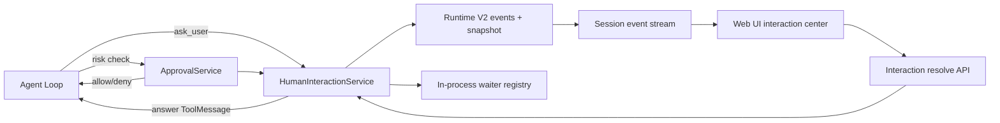

# Ask 工具分析与 SugarAgent 适配方案

## 1. 结论先行

本地两个参考仓库中的 “ask” 实际上是两种不同能力：

1. **Claude Code `AskUserQuestion`**：Agent 在执行过程中主动向用户收集需求、偏好或决策，回答会作为当前 tool call 的结果回注模型，然后继续同一条 ReAct 链路。
2. **OpenClaw `exec.ask`**：高风险命令执行前的人类审批策略，回答是 `allow-once`、`allow-always` 或 `deny`，目标是控制副作用，不是补充任务需求。

SugarAgent 不应把两者合并成一个通用弹窗。推荐形成两个边界清晰、共用底层等待基础设施的子系统：

- `ask_user`：业务问答，答案进入模型上下文。
- `approval`：安全审批，决定工具能否执行，默认失败关闭。
- `HumanInteractionService`：二者共用的持久化请求、状态机、等待器、幂等 resolve、取消、过期和重连恢复能力。

首个可交付版本应优先完成 `ask_user` 的单会话 Web UI 闭环，同时把现有内存审批 Future 改造成“Runtime V2 是事实源、Future 只负责唤醒”的结构。不要先复制 Claude Code 的图片粘贴、Plan Mode 专用入口或 OpenClaw 的跨频道审批转发。

## 2. 分析基线

本文基于以下本地代码：

- OpenClaw：Git `4f00b3b534`，`v2026.3.13-1-1580-g4f00b3b534`。
- Claude Code：`claude-code-main` 本地源码归档，无 Git 元数据。
- SugarAgent：当前工作树，基线提交 `26608d3`；工作树已有其他未提交修改，本文只新增本方案文件。

参考根目录：

- OpenClaw：`OpenClaw/openclaw/`
- Claude Code：`Claude Code/claude-code-main/`
- SugarAgent：当前仓库根目录

## 3. Claude Code 的 AskUserQuestion

### 3.1 工具契约

核心实现位于：

- `src/tools/AskUserQuestionTool/AskUserQuestionTool.tsx`
- `src/tools/AskUserQuestionTool/prompt.ts`
- `src/components/permissions/AskUserQuestionPermissionRequest/`

输入契约的主要特征：

- 一次包含 1 至 4 个问题。
- 每个问题包含 `question`、短 `header`、2 至 4 个 `options` 和 `multiSelect`。
- 每个选项包含短 `label`、解释性 `description`，可选 `preview`。
- UI 自动提供 `Other` 自由输入，模型不得自己生成 `Other`。
- 问题文本在一次调用内唯一；同一问题的 option label 唯一。
- 可附带 `metadata.source` 做来源分析。

输出包含原问题、`answers` 和可选 `annotations`。`annotations` 可以携带被选选项的 preview 以及用户补充 notes。多选答案当前被拼成逗号分隔字符串。

### 3.2 运行链路

`AskUserQuestionTool` 本身不负责读取终端输入。它通过普通工具权限链路声明：

- `requiresUserInteraction() = true`
- `checkPermissions()` 返回 `behavior: "ask"`
- `call()` 只把 UI 已写回 input 的 `answers/annotations` 包装成工具结果
- `mapToolResultToToolResultBlockParam()` 把答案转换为模型可读的 tool result

因此真实链路是：

```text
模型生成 AskUserQuestion tool call
  -> 权限/交互调度器识别 requiresUserInteraction
  -> AskUserQuestionPermissionRequest 渲染问题
  -> 用户选择、自由输入或取消
  -> onAllow(updatedInput) 把 answers 写回工具 input
  -> tool call 返回结构化结果
  -> 结果作为 tool_result 回注模型
  -> Agent 继续执行
```

这是一种对现有“工具调用等待许可”通道的复用：交互 UI 被挂在 permission request 上，但语义仍然是收集答案。

### 3.3 前端体验

Claude Code 的终端 UI 支持：

- 单选和多选。
- 自动 `Other` 输入。
- 多问题标签页、前后导航、统一 Submit。
- 单问题单选后快速提交。
- 选项 preview 的左右对照视图。
- 自由文本、外部编辑器以及图片粘贴。
- “Chat about this”，即不直接回答，而是先与 Agent 澄清。
- Plan Mode 中的“跳过访谈并直接完成计划”。

当启用 Telegram/Discord 等 channels 且无人看守本地 TUI 时，该工具会被禁用，避免无人响应导致挂起。这说明交互工具必须先确认存在可用交互表面。

### 3.4 可借鉴与不应照搬之处

可直接借鉴：

- 问题数量和选项数量设硬上限。
- 单选、多选、自由输入统一为结构化 tool result。
- 推荐项排第一并显式标记。
- 交互是可取消、可中断的等待状态。
- preview 只在确实有比较价值时出现。

不应原样照搬：

- `answers` 以完整问题文本为 key，问题文字调整后不稳定。
- 多选压成逗号字符串，不利于可靠解析。
- 把业务问答挂在 permission 命名空间下，会模糊授权与交互的边界。
- HTML preview 只拒绝 `script/style` 仍不等于安全净化；其源码注释也承认 inline event handler 仍需消费者处理。
- Plan Mode、终端编辑器和图片粘贴是 Claude Code 特有体验，不是 SugarAgent MVP 的必要条件。

## 4. OpenClaw 的 exec.ask

### 4.1 定位

在本次检查的 OpenClaw 核心工具中未发现与 Claude Code 等价的独立 `AskUserQuestion` 工具。OpenClaw 的 `ask` 主要出现在 exec 安全审批体系：

- `docs/tools/exec-approvals.md`
- `src/agents/bash-tools.exec.ts`
- `src/infra/exec-approvals.ts`
- `src/gateway/server-methods/exec-approval.ts`
- `ui/src/ui/controllers/exec-approval.ts`
- `ui/src/ui/views/exec-approval.ts`

Agent 的普通澄清仍可通过对话完成；`exec.ask` 专门决定主机命令是否允许运行。

### 4.2 策略模型

OpenClaw 把 exec 安全拆成多个相互叠加的门：

- `security = deny | allowlist | full`
- `ask = off | on-miss | always`
- `askFallback = deny | allowlist | full`
- 每 Agent 独立 allowlist
- tool policy 与 elevated gating 仍在外层生效

有效策略取配置与主机审批默认值中更严格者。典型语义是：

- `off`：不弹审批；结果仍受 security/allowlist 限制。
- `on-miss`：allowlist 未命中才询问。
- `always`：每次都询问。
- 无可达审批 UI 时使用 `askFallback`，默认 deny。

用户决定不是简单布尔值，而是：

- `allow-once`
- `allow-always`
- `deny`

`allow-always` 会更新对应 Agent 的 allowlist，再执行本次命令。

### 4.3 控制平面与恢复语义

Gateway 接收请求后注册带过期时间的 approval record，广播 `exec.approval.requested`，由 Control UI、macOS App 或已配置聊天频道处理，再通过 `exec.approval.resolve` 解决。

值得借鉴的工程特征：

- 请求有稳定 approval id、创建时间和过期时间。
- 支持 two-phase：先返回 accepted/id，再等待最终 decision。
- 没有可用审批客户端时立即按无路由处理，而不是无限等待。
- resolve 校验 decision，并拒绝未知、过期或有歧义的短 id。
- 请求和解决事件都向 operator clients 广播。
- 审批绑定 canonical argv、cwd、env、可执行路径；脚本内容发生漂移时拒绝执行。
- prompt 包含命令、cwd、Agent、host 和策略元数据。
- 执行结果通过 `Exec running/finished/denied` 系统事件回到会话。

### 4.4 对 SugarAgent 的意义

OpenClaw 的价值不在弹窗样式，而在于它把审批当作控制平面资源：可寻址、可超时、可审计、可由多个交互表面解决，并且与精确执行上下文绑定。

SugarAgent 的 `ask_user` 不需要 OpenClaw 的 allowlist；但它和审批都需要同样可靠的 pending request、resolve 幂等、断线重连和终态事件机制。

## 5. SugarAgent 当前基础与缺口

### 5.1 已有基础

当前仓库已经具备：

- `app/agent_tools.py` 中的 OpenAI function tool schema 和 Python dispatch 字典。
- `app/agent_loop.py` 中 assistant tool call 落盘、工具串并行调度、ToolMessage 回注和下一轮 ReAct。
- `app/tool_approval_gate.py` 中按 `(session_id, approval_id)` 等待的进程内 Future。
- `tool_approval_required` ephemeral SSE。
- `/sessions/{session_id}/tool-approval` allow/deny HTTP 回调。
- 前端 `sse-handling.js` 中的确认 modal。
- interrupt 时拒绝 pending approval。
- Runtime V2 append-only event、snapshot、projector、UI projection 和 stream publisher。
- `app/runtime_v2/permission_manager.py` 中最小的 allow/deny/ask 规则表。

工具审批由中央能力策略触发，覆盖工作区外 Shell、网络、删除、未知副作用、Hook `ask` 以及需要确认的 MCP/Plugin 能力。

### 5.2 关键缺口

1. **没有业务问答工具**：模型只能在最终回答里追问，不能在执行中等待答案后继续同一任务。
2. **审批事实只在内存**：`tool_approval_gate.py` 的 Future 在刷新、断线时还能等，但服务进程重启后丢失。
3. **审批请求只发 ephemeral SSE**：Runtime V2 `CORE_EVENT_TYPES` 没有 approval 或 interaction 终态，snapshot 不能恢复 pending 状态。
4. **决定只有 bool**：没有 `allow-always`、规则更新、过期原因或 resolver 审计。
5. **resolve 未绑定 tool input**：只凭 session id + approval id 命中 Future，没有 input digest、tool_call_id、run_id/version 校验。
6. **前端 modal 不可恢复**：刷新后无法从 snapshot 重新显示；多个 pending 请求也没有队列视图。
7. **`PermissionManager` 未成为主链路事实源**：规则表在内存中，尚未统一 Hook、内置工具和 MCP 的决策。
8. **工具并发需增加交互类**：当前只有 read-only 并行和其他工具串行；`ask_user` 不能被当作普通只读工具并行执行。
9. **新用户消息与 pending ask 的关系未定义**：steer、interrupt、关闭会话或重启时必须关闭未完成 tool call，避免历史中出现悬空 tool call。

## 6. 目标架构



建议新增：

```text
app/
  human_interaction/
    models.py          # request/question/option/answer/decision 数据模型
    service.py         # create/list/resolve/cancel/expire/recover
    waiters.py         # 仅负责当前进程协程唤醒
    validation.py      # schema、状态转换、digest、大小限制
    tool.py            # ask_user schema 与 tool result 格式
  approval/
    service.py         # 风险规则、allow-once/always/deny
    policy.py          # allow/deny/ask、scope、allowlist
```

兼容期可以让 `app/tool_approval_gate.py` 变成上述 service 的薄包装，避免一次性重写 `agent_loop.py`。

## 7. 统一状态模型

### 7.1 两类请求

统一 envelope，语义 payload 分开：

```json
{
  "interaction_id": "uuid",
  "kind": "question | approval",
  "session_id": "...",
  "run_id": "...",
  "tool_call_id": "...",
  "status": "pending | resolved | cancelled | expired",
  "created_at": "...",
  "expires_at": null,
  "request_version": 1,
  "request_digest": "sha256:...",
  "payload": {}
}
```

业务问答的 resolved payload 是结构化 answers；安全审批的 resolved payload 是 decision 和 resolver metadata。不要让 `ask_user` 接受 `allow-always`，也不要把审批结果作为普通用户偏好回注模型。

### 7.2 Runtime V2 事件

新增核心事件：

```text
interaction_requested
interaction_resolved
interaction_cancelled
interaction_expired

approval_requested
approval_resolved
approval_cancelled
approval_expired
approval_policy_changed
```

若希望减少事件类型，也可以统一为 `human_interaction_*` 并以 `kind` 区分；但 UI projection 和安全审计必须继续把 question 与 approval 分开呈现。

Projector 应从事件重建：

```json
{
  "pending_interactions": [],
  "pending_approvals": [],
  "latest_interaction_terminal": {}
}
```

所有状态转换使用 compare-and-set：只有 `pending` 能进入一个终态；重复 resolve 返回原结果，不能二次写事件。

### 7.3 等待与进程重启

- Runtime V2 event log 是事实源。
- Future registry 只负责唤醒当前进程里仍存活的工具协程。
- 创建请求时先落 `*_requested`，再注册/检查 waiter，并发布事件。
- resolve 先校验状态、digest、run/tool call，再原子写终态事件，最后唤醒 waiter。
- 服务重启后 pending 请求仍能在 snapshot/UI 恢复。
- 若原 run 协程已不存在，resolve 后启动一次受控 continuation：为原 `tool_call_id` 追加且只追加一个 ToolMessage，再恢复 ReAct。
- continuation 必须用 operation id 幂等，防止 HTTP 重试产生两个 tool result 或两个新 run。

## 8. ask_user 工具设计

### 8.1 建议 schema

对模型只暴露一个规范名称 `ask_user`，不要同时暴露多个同义工具：

```json
{
  "questions": [
    {
      "header": "短标题",
      "question": "完整问题？",
      "options": [
        {
          "label": "方案 A",
          "description": "选择后的影响",
          "preview": "可选 Markdown 预览"
        }
      ],
      "multi_select": false
    }
  ],
  "metadata": {
    "source": "optional"
  }
}
```

服务端约束：

- `questions`：1 至 4。
- `header`：1 至 12 个可视字符。
- `options`：2 至 4，label 在问题内唯一。
- `label`：建议 1 至 5 个词；`description` 必填。
- `multi_select` 默认 false。
- 不允许模型提供 `Other`；UI 自动添加。
- 问题文本唯一。
- 单次 payload 和 preview 都有字节上限。
- 服务端按 interaction id + question index 生成稳定 `question_id`，按 option index 生成 `option_id`，不使用问题文本作为数据库 key。

推荐项放在第一项，并在 label 末尾标记“（推荐）”。

### 8.2 结构化输出

不要采用 Claude Code 的逗号拼接多选格式。建议返回：

```json
{
  "interaction_id": "...",
  "answers": [
    {
      "question_id": "q1",
      "selected_option_ids": ["q1o1"],
      "selected_labels": ["方案 A"],
      "other_text": null,
      "notes": null
    }
  ]
}
```

ToolMessage 给模型的 content 可以是这段 JSON 加一段短说明，UI 使用完整结构化对象。这样模型可读、程序也不需要从自然语言反解析。

### 8.3 Agent loop 接入

接入点位于 `app/agent_loop.py` 的 `_execute_one_core()` 和工具批次调度：

1. 在 `app/agent_tools.py` 注册 schema；实际等待逻辑交给 `human_interaction/tool.py`。
2. `ask_user` 不加入 `READ_ONLY_TOOLS`，标为 `interactive + serial + interruptible`。
3. 禁止 `ask_user` 与其他工具出现在同一 assistant tool-call batch。原因是用户答案可能改变后续工具参数；若混用，执行层应返回明确 tool error，要求模型单独重试 `ask_user`，不得先执行同批副作用工具。
4. assistant tool call 已按现有流程先进入模型历史，然后才创建 `interaction_requested`。
5. 用户回答后生成普通 ToolMessage，复用现有 checkpoint、落盘、UI tool result 和下一轮模型请求路径。
6. 用户取消时也必须生成终态 tool result，例如 `{"status":"cancelled","reason":"user_cancelled"}`，保证 tool-call/result 配对闭合。
7. session interrupt、steer 替换、归档或 run 终止时，先写 `interaction_cancelled`，再生成/恢复必要的关闭结果，不能只取消 Future。

### 8.4 模型提示词

在 `app/prompt.md` 的 tool contract 增加：

- 能从仓库、环境或安全只读探测中得到的信息，不要问用户。
- 只有答案会实质改变结果时才调用 `ask_user`。
- 合理默认值足够安全时，说明假设并继续。
- 问题必须具体，选项互斥；多选时明确说明。
- 推荐项排第一。
- 不询问“是否继续执行已获授权的普通步骤”。高风险执行交给 approval。
- `ask_user` 必须是该 assistant 消息中唯一 tool call。
- 同一事实不要重复询问。

## 9. 安全审批改造

### 9.1 保留现有语义，升级状态可靠性

现有 `tool_approval_required` 路径先保持行为兼容，但内部改为：

```text
风险识别
  -> ApprovalService.evaluate
  -> allow: 直接执行
  -> deny: 返回拒绝 tool result
  -> ask: 持久化 approval_requested 并等待
```

首期决定可以仍只提供 allow/deny；第二期再加入 `allow-always`。一旦加入 `allow-always`，必须同时实现持久化 policy/allowlist、作用域和撤销入口，不能只在前端多放一个按钮。

### 9.2 请求绑定

每个 approval 至少绑定：

- `session_id`、`run_id`、`tool_call_id`
- `tool_name`
- 规范化后的安全 input preview
- 完整规范化 input 的 SHA-256 digest
- 风险原因、requested scope
- `created_at`、`expires_at`
- policy version

resolve 必须提交 `approval_id`、`request_digest`、decision 和 idempotency key。以下情况拒绝：

- 已终态或过期。
- run 已终止。
- digest/version 不匹配。
- tool call 不再是当前待执行调用。
- resolver 没有 approval scope。

### 9.3 默认策略

- 业务问题无交互表面时可以保持 pending，并在 UI 恢复后继续；可配置较长 timeout。
- 安全审批无交互表面时必须 deny，不能因为当前只有本机单用户就默认 allow。
- interrupt、进程关闭和 session 删除应把 pending approval 终结为 cancelled/denied。
- 日志、事件和 UI preview 继续使用现有敏感信息脱敏函数；digest 基于规范化原始 input 计算，但不落原始 secret。

## 10. HTTP、事件与前端

### 10.1 API

建议新增通用资源 API：

```text
GET  /sessions/{session_id}/interactions?status=pending
POST /sessions/{session_id}/interactions/{interaction_id}/resolve
POST /sessions/{session_id}/interactions/{interaction_id}/cancel

GET  /sessions/{session_id}/approvals?status=pending
POST /sessions/{session_id}/approvals/{approval_id}/resolve
```

兼容期保留 `/sessions/{session_id}/tool-approval`，内部转发到 ApprovalService，并在前端切换完成后废弃。

resolve body 示例：

```json
{
  "request_digest": "sha256:...",
  "request_version": 1,
  "idempotency_key": "client-uuid",
  "answers": []
}
```

### 10.2 前端交互

完整的页面结构、线框、组件、状态机、响应式、可访问性、文案、事件时序和验收设计见 [`ask_tool_frontend_design.md`](ask_tool_frontend_design.md)。本节只保留总体原则。

问答不建议使用现有危险确认 modal。应在消息流内增加可恢复的 interaction card：

- 显示问题 header、正文、选项说明。
- 单选、多选和自动 `Other`。
- 多问题使用小型 tab/步骤条，显示已回答状态。
- 提交前本地校验必答问题。
- pending 时可取消；resolved 后变成只读答案摘要。
- snapshot/历史回放能重建同一张卡，不重复弹 modal。
- 同 session 多个 pending 请求按创建顺序排队，但正常策略应限制同一 run 同时只有一个 ask。

审批继续用高风险视觉样式，但从一次性 modal 升级为队列：

- 展示 tool、风险原因、参数 preview、创建/过期时间。
- allow/deny；实现 policy 后再展示 allow-always。
- resolve 后由 durable event 原位更新，不依赖请求成功后的本地猜测。

### 10.3 Preview 安全

MVP 只支持 Markdown/plain-text preview，复用现有 Markdown 渲染并禁用原始 HTML。若以后支持 HTML：

- 使用成熟 sanitizer 白名单净化。
- 禁止 script、style、iframe、object、embed、form、事件属性和危险 URL scheme。
- 配合 CSP；不能只靠正则检查标签。
- preview 作为不可信模型输出处理。

## 11. 分阶段实施

### Phase 0：统一持久化等待基础设施

- 新增 `HumanInteractionService`、模型、状态机和 waiter registry。
- 增加 interaction/approval Runtime V2 事件与 projector。
- 将现有 `tool_approval_gate.py` 改成 service adapter。
- 现有 HTTP route 和 modal 行为保持不变。

验收：审批期间刷新仍可恢复；服务重启后 pending 可查询；重复 resolve 不产生第二个终态事件。

### Phase 1：ask_user MVP

- 注册 `ask_user` schema。
- 先支持 1 至 4 问、单选、自动 Other；多选可同一期实现，preview 暂用 Markdown。
- 加入 interaction card、resolve/cancel API。
- 回答转为结构化 ToolMessage，继续同一 ReAct run。
- 明确 mixed tool-call batch、interrupt、steer、超时和取消语义。

验收：Agent 在执行中询问，用户回答后继续完成任务；页面刷新不丢问题；取消后模型历史没有悬空 tool call。

### Phase 2：可恢复 continuation 与审批增强

- 服务进程重启后，回答 pending ask 能幂等创建 continuation。
- approval 加 input digest、run/tool call binding 和过期。
- 将 PermissionManager 接入内置工具、Hook 和 MCP 的统一决策入口。
- 实现有作用域的 `allow-always` 与规则撤销。

验收：在 pending ask/approval 时重启服务，恢复 UI 后仍能各自完成一次且只完成一次。

### Phase 3：高级体验与远程表面

- 多问题导航、preview 对照、notes。
- 可选附件；先明确 blob 生命周期和模型多模态支持。
- 与 `remote_control_adaptation_plan.md` 的 approval scope、Direct WS 协议对接。
- 根据真实需求再增加 Telegram/Discord 等 interaction/approval 路由。

## 12. 文件级改造清单

| 文件/模块 | 改造内容 |
|---|---|
| `app/agent_tools.py` | 注册 `ask_user` schema 与 dispatch；保持 schema 上限稳定 |
| `app/agent_loop.py` | interactive 工具分类、独占 batch、等待/取消、ToolMessage 回注、恢复 continuation |
| `app/prompt.md` | 增加何时询问、何时自行探测、问答与审批分离的规则 |
| `app/tool_approval_gate.py` | 降级为 durable service + waiter 的兼容 adapter |
| `app/runtime_v2/event_schema.py` | 新增 interaction/approval 核心事件 |
| `app/runtime_v2/projector.py` | 重建 pending/terminal interaction 与 approval 状态 |
| `app/runtime_v2/ui_projection.py` | 投影可恢复的交互卡和审批卡事件 |
| `app/runtime_v2/gateway.py` | 提供 create/resolve/cancel/list 统一入口或转调 application service |
| `app/webui.py` | 新 API 的薄路由；旧 tool-approval route 兼容转发 |
| `frontend/src/app/modules/sse-handling.js` | 从 ephemeral modal 分支迁移到 durable interaction reducer |
| `frontend/src/app/modules/message-rendering.js` | 渲染 question/approval card 及终态摘要 |
| `frontend/src/app/state/session-event-reducer.js` | 按 interaction id 原位 upsert，处理重放去重 |
| `frontend/src/styles/app.css` | interaction card、选项、多问导航和 approval 风险样式 |
| `tests/` | schema、状态机、loop、API、投影、恢复和前端 dist 同步测试 |

前端源码变更后需要执行 `npm run build`，并用 `npm run verify:dist` 验证 `app/templates/dist` 与源码同步。

## 13. 测试矩阵

### 13.1 Schema 与模型结果

- 0/5 个问题、1/5 个选项、重复问题、重复 label 被拒绝。
- 单选、多选、Other、notes 正确生成结构化 ToolMessage。
- 非法/超大 preview 被拒绝或安全截断。
- `ask_user` 与其他 tool calls 混批时无副作用工具被提前执行。

### 13.2 状态机与幂等

- pending -> resolved/cancelled/expired 各路径。
- resolved 后再次 resolve 返回原终态，不追加事件。
- 同 idempotency key 同 payload 重放成功；不同 payload 冲突。
- 错误 digest、version、session、run、tool_call_id 拒绝。

### 13.3 Run 与恢复

- 正常回答后继续 ReAct。
- 等待时 interrupt、steer、session archive、服务退出。
- 浏览器断开不取消 run；刷新后 card 恢复。
- 服务重启后 resolve 只创建一次 continuation 和一次 ToolMessage。
- pending 问题不被 Runtime V2 health repair 误判为普通 running 卡死，也不能永远保持无 heartbeat 的 active run。

### 13.4 Approval

- 旧版 `run_shell` 范围参数只做 API 兼容，不再构成模型可控制的权限开关；`web_download` 继续由网络策略审批。
- allow、deny、timeout、无 UI fallback。
- Hook/MCP ask 走统一 service。
- 第二期覆盖 allow-always、规则命中、规则撤销和跨 Agent 隔离。

### 13.5 前端

- durable replay 与实时事件对同一 interaction id 只渲染一张卡。
- 多次点击提交只发一个有效 resolve。
- 提交失败恢复可操作状态，不把卡片误标 resolved。
- 切换 session、加载更早历史、断线重连不会把回答提交到错误会话。
- 构建产物同步检查通过。

## 14. 首个开发切片

建议第一批代码只完成以下闭环：

1. 新增 question interaction 的数据模型、Runtime V2 事件和 projector。
2. 新增 `ask_user`，仅支持单选 + Other，且强制独占 tool-call batch。
3. 前端用消息流 card 展示并提交答案。
4. 回答生成结构化 ToolMessage，Agent 继续运行。
5. interrupt/cancel 能闭合 tool call。
6. 把现有 approval 请求同步写入 Runtime V2，但暂不改变 allow/deny UI。

这个切片最早验证真正困难的闭环：tool call 已落模型历史后，如何可靠暂停、跨前端重连收集输入、补齐唯一 ToolMessage 并恢复 ReAct。完成它之后，多选、preview、allow-always 和远程交互都只是沿同一状态机扩展，不需要再发明第二套等待机制。

## 15. 最终建议

- **采用 Claude Code 的结构化业务问答体验**，但改用稳定 question/option id 和数组答案。
- **采用 OpenClaw 的可寻址、可过期、可审计审批控制面**，但不把 exec allowlist 语义塞进业务问答。
- **以 Runtime V2 作为唯一事实源**；内存 Future 只能做当前进程唤醒优化。
- **先实现 Web UI 单表面闭环**，再接 Remote Control 或聊天频道。
- **问答默认可恢复，审批默认失败关闭**。
- **交互工具必须独占 tool-call batch**，防止模型在用户答案未知时预先提交后续副作用参数。
- **所有终态都必须闭合原 tool call**，这是避免历史损坏、恢复重复和下一轮 API 报错的核心不变量。

## 16. 功能开关

在 `app/.env` 中使用统一开关：

```dotenv
ASK_USER_ENABLED=1
```

- `0/false/no/off`：从模型工具列表移除 `ask_user`，服务层同时拒绝创建新问题。
- `1/true/yes/on` 或未配置：允许主 Agent 使用 `ask_user`。
- 开关按次读取，通过高级配置页保存后立即生效。
- 已经创建的 pending 问题仍可回答或取消，避免正在等待的运行悬空。
- 安全审批由 `TOOL_UI_APPROVAL` 独立控制；关闭业务问答不会关闭或绕过高风险操作审批。
