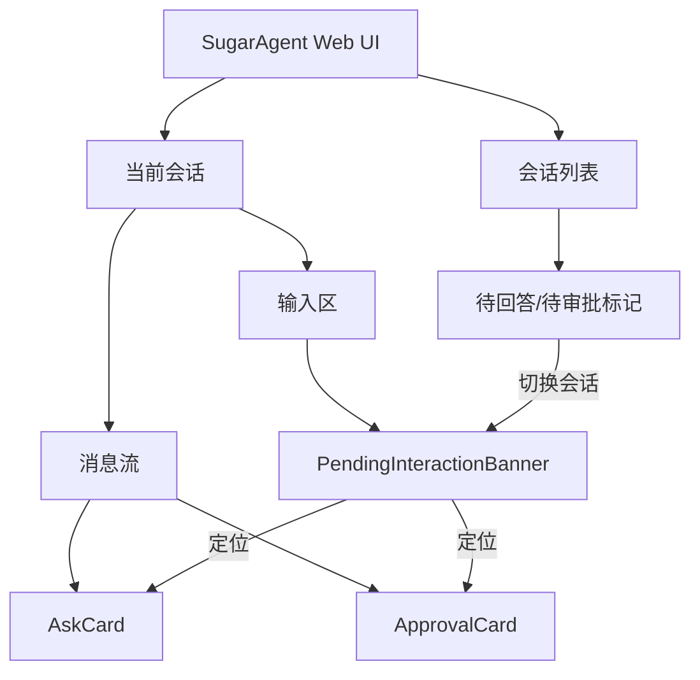
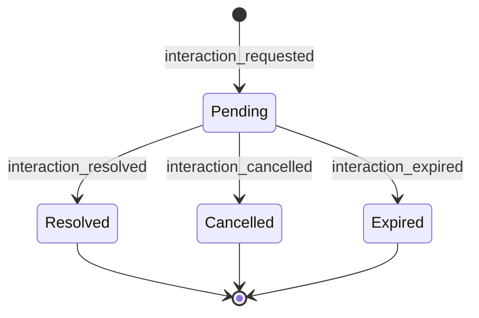
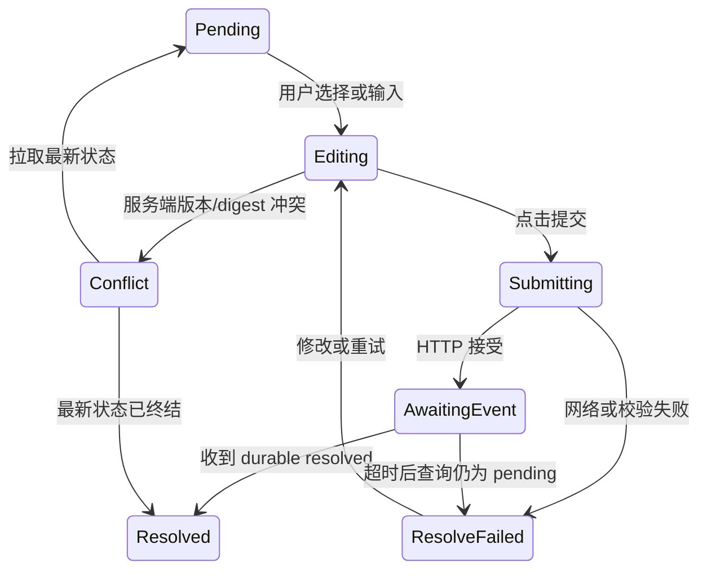
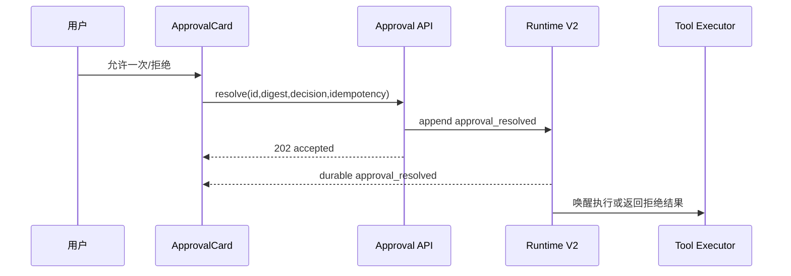

# Ask 与 Approval 前端完整设计

## 1. 设计结论

SugarAgent 的人机交互前端采用“**消息流内持久卡片 + 输入区等待提示 + 会话列表待处理标记**”三层结构：

- 消息流卡片是完整内容和操作的唯一主界面。
- 输入区上方提示条负责把滚出视口的 pending 卡片带回用户视野。
- 会话列表标记负责跨会话提醒。

业务问答和安全审批共用定位、恢复与状态更新机制，但使用不同组件、视觉层级和决定语义：

| 类型 | 主组件 | 主要操作 | 无 UI 时 | 结果去向 |
|---|---|---|---|---|
| `question` | AskCard | 选择、自由输入、提交、取消 | 保持 pending 或按业务超时 | 作为 ToolMessage 回注模型 |
| `approval` | ApprovalCard | 允许一次、拒绝；后续可增加始终允许 | 默认拒绝 | 决定工具是否执行 |

不使用收到事件后自动弹出的不可恢复 modal。Modal 只用于二次确认高影响的“始终允许”或“发送新消息并取消当前问答”等少数操作。

## 2. 范围

### 2.1 本设计覆盖

- 当前 Web UI 桌面端与移动端。
- 单问、多问、单选、多选、Other、补充说明和 Markdown preview。
- Pending、Submitting、Resolved、Cancelled、Expired、Resolve Failed、Conflict 状态。
- 安全审批卡片和后续 `allow-always` 扩展位。
- SSE 实时事件、历史回放、页面刷新、断线重连和服务恢复。
- 跨会话 pending 提醒。
- 键盘、触屏、屏幕阅读器、深浅主题与中英文文案。
- 对现有原生 JavaScript、Vite 构建和 Runtime V2 UI projection 的接入。

### 2.2 首期不覆盖

- 图片或文件附件回答。
- 原始 HTML preview。
- Telegram、Discord、桌面原生端等其他交互表面。
- 多人同时编辑一个回答。
- 审批 allowlist 管理后台。
- Plan Mode 专用访谈页面。

这些能力可以复用同一 interaction id 和状态机扩展，不改变本文的卡片定位与事件模型。

## 3. 设计原则

1. **状态可恢复**：刷新后用户看到的 pending、选择草稿和终态不能依赖一次性 SSE 或 DOM。
2. **问答与审批分离**：问答收集需求，审批控制副作用；文案、颜色和操作不得混淆。
3. **不抢焦点**：新请求到达时只做 `aria-live=polite` 通知和等待提示，不强制把光标从输入框移走。
4. **单一提交事实**：只有服务端 `*_resolved` 事件能把卡片标为已完成；HTTP 200 不能直接成为终态事实。
5. **原位更新**：同一个 `interaction_id` 永远更新同一张卡，历史回放与实时事件不能生成副本。
6. **防误操作**：取消、拒绝和“始终允许”语义明确；Esc、切换会话、关闭页面都不隐式提交。
7. **逐步披露**：默认只展示完成当前决定所需内容，长 preview、技术详情和请求元数据按需展开。
8. **移动优先可用**：320px 宽度下无需横向滚动，操作按钮和选项保持可触达。

## 4. 信息架构



信息层级：

1. 会话列表只显示数量与类型，不展示问题正文或命令。
2. 输入区提示条显示当前会话最优先的一条 pending 请求及“查看”。
3. 消息流卡片展示全部问题、选项、风险信息与操作。
4. 终态卡片保留摘要，成为可审计的会话历史。

## 5. 页面总体布局

现有页面由左侧会话栏、中央消息流、右侧历史栏和底部输入区组成。本设计不新增永久侧栏，避免压缩聊天内容。

### 5.1 桌面端

```text
┌────────────会话列表────────────┬──────────────────当前会话──────────────────┬────历史────┐
│ 新建对话                       │ 消息流                                      │            │
│                               │                                              │            │
│ 架构分析          待回答 1     │ Agent 过程                                  │            │
│ 下载任务          待审批 1     │                                              │            │
│ 普通会话                       │ ┌──────────────────────────────────────────┐ │            │
│                               │ │ Agent 需要你的选择              待回答  │ │            │
│                               │ │ [问题卡完整内容与操作]                    │ │            │
│                               │ └──────────────────────────────────────────┘ │            │
│                               │                                              │            │
│                               ├──────────────────────────────────────────────┤            │
│                               │ Agent 正在等待你的回答            [查看问题] │            │
│                               │ [消息输入………………………………………] [发送] │            │
└───────────────────────────────┴──────────────────────────────────────────────┴────────────┘
```

### 5.2 移动端

```text
┌──────────────────────────────┐
│ 会话标题       待处理 1  菜单 │
├──────────────────────────────┤
│ 消息流                       │
│                              │
│ ┌──────────────────────────┐ │
│ │ Agent 需要你的选择       │ │
│ │ 待回答 · 问题 1/2        │ │
│ │                          │ │
│ │ 选择发布方式？           │ │
│ │ ○ 直接发布               │ │
│ │ ○ 创建草稿               │ │
│ │ ○ Other                  │ │
│ │                          │ │
│ │ [取消]       [下一题]    │ │
│ └──────────────────────────┘ │
│                              │
├──────────────────────────────┤
│ Agent 正在等待回答    [查看] │
│ [消息输入………………] [发送] │
└──────────────────────────────┘
```

移动端隐藏左右侧栏时，在会话标题区域显示“待处理 N”按钮；点击后打开一个轻量列表，列出本机所有会话的 pending 请求。列表项只显示会话标题、`待回答/待审批`、创建时间和“前往”。

## 6. AskCard 设计

### 6.1 单问题单选

```text
┌──────────────────────────────────────────────────────────────┐
│ ◇ Agent 需要你的选择                              待回答     │
│   为了继续实现，需要确定一个方向。                           │
│                                                              │
│ 部署方式                                                     │
│ 你希望使用哪种部署方式？                                     │
│                                                              │
│ ┌──────────────────────────────────────────────────────────┐ │
│ │ ◉ 本机服务（推荐）                                      │ │
│ │   使用当前操作系统的原生服务管理与 Python 环境。          │ │
│ └──────────────────────────────────────────────────────────┘ │
│ ┌──────────────────────────────────────────────────────────┐ │
│ │ ○ 本机进程                                              │ │
│ │   配置更少，但依赖当前机器的 Python 环境。                │ │
│ └──────────────────────────────────────────────────────────┘ │
│ ┌──────────────────────────────────────────────────────────┐ │
│ │ ○ 其他                                                  │ │
│ │   输入不同方案……                                        │ │
│ └──────────────────────────────────────────────────────────┘ │
│                                                              │
│ [＋补充说明]                          [取消] [提交回答]       │
└──────────────────────────────────────────────────────────────┘
```

结构顺序固定：

1. Card header：类型、状态。
2. 可选短说明：为什么需要回答。
3. 问题 header 和正文。
4. 选项组。
5. Other 或 notes 输入。
6. 校验/网络错误。
7. Card footer：次要操作在左，取消与主操作在右。

### 6.2 多问题

```text
┌──────────────────────────────────────────────────────────────┐
│ ◇ Agent 需要你的选择                              待回答     │
│                                                              │
│ [● 部署方式]──[○ 数据库]──[○ 日志]──[✓ 确认]                 │
│    已回答       当前        未回答                            │
│                                                              │
│ 数据库                                                       │
│ 需要使用哪种数据库？                                         │
│                                                              │
│ ○ PostgreSQL                                                │
│ ○ SQLite                                                    │
│ ○ 其他                                                      │
│                                                              │
│ [取消]                         [上一题] [下一题]              │
└──────────────────────────────────────────────────────────────┘
```

规则：

- 问题数为 1 时不显示步骤条。
- 问题数为 2 至 4 时显示步骤条。
- 步骤状态同时使用符号和文字/可访问名称，不能只依赖颜色。
- 用户可以返回已回答问题修改答案。
- “下一题”只校验当前题；最终一步显示所有答案摘要和“提交全部回答”。
- 步骤 header 过长时使用服务端已限制的短 `header`，不使用完整问题正文。
- 320px 下步骤条改为 `问题 2/4 · 数据库`，左右题目使用“上一题/下一题”按钮，不横向滚动 tab。

### 6.3 多选

- 使用原生 checkbox 语义。
- 题目旁显示“可多选”。
- 选择顺序不参与业务语义；提交按 option 原始顺序输出。
- 至少选择一项；若只选择 Other，则 Other 文本必填。
- 多选选项之间不得呈现单选互斥视觉。

### 6.4 Other

- 每题自动追加“其他”选项，模型 payload 不包含它。
- 单选选择 Other 后，在该选项内部展开 textarea。
- 多选勾选 Other 后展开 textarea；取消勾选时保留当前页内草稿，但提交时不发送。
- 空白字符串视为未回答。
- textarea 初始 2 行，允许垂直增长到 8 行，之后内部滚动。
- 文案为“请输入你的答案”，不使用含义不明的“自定义”。

### 6.5 补充说明

“补充说明”不是一个新用户消息，而是当前问题的 `notes`：

- 点击后在选项下展开 textarea。
- 可以与标准选项一起提交。
- 用于补充限制、背景或偏好。
- 若用户真正想改变任务或打断等待，仍通过底部普通输入框发送新消息。

这样可以覆盖 Claude Code 的“Chat about this”大部分实际用途，同时不引入第二条并行对话链。

### 6.6 Preview

桌面宽屏：

```text
┌──────────────────────────────────────────────────────────────┐
│ 你更喜欢哪个页面布局？                                       │
│                                                              │
│ ┌────────────选项───────────┐ ┌────────────预览────────────┐ │
│ │ ◉ 左侧导航（推荐）        │ │ Dashboard                 │ │
│ │ ○ 顶部导航                │ │ ┌──────┬────────────────┐ │ │
│ │ ○ 极简布局                │ │ │ Nav  │ Main           │ │ │
│ │ ○ 其他                    │ │ └──────┴────────────────┘ │ │
│ └───────────────────────────┘ └────────────────────────────┘ │
└──────────────────────────────────────────────────────────────┘
```

规则：

- Preview 只支持 Markdown/plain text，禁用 raw HTML。
- 选项获得焦点或被选择时更新 preview；触屏以选择为准。
- 初始展示首个推荐项或首个带 preview 的选项。
- Preview 没有内容时显示“此选项没有预览”，不保留空白面板。
- 超过 24 行时折叠，显示“展开完整预览”；展开不改变选择。
- 小于 900px 时 preview 堆叠到选项下方。
- 多选首期不显示组合 preview，避免定义多个 preview 的合并语义。

### 6.7 确认页

多问题最后一步使用只读摘要：

```text
部署方式   本机服务（推荐）
数据库     PostgreSQL
日志       文件、控制台
补充说明   日志保留 30 天

[返回修改]                                  [提交全部回答]
```

不重复 option description，避免确认页过长；Other 和 notes 完整展示。长文本超过 3 行时默认折叠并可展开。

## 7. ApprovalCard 设计

### 7.1 基础审批

```text
┌──────────────────────────────────────────────────────────────┐
│ ⚠ 需要安全确认                                     待审批    │
│   该操作可能访问工作区之外的文件。                           │
│                                                              │
│ 工具      run_shell                                         │
│ 目录      D:\AI\AI Agent                                    │
│ 命令      python install.py --system                         │
│                                                              │
│ 风险      工作区外执行 · 可能修改系统环境                    │
│ [查看完整参数]                                               │
│                                                              │
│ [拒绝]                                      [允许执行一次]   │
└──────────────────────────────────────────────────────────────┘
```

设计规则：

- 使用 warning 图标、`需要安全确认` 标题和“待审批”状态，不使用问答的菱形图标。
- 工具、目录、命令使用等宽字体；长命令先显示头尾摘要。
- 默认展开风险原因，参数详情折叠。
- “拒绝”为明确按钮，不隐藏在取消/关闭图标中。
- 首期主操作只有“允许执行一次”。
- 请求过期时间少于 60 秒时显示“将在 42 秒后自动拒绝”，并用文本而非只用颜色提示。

### 7.2 始终允许

第二期加入 `allow-always` 时，不与“允许一次”做两个同权主按钮。建议：

- 主按钮：“允许执行一次”。
- 次级菜单：“更多操作” -> “始终允许此规则”。
- 点击后打开二次确认 modal，展示将持久化的规范化 rule、作用域、Agent 和撤销入口。
- Modal 主按钮文案为“保存规则并执行”，不能只写“确定”。

如果后端不能给出精确 rule preview，则不展示 `allow-always`。

### 7.3 问答与审批视觉区别

| 元素 | AskCard | ApprovalCard |
|---|---|---|
| 图标 | 菱形/对话 | 警告三角 |
| 状态词 | 待回答 | 待审批 |
| 主色 | 现有 accent | amber/warning |
| 主按钮 | 提交回答 | 允许执行一次 |
| 取消按钮 | 取消回答 | 拒绝 |
| 终态 | 已回答/已取消 | 已允许/已拒绝/已过期 |
| 数据展示 | 问题与选项 | 工具、命令、cwd、风险 |

颜色之外始终同时显示图标与状态文字。

## 8. 输入区等待提示

现有 `subagent-continue-banner` 位于输入区上方。新增独立的 `pending-interaction-banner`，二者通过统一 banner stack 排列，不相互覆盖。

### 8.1 当前会话只有一条 pending

```text
◇ Agent 正在等待你的回答：部署方式                         [查看]
```

或：

```text
⚠ 有一项操作等待安全确认                                  [查看]
```

点击“查看”：

1. 滚动到对应 card。
2. 若卡片折叠则展开。
3. 将焦点放到卡片标题或第一个可操作控件。

### 8.2 当前会话多条 pending

正常 Agent loop 应限制同一 run 只有一条交互等待，但恢复或未来并发 run 可能出现多条。此时显示：

```text
当前会话有 2 项待处理                                      [查看全部]
```

点击后在 banner 下展开小列表，按 `approval` 优先、再按创建时间排序。列表不使用 modal。

### 8.3 输入框发送新消息

Pending ask 时输入框保持可用，因为用户仍有权 steer 或中断任务。发送前规则：

- 输入为空：不处理。
- 仍有 pending ask：显示确认 modal：
  - 标题：“发送新消息并取消当前问题？”
  - 正文：“Agent 正在等待你的回答。发送新消息会取消当前问题，并把新消息作为运行中追问处理。”
  - 次按钮：“返回回答问题”
  - 主按钮：“取消问题并发送”
- Pending approval 时发送普通消息不自动允许或拒绝审批；消息按现有 steer 规则处理，审批由 run interrupt/cancel 事件终结。

切换会话、滚动、刷新或关闭浏览器不触发取消。

## 9. 会话列表与全局待处理入口

### 9.1 会话条目

会话条目右侧增加紧凑 badge：

- `待回答`：question pending。
- `待审批`：approval pending。
- 两者同时存在：`待处理 2`。

Badge 只显示非零状态。排序规则不自动把会话置顶，避免列表跳动；可在现有 unread 指示器旁显示。

### 9.2 当前会话之外的新请求

- 不自动切换会话。
- 更新该会话 badge。
- 可使用现有 toast host 显示一次 `“会话「部署脚本」正在等待安全确认”`。
- Toast 点击切换到会话并定位卡片。
- 相同 interaction id 的重放不能重复 toast。

### 9.3 移动端全局入口

在移动端会话标题区显示 `待处理 N`。展开列表结构：

```text
待处理
部署脚本      待审批 · 刚刚                    [前往]
架构分析      待回答 · 3 分钟前                 [前往]
```

这里只做导航，不在跨会话列表中直接提交决定，避免上下文不足导致误操作。

## 10. 卡片状态

### 10.1 服务端生命周期



服务端终态不可逆。重复事件只能更新相同版本的显示信息，不得让终态回到 pending。

### 10.2 前端提交子状态



前端局部状态不写入 Runtime V2：

- `editing`、`submitting`、`awaiting_event`、`resolve_failed` 是客户端状态。
- `pending/resolved/cancelled/expired` 是服务端状态。

### 10.3 各状态呈现

| 状态 | 控件 | 状态文案 | 行为 |
|---|---|---|---|
| Pending | 可操作 | 待回答/待审批 | 允许编辑、提交、取消/拒绝 |
| Editing | 可操作 | 待回答 | 保留草稿 |
| Submitting | 禁用 | 正在提交… | 按钮显示进度，禁止重复提交 |
| AwaitingEvent | 禁用 | 正在确认… | 等 durable event；超时查询状态 |
| ResolveFailed | 可操作 | 提交失败 | 保留草稿，显示“重试” |
| Conflict | 暂停操作 | 状态已变化 | 拉取最新 snapshot 后恢复 |
| Resolved | 只读 | 已回答/已允许/已拒绝 | 显示摘要、时间 |
| Cancelled | 只读 | 已取消 | 显示原因，不显示可操作控件 |
| Expired | 只读 | 已过期 | 审批显示“未执行”，问答显示“未回答” |

## 11. 草稿与恢复

### 11.1 草稿保存

用户尚未提交的选择保存在浏览器 `sessionStorage`，key 为：

```text
sugaragent.interaction-draft:{session_id}:{interaction_id}:{request_version}
```

保存内容：

- 当前问题索引。
- 每题 selected option ids。
- Other 文本。
- Notes 文本。
- 最后修改时间。

不保存 approval 决定，不保存完整命令或敏感参数。

### 11.2 草稿失效

以下情况删除草稿：

- 收到任何服务端终态。
- `request_version` 改变。
- request digest 不匹配。
- 会话删除。
- 草稿超过 7 天。

恢复草稿后显示小字“已恢复未提交的回答”，不自动提交。

### 11.3 多标签页

多个浏览器标签页可以同时看到 pending，但只有一个 resolve 成功：

- 第一个终态事件生效。
- 其他标签收到 terminal event 后立即切为只读。
- 如果另一标签仍在 Submitting，终态事件优先，HTTP 冲突不再显示错误。

## 12. 数据模型

### 12.1 前端标准化记录

```js
{
  id: 'interaction-id',
  kind: 'question',
  sessionId: 'session-id',
  runId: 'run-id',
  toolCallId: 'tool-call-id',
  status: 'pending',
  requestVersion: 1,
  requestDigest: 'sha256:...',
  createdAt: '2026-07-17T00:00:00Z',
  expiresAt: null,
  payload: {
    questions: [],
    context: ''
  },
  resolution: null,
  runtimeSeq: 123,
  eventIndex: 45
}
```

### 12.2 Store

新增 `frontend/src/app/state/interaction-store.js`：

```js
const interactionStore = {
    byId: new Map(),
    idsBySession: new Map(),
    pendingCountsBySession: new Map(),
    clientStateById: new Map(),
    liveToastSeen: new Set(),
};
```

必须提供纯函数或稳定入口：

- `normalizeInteractionEvent(event)`
- `upsertInteraction(record)`
- `applyInteractionTerminal(event)`
- `getInteraction(id)`
- `listSessionInteractions(sessionId, status)`
- `getSessionPendingCounts(sessionId)`
- `setInteractionClientState(id, patch)`
- `clearInteractionDraft(id)`

状态索引按 id 更新，不能扫描 DOM 推断事实。

### 12.3 DOM identity

```html
<article
  class="msg-wrap msg-wrap--assistant msg-wrap--interaction"
  data-interaction-id="..."
  data-interaction-kind="question"
  data-interaction-status="pending"
  data-runtime-seq="123"
  data-event-index="45">
</article>
```

同 id 的事件先更新 store，再调用 `renderOrUpdateInteractionCard()`。渲染函数必须查找 `data-interaction-id` 并原位更新；找不到时才插入。

## 13. 事件处理

### 13.1 前端消费事件

```text
interaction_requested
interaction_resolved
interaction_cancelled
interaction_expired
approval_requested
approval_resolved
approval_cancelled
approval_expired
```

如果后端最终统一为 `human_interaction_*`，前端 normalize 层把 `kind` 分流，组件层不关心原始事件命名。

### 13.2 Reducer 顺序

```text
收到事件
  -> normalize
  -> interactionStore upsert/CAS
  -> session pending count
  -> 当前 session card 原位渲染
  -> 输入区 banner 更新
  -> 会话列表 badge 更新
  -> 非当前 session 且首次 live requested 时 toast
```

历史回放使用同一 reducer，但 `source=history` 时不 toast、不抢焦点、不自动滚动。

### 13.3 插入位置

- `requested` 事件首次出现时，在对应 assistant tool-call 所在 process group 之后插入 card。
- 若无法定位 tool call，则按 event index 插入消息流正常位置。
- terminal event 不新增消息行。
- 若 terminal 先于 requested 被加载，projected payload 必须带足够的 request summary，前端创建终态卡；稍后 requested 到达只能补全内容，不能回到 pending。

## 14. API 与提交时序

### 14.1 问答提交

```mermaid
sequenceDiagram
    participant U as 用户
    participant UI as AskCard
    participant API as Interaction API
    participant RT as Runtime V2
    participant LOOP as Agent Loop

    U->>UI: 选择答案并提交
    UI->>UI: 本地校验，进入 Submitting
    UI->>API: resolve(id,digest,version,idempotency,answers)
    API->>RT: append interaction_resolved
    API-->>UI: 202 accepted
    UI->>UI: AwaitingEvent
    RT-->>UI: durable interaction_resolved
    UI->>UI: 原位更新为“已回答”
    RT->>LOOP: 唤醒 waiter/continuation
    LOOP->>LOOP: 追加唯一 ToolMessage 并继续 ReAct
```

### 14.2 HTTP 成功但事件延迟

- HTTP 202 后按钮显示“正在确认…”。
- 3 秒未收到事件：通过现有 session snapshot 或 interaction GET 查询。
- 查询为 resolved：用查询结果更新 store，等待后续事件去重。
- 查询仍 pending：恢复可操作并提示“尚未确认，请重试”。
- 查询失败：保留草稿和重试入口。

### 14.3 审批



审批过期倒计时只用于显示；真正过期以服务端事件为准。客户端计时归零后先禁用按钮并查询状态，不能自行标记 expired。

## 15. 组件与模块设计

### 15.1 组件树

```text
InteractionCardHost
├─ AskCard
│  ├─ InteractionHeader
│  ├─ QuestionStepper
│  ├─ QuestionPanel
│  │  ├─ OptionGroup
│  │  │  ├─ SingleOption
│  │  │  ├─ MultiOption
│  │  │  └─ OtherOption
│  │  ├─ NotesField
│  │  └─ PreviewPanel
│  ├─ AnswerReview
│  ├─ InlineError
│  └─ InteractionActions
└─ ApprovalCard
   ├─ InteractionHeader
   ├─ RiskSummary
   ├─ CommandPreview
   ├─ ApprovalDetails
   ├─ InlineError
   └─ ApprovalActions

PendingInteractionBanner
SessionPendingBadge
MobilePendingList
```

当前前端不使用组件框架，因此上面的“组件”实现为小型 DOM builder/update 函数，不引入 React/Vue。

### 15.2 建议文件

```text
frontend/src/app/
  state/
    interaction-store.js
  modules/
    interaction-normalize.js
    interaction-rendering.js
    interaction-actions.js
    interaction-drafts.js
```

职责：

- `interaction-store.js`：规范化状态、索引、CAS 和 pending count。
- `interaction-normalize.js`：兼容 Runtime V2/UI projection 字段命名。
- `interaction-rendering.js`：card、banner、badge、移动列表 DOM。
- `interaction-actions.js`：校验、resolve/cancel fetch、idempotency、冲突恢复。
- `interaction-drafts.js`：sessionStorage 草稿版本和清理。

### 15.3 加载顺序

`frontend/src/app/index.js` 当前把 `?raw` 源码拼接后执行。新增顺序建议：

```text
session-store
interaction-store
session-event-reducer
message-rendering
interaction-normalize
interaction-rendering
interaction-drafts
interaction-actions
event-dispatch
sse-handling
```

`session-event-reducer` 只能调用已加载的 store；`event-dispatch` 需要已加载的 renderer；`sse-handling` 只负责接收，不再直接弹 approval modal。

### 15.4 现有文件改动

| 文件 | 改动 |
|---|---|
| `shell-body.html` | 增加 banner stack 和移动端 pending 入口容器 |
| `session-event-reducer.js` | interaction/approval 事件进入 store、更新 counts |
| `event-dispatch.js` | 调用 `renderOrUpdateInteractionCard` |
| `sse-handling.js` | 删除 `tool_approval_required` 即时 modal 主路径，统一交给 reducer |
| `session-renderers.js` | 渲染会话 pending badge |
| `message-rendering.js` | 提供按 event index/tool call 定位的插入 helper；不把完整 card 继续塞进此大文件 |
| `shared-state-and-dialogs.js` | 仅复用危险操作二次确认 modal |
| `i18n.js` | 新增 Ask/Approval 文案 key |
| `app.css` | 新增 interaction 命名空间样式与响应式规则 |

## 16. 表单校验

### 16.1 客户端

- 每个可见必答问题必须有有效答案。
- 单选只能提交一个 option id 或 Other。
- 多选至少一项，去重并按原 option 顺序提交。
- 选择 Other 时文本 trim 后非空。
- `notes` 可空。
- option/question id 必须来自当前 request，不能由 DOM 任意值构造。
- 提交时带当前 digest/version。

### 16.2 错误位置

- 问题级错误放在题目选项下方，并通过 `aria-describedby` 关联。
- 请求级错误放在 footer 上方。
- 提交失败不能使用只出现几秒的 toast 作为唯一提示。
- 校验失败后把焦点移到第一个错误问题标题/控件。

### 16.3 错误文案

- “请选择一个选项。”
- “请至少选择一个选项。”
- “请输入其他答案。”
- “回答未能提交，请重试。”
- “问题已在其他窗口处理，正在加载最新状态。”
- “请求内容已更新，请重新确认后提交。”

## 17. 视觉规范

### 17.1 沿用现有设计系统

复用现有变量：

- Surface：`--surface-glass2`、`--bot-bubble`
- Border：`--border-glass`、`--border-accent`
- Text：`--text-primary/secondary/tertiary`
- Accent：`--accent-1/2/3`
- Functional：`--green-accent`、`--red-accent`、`--amber-accent`
- Radius：`--radius-sm/md/lg`
- Font：`--sans`、`--mono`

新增语义变量应由现有变量派生，不为深浅主题分别散落硬编码颜色：

```css
--interaction-bg: var(--bot-bubble);
--interaction-border: var(--border-accent);
--interaction-option-bg: var(--surface-glass3);
--interaction-selected: var(--accent-1);
--interaction-success: var(--green-accent);
--interaction-warning: var(--amber-accent);
--interaction-danger: var(--red-accent);
```

### 17.2 CSS 命名

统一前缀，避免与现有 message/tool 样式冲突：

```text
.interaction-card
.interaction-card--question
.interaction-card--approval
.interaction-card--pending
.interaction-card--terminal
.interaction-header
.interaction-status
.interaction-stepper
.interaction-question
.interaction-option
.interaction-option.is-selected
.interaction-other
.interaction-preview
.interaction-actions
.interaction-error
.pending-interaction-banner
.session-pending-badge
```

### 17.3 尺寸

- Card：`width: min(100%, 52rem)`，跟随 assistant message 左对齐。
- Card padding：桌面 1rem，移动 0.75rem。
- 选项最小点击高度：44px。
- 按钮最小高度：40px；移动端主按钮 44px。
- 问题之间不同时展开，避免超长页面。
- Preview 桌面最大可见高度约 24 行，之后折叠。

### 17.4 动效

- 新卡片使用现有 `msgEnt` 短入场。
- 状态更新只做 150–200ms 背景/边框过渡，不做循环闪烁。
- Submitting spinner 尊重 `prefers-reduced-motion`。
- 历史回放不播放入场动画。

## 18. 响应式规则

| 宽度 | 布局 |
|---|---|
| `>= 900px` | Card 完整宽度；preview 左右双栏；footer 单行 |
| `561–899px` | Preview 上下堆叠；步骤条可压缩；footer 可换行 |
| `<= 560px` | `问题 n/m` 替代完整 stepper；按钮 2 列或主按钮整行；详情表改为 label/value 上下布局 |
| `<= 360px` | 操作纵向排列；取消/拒绝在主按钮下方；长 header 两行截断 |

禁止：

- 整张卡横向滚动。
- 固定像素宽度导致 320px 溢出。
- 移动端把命令详情缩成不可读小字。
- Footer 按钮只显示图标。

## 19. 可访问性

### 19.1 语义

- Card 使用 `<article>`，标题使用 `<h3>`。
- 单选使用 `<fieldset><legend>` + 原生 radio。
- 多选使用原生 checkbox。
- Other/notes 使用 `<label>` 关联 textarea。
- 状态 badge 是文本，不只用伪元素。
- Preview 使用 `<section aria-labelledby>`。
- 错误区域使用 `role="alert"`。
- Pending banner 使用 `role="status" aria-live="polite"`。

### 19.2 焦点

- 新事件不自动抢焦点。
- 点击“查看”后滚动并聚焦 card 标题。
- 提交成功后焦点回到终态 card 标题或消息输入框，选择其一并保持一致；建议回到终态标题，让屏幕阅读器先读出“已回答”。
- 卡片更新 DOM 时尽量保留当前焦点元素；不能整卡无条件 `innerHTML` 重建。
- Modal 继续使用现有焦点圈定与返回焦点机制。

### 19.3 键盘

- Tab/Shift+Tab 按 DOM 顺序导航。
- Radio 使用浏览器方向键行为。
- Checkbox 使用 Space。
- `Ctrl+Enter`/`Cmd+Enter` 提交当前题或全部回答。
- Textarea 中 Enter 换行。
- Esc 不取消请求，防止误触。

### 19.4 对比与缩放

- 深浅主题均满足正文和控件可读性。
- 200% 浏览器缩放下无横向页面滚动。
- Selected、error、warning 同时使用边框/图标/文字，不仅依赖颜色。

## 20. 国际化文案

所有文案进入 `i18n.js`，不要散落在 renderer。

| Key | 中文 | English |
|---|---|---|
| `interaction.ask.title` | Agent 需要你的选择 | Agent needs your input |
| `interaction.ask.pending` | 待回答 | Waiting for answer |
| `interaction.ask.submit` | 提交回答 | Submit answer |
| `interaction.ask.submitAll` | 提交全部回答 | Submit all answers |
| `interaction.ask.cancel` | 取消回答 | Cancel question |
| `interaction.ask.other` | 其他 | Other |
| `interaction.ask.otherPlaceholder` | 请输入你的答案 | Enter your answer |
| `interaction.ask.notes` | 补充说明 | Add context |
| `interaction.ask.review` | 确认回答 | Review answers |
| `interaction.ask.resolved` | 已回答 | Answered |
| `interaction.ask.cancelled` | 已取消 | Cancelled |
| `interaction.ask.expired` | 已过期 · 未回答 | Expired · Not answered |
| `interaction.approval.title` | 需要安全确认 | Security approval required |
| `interaction.approval.pending` | 待审批 | Waiting for approval |
| `interaction.approval.allowOnce` | 允许执行一次 | Allow once |
| `interaction.approval.deny` | 拒绝 | Deny |
| `interaction.approval.allowAlways` | 始终允许此规则 | Always allow this rule |
| `interaction.approval.allowed` | 已允许 | Allowed |
| `interaction.approval.denied` | 已拒绝 · 未执行 | Denied · Not executed |
| `interaction.approval.expired` | 已过期 · 未执行 | Expired · Not executed |
| `interaction.banner.answer` | Agent 正在等待你的回答 | Agent is waiting for your answer |
| `interaction.banner.approval` | 有一项操作等待安全确认 | An action needs security approval |
| `interaction.action.view` | 查看 | View |
| `interaction.action.retry` | 重试 | Retry |
| `interaction.status.submitting` | 正在提交… | Submitting… |
| `interaction.status.confirming` | 正在确认… | Confirming… |
| `interaction.error.submit` | 回答未能提交，请重试。 | The answer could not be submitted. Try again. |

命令、工具名、option label 和用户输入不翻译。

## 21. 安全与隐私

- Session badge、toast 和移动 pending 列表不显示命令全文或问题中的潜在敏感数据。
- Approval details 使用后端已脱敏 preview，前端不自行读取完整 tool input。
- `request_digest` 只用于绑定，不展示给普通用户；调试详情可显示前 8 位。
- Draft 不保存 approval decision、命令、环境变量或 secret。
- Markdown preview 禁用 raw HTML、危险链接协议和自动远程资源加载。
- 外部链接复用现有新标签页与安全属性处理。
- “始终允许”必须显示准确 rule 和 scope；不能用自然语言概括代替后端规范化规则。

## 22. 异常与边界场景

### 22.1 请求到达时用户不在当前会话

只更新 badge 和一次 toast，不切换页面、不响铃、不抢焦点。

### 22.2 请求到达时用户正在滚动历史

不强制滚到底部。Banner 更新并显示“查看”；现有 follow-scroll 规则保持不变。

### 22.3 页面刷新

先用 snapshot 渲染 pending card，再连接流补事件。若 live event 与 snapshot 重复，按 id/version 去重。

### 22.4 SSE 断开

卡片保持当前状态并显示非阻塞的连接状态；提交 API 成功但无事件时走状态查询。连接恢复后 durable event 修正最终状态。

### 22.5 服务重启

Pending card 从 Runtime V2 恢复。若回答触发 recovery continuation，前端仍只显示同一 interaction 的 resolved 终态；新的 run 状态按现有 run 事件展示。

### 22.6 请求在其他端完成

立即切只读，并显示“已在其他窗口处理”；不把本地未提交草稿覆盖进终态。

### 22.7 问题 payload 无效

不渲染损坏表单。显示只读错误卡：

```text
无法显示 Agent 的问题
问题格式无效，已通知运行时重新生成。
```

后端应同时给模型一个 tool error 以重试；前端不能自行猜选项。

### 22.8 Approval 无可用路由

若服务端立即 fallback deny，前端只显示终态“已拒绝 · 没有可用审批通道”，不短暂展示可点的 pending card。

### 22.9 会话归档或删除

- 归档前有 pending 时进行明确确认。
- 删除后清理 store、DOM、draft 和 badge。
- 不允许在归档只读会话中 resolve；先由服务端决定是否仍可处理。

## 23. 性能

- Store 更新按 interaction id O(1)。
- 只有当前可见会话渲染完整 card；其他会话只更新 count。
- 历史终态卡可以 `content-visibility:auto`。
- Preview Markdown 只在当前问题且展开时渲染。
- 倒计时使用一个全局 1 秒 ticker，只更新临近过期的可见审批，不为每卡创建 interval。
- 终态事件原位 patch 必要节点，避免整条消息流重绘。
- 大 preview 由后端限制，前端再次设最大字符数并显示截断标记。

## 24. 测试设计

### 24.1 纯状态测试

- requested -> pending count +1。
- resolved/cancelled/expired -> count -1，重复终态不再变化。
- terminal-before-request 不回退到 pending。
- 同 id 低版本事件被忽略。
- 当前/非当前 session 索引隔离。
- 多标签 resolve 冲突收敛到同一终态。

### 24.2 DOM 测试

- 单选、多选、Other、notes、确认页。
- 同 id 事件原位更新，DOM 只有一张卡。
- 更新不丢当前焦点。
- 历史 source 不 toast、不自动滚动。
- 错误与控件正确 `aria-describedby`。
- Preview 响应选择与 focus。
- 320、560、900px 无横向溢出。

### 24.3 API 测试

- resolve body 含 digest/version/idempotency。
- 202 后等待 durable event。
- 网络失败保留草稿。
- 409/412 拉取最新状态。
- 重复点击只发一个在途请求。
- cancel/deny 和普通发送互不混淆。

### 24.4 恢复测试

- Pending 时刷新。
- Submitting 时刷新。
- HTTP 成功但事件丢失。
- SSE 断线、恢复和事件重放。
- 服务重启后 pending -> resolved -> continuation。
- 从另一个会话或标签页解决。

### 24.5 可访问性测试

- 仅键盘完成单问和多问。
- 屏幕阅读器能读标题、状态、问题、选项说明和错误。
- 200% 缩放。
- 深浅主题高对比检查。
- Reduced motion。

前端当前无独立测试框架。实施时建议：

- Store/reducer 使用 Node 内置 test runner 做无 DOM 单测。
- Renderer 使用 Vitest + happy-dom/jsdom，或现有项目可接受的浏览器测试工具。
- Python 继续覆盖 API、Runtime V2 projection 和幂等恢复。
- 每次执行 `npm run build` 与 `npm run verify:dist`。

## 25. 埋点与诊断

只记录行为和时延，不记录问题正文、option 文本、用户答案或命令：

- `interaction_card_viewed`
- `interaction_submit_started`
- `interaction_submit_succeeded`
- `interaction_submit_failed`
- `interaction_cancelled`
- `approval_allowed_once`
- `approval_denied`
- `interaction_recovered_after_refresh`

建议字段：kind、question_count、option_count、has_other、has_preview、latency_ms、source、error_code。默认本地日志即可，不要求外部遥测。

## 26. 实施顺序

### Frontend Phase A：只读恢复

- 增加 interaction store、normalize 和终态/待处理 card renderer。
- 从 Runtime V2 snapshot/history 渲染。
- 会话 badge 和输入区 banner 可工作。
- 现有 approval modal 暂时保留为兼容路径。

验收：刷新和重放没有重复卡，pending count 准确。

### Frontend Phase B：Ask 可操作闭环

- 单选、Other、提交、取消。
- Client submitting/awaiting/error 状态。
- Durable resolved 原位更新。
- 草稿恢复、普通输入框冲突确认。

验收：完整回答后 Agent 继续；网络失败不丢回答。

### Frontend Phase C：完整问答体验

- 多问题、多选、notes、确认页和 preview。
- 响应式、键盘和 a11y 完整验证。
- 移动端 pending 入口。

### Frontend Phase D：审批迁移

- ApprovalCard 取代即时 modal。
- 过期、拒绝、允许一次、无路由终态。
- 后端规则系统完成后再增加 allow-always。

## 27. Definition of Done

前端功能只有同时满足以下条件才算完成：

- Question 和 approval 使用不同组件与明确语义。
- 所有 pending/terminal 状态能从 Runtime V2 snapshot/history 恢复。
- 相同 interaction id 在实时、重放、轮询下只出现一张卡。
- HTTP 成功不会提前把卡片标为终态。
- 单选、多选、Other、notes、多问题和 preview 均有定义明确的提交格式。
- Pending 时刷新、切会话、SSE 断线、服务重启和多标签页均有可验证行为。
- 320px、桌面宽屏、深色、浅色和 200% 缩放通过。
- 仅键盘可完成问答和审批。
- Approval 无 UI 时保持默认拒绝，前端不能绕过。
- 普通输入框发送不会悄悄吞掉 pending ask。
- 源码构建和 `app/templates/dist` 同步检查通过。
- 关键 reducer、API、DOM、恢复和可访问性测试通过。

## 28. 推荐的首张实现卡片

第一张实现卡片只做“单问题单选 + Other”的完整质量闭环：

```text
AskCard
├─ Header：Agent 需要你的选择 / 待回答
├─ Question：header + question
├─ Radio options
├─ Other textarea
├─ Inline error
└─ Footer：取消回答 / 提交回答
```

同时必须完成：

- interaction store。
- `interaction_id` 原位 upsert。
- pending banner。
- session badge。
- Submitting/AwaitingEvent/ResolveFailed。
- durable terminal event。
- 刷新草稿恢复。
- interrupt/cancel 终态。
- 320px、键盘和深浅主题。

不要把多选和 preview 提前于这组可靠性能力。首张卡片稳定后，剩余功能都是同一组件和状态机上的增量扩展。
