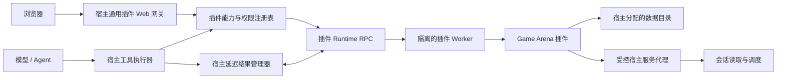
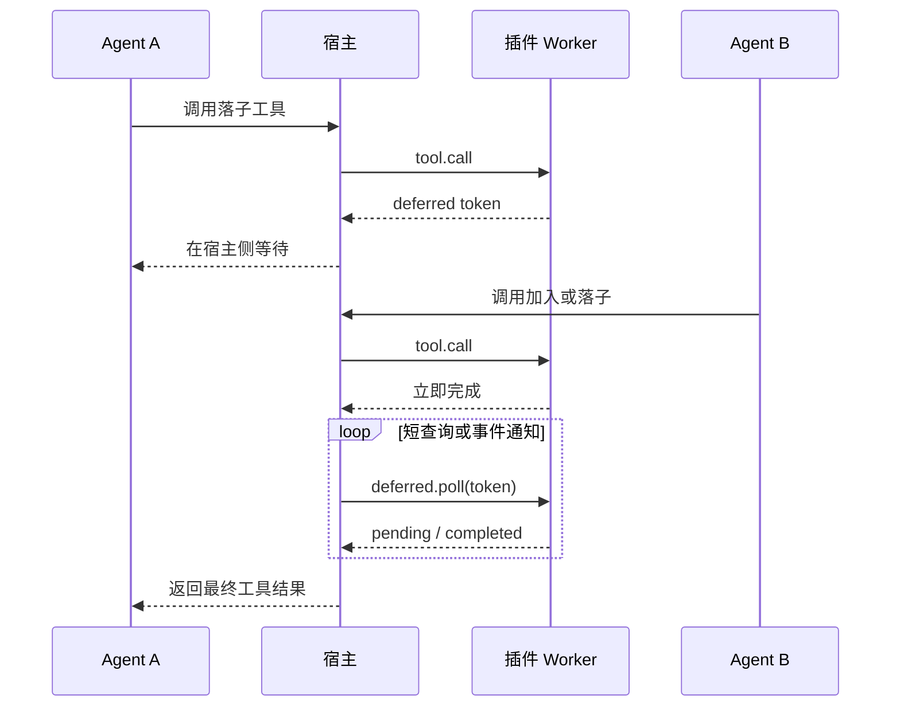
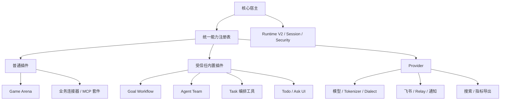

# Agent 插件系统与 Game Arena 优化方案

## 1. 结论

Game Arena 可以做到完全插件化，包括目前散落在 Agent 循环、Web 后端、主前端构建和会话调度中的
耦合点。主程序最终只保留可供所有插件复用的通用能力，不再识别 Game Arena、五子棋、游戏工具名或
游戏数据结构。

这次优化不建议只做“文件搬家”，而应分成两部分推进：

1. 先补齐插件平台缺少的通用能力：可信上下文、能力声明、权限、Web 扩展、延迟工具结果、会话调度、
   数据目录和生命周期管理；
2. 再用这些能力迁移 Game Arena，最后删除主程序中的游戏专用代码。

完全插件化不等于主程序里没有插件基础设施。边界应当是：

- **主程序知道如何加载、授权、调用、停止一个插件；**
- **主程序不知道插件是在下棋、审批、抓取数据还是执行其他业务。**

## 2. 优化目标

### 2.1 插件系统目标

- 插件通过清晰、版本化的契约接入，安装时可判断是否兼容；
- 插件对宿主能力的使用必须显式声明并经过授权；
- 身份、路径等可信信息由宿主注入，不进入模型可见的工具参数；
- 插件可以独立提供工具、命令、Hook、页面、API、静态资源和后台等待；
- 插件源码视为只读，运行数据写入宿主分配的数据目录；
- 启用、禁用、重载和卸载必须同时处理工具、路由、任务和资源；
- 一个插件出错或等待，不应阻塞其他插件或同一插件的其他短请求；
- 所有跨边界调用可追踪、可超时、可取消，并有稳定错误码。

### 2.2 Game Arena 目标

- 安装并启用插件后，提供完整的游戏大厅、五子棋工具、对局 API、回放和状态存储；
- 禁用或删除插件后，以上能力全部消失，不留下失效入口和后台任务；
- `app/`、主前端源码和主前端构建配置中没有 Game Arena 专用分支；
- 模型不能填写或伪造会话 ID；
- 等待对手行动时不占住插件 Worker；
- 两个会话启动对局要么同时成功，要么都不启动；
- 请求期间不生成、覆盖或导入临时 Python 源文件；
- 并发落子、刷新页面、重载插件和服务重启不会损坏对局状态。

### 2.3 本轮不做的事

- 不把所有插件都强制迁移到新能力；旧插件在未使用新能力时保持兼容；
- 不允许插件在宿主进程内任意挂载 FastAPI Router 或直接访问内部对象；
- 不为了 Game Arena 在通用协议中加入 `game_id`、`board`、`move` 等业务字段；
- 不先引入分布式队列或外部数据库；单机可靠性满足后再按需要演进。

## 3. 当前基础与主要问题

### 3.1 已有基础

当前插件系统已经具备：

- 多种插件清单格式的发现与适配；
- 插件启用状态、加载、卸载和热重载；
- 独立 Python Worker 与 JSON 行协议；
- 工具、Hook、命令和基础生命周期；
- 安装、卸载及依赖处理；
- 第一版可信工具调用上下文，`session_id` 不再需要由模型填写。

这些能力可以继续使用，无需推倒重来。

### 3.2 初始平台缺口

| 缓解目标 | 当前缺口 | 影响 |
| --- | --- | --- |
| Web 扩展 | 页面和 API 只能写进主 Web 服务 | 业务页面必然与核心耦合 |
| 长时间等待 | Worker 请求串行，长轮询会占住 Worker | 对手无法加入或落子 |
| 会话调度 | 插件没有受控的会话启动接口 | 业务代码绕过宿主运行围栏 |
| 权限边界 | 能调用什么主要由代码约定 | 安装者无法审计插件权限 |
| 数据目录 | 插件自行推算仓库路径 | 源码被写入，安装位置变化就失效 |
| 生命周期 | 工具、Web、等待任务缺少统一撤销 | 禁用后可能留下路由或后台任务 |
| 错误与观测 | 跨进程错误语义不统一 | 难以定位超时、权限或插件故障 |

### 3.3 Game Arena 现有耦合

| 位置 | 当前职责 | 迁移后的归属 |
| --- | --- | --- |
| `app/agent_loop.py` | 按游戏工具名前缀进行长等待 | 通用延迟工具结果执行器 |
| `app/game_arena_blocking.py` | 游戏轮询与棋盘结果组装 | Game Arena 协调器 |
| `app/webui.py` | 游戏列表、状态、回放、启动、轨迹和页面路由 | 插件 Web/API 处理器 |
| `frontend/game-arena.html` | 游戏页面 | 插件自带 Web 资源 |
| `frontend/vite.config.js` | 写死 Game Arena 构建入口 | 插件独立构建 |
| `plugins/game-arena/storage.py` | 从仓库结构推算数据位置 | 宿主提供的插件数据目录 |
| `engine/_gomoku_*.py` | 运行时生成临时源码辅助导入 | 正常包导入，彻底删除 |

## 4. 目标架构



调用边界遵循三个规则：

1. 模型参数只表达业务输入；
2. 可信上下文只由宿主生成；
3. 插件访问宿主资源必须通过有权限检查的服务代理。

## 5. 插件系统优化设计

### 5.1 能力声明与权限分离

“能力”和“权限”不是一回事：

- **能力**表示插件向宿主提供什么，例如工具、页面或 API；
- **权限**表示插件要使用宿主的什么，例如读取当前会话或启动会话。

建议在现有清单上做向后兼容的增量扩展。下面是概念示例，不作为最终字段名的硬性约束：

```json
{
  "api_version": "1",
  "capabilities": {
    "tools": true,
    "web": {
      "entry": "web/index.html",
      "assets": "web/assets",
      "api": true
    },
    "deferred_results": true
  },
  "permissions": [
    "plugin_data.read",
    "plugin_data.write",
    "sessions.read",
    "sessions.run"
  ]
}
```

规则：

- 未声明的能力不注册；
- 未声明或未授权的权限在宿主边界拒绝；
- 旧清单默认只有现有工具、Hook、命令能力，不自动获得新增权限；
- 新字段先以兼容方式加入 Plugin API v1；只有出现破坏性变更时才升级主版本；
- 安装与设置页面显示权限用途，危险权限必须由用户明确启用。

### 5.2 可信只读上下文

工具参数与宿主上下文分开传输。建议上下文逐步统一为：

```text
ToolCallContext
├── session_id
├── run_id
├── plugin_id
├── workspace_root（按权限提供）
├── plugin_data_dir
├── plugin_cache_dir
├── plugin_temp_dir
└── cancellation_id
```

要求：

- 上下文字段不出现在工具 JSON Schema 中；
- 模型传入 `_session_id`、`session_id` 等保留字段时，宿主删除或拒绝；
- 插件侧通过只读 API 获取，不能回写宿主上下文；
- 只提供插件声明且实际需要的字段；
- 日志默认对会话 ID 做缩略或脱敏，避免无意泄漏。

现有 `current_tool_context()` 作为第一版继续保留，后续扩字段不改变插件工具函数签名。

Plugin API v1 当前采用以下兼容声明，未声明的可选字段保持为空：

```json
{
  "permissions": {
    "context": ["session_id", "workspace_root"]
  }
}
```

`plugin_id` 和三个插件专属目录属于宿主分配的固有身份，不接受调用方覆盖；`session_id`、`run_id`、
`workspace_root`、`cancellation_id` 只有在上述清单中声明后才会传入工具、命令及生命周期上下文。

### 5.3 插件数据、缓存和临时目录

每个插件由宿主分配三个目录：

| 目录 | 用途 | 卸载策略 |
| --- | --- | --- |
| `plugin_data_dir` | 对局、配置、数据库等持久数据 | 默认保留，可由用户选择删除 |
| `plugin_cache_dir` | 可重新生成的构建或查询缓存 | 可安全清理 |
| `plugin_temp_dir` | 单次运行的临时文件 | 停止或启动恢复时清理 |

插件安装目录只读。插件不得通过 `__file__` 向上推算主仓库路径，也不得在请求处理中生成 Python
源码。数据写入必须使用原子替换；Game Arena 的同一对局还要使用进程内锁或文件锁，避免同时落子覆盖。

插件数据格式包含 `schema_version`，升级时执行幂等迁移；迁移失败时保留原文件并禁用写入，而不是静默
覆盖。

### 5.4 通用 Web 扩展

主程序增加三个稳定入口：

- `GET /plugins/{plugin_id}`：加载插件页面；
- `GET /plugin-assets/{plugin_id}/{path}`：读取插件静态资源；
- `/api/plugins/{plugin_id}/{path}`：将请求转给插件 Worker。

宿主只处理通用工作：

- 检查插件是否安装、启用且声明了 Web 能力；
- 规范化路径，阻止 `..`、符号链接越界和任意文件读取；
- 限制方法、请求体、响应体、处理时长和并发数；
- 过滤 Cookie、授权头等敏感头，只注入必要的可信 Web 上下文；
- 对写请求执行同源与 CSRF 校验；
- 为静态页设置合理的 CSP、MIME 和缓存头；
- 将插件错误转换为稳定的 HTTP 错误，不暴露堆栈。

Worker 提供通用 `http.handle` RPC，输入为清洗后的 method、path、query、headers 和 body，输出为
status、headers 和 body。`app/webui.py` 不出现游戏字段或游戏路由。

插件 Web 注册和撤销统一挂到 FastAPI `lifespan` 生命周期；不再使用已弃用的 `on_event`。

当前 Plugin API v1 已实现 `on_http_request` / Node `onHttpRequest` 和上述三个通用入口。网关限制为
1 MiB 请求、5 MiB 响应、每插件最多 8 个并发请求，过滤 Cookie、Authorization、Set-Cookie 等敏感头，
拒绝跨站浏览器写请求、外部重定向、响应头换行、路径穿越及符号链接越界。Game Arena 页面和 API 已完全
使用该网关，`webui.py`、主前端入口和 Vite 构建配置不再含游戏路由或构建入口。

### 5.5 通用延迟工具结果

等待对手行动不能发生在单次 Worker 调用中。工具完成一次短事务后，可以返回延迟结果：

```json
{
  "ok": true,
  "_myagent_deferred": {
    "token": "opaque-token",
    "timeout_seconds": 300,
    "poll_after_ms": 1000
  }
}
```

Plugin API v1 通过 `deferred_result(...)` 生成该保留标记，并用 `on_deferred_poll`、
`on_deferred_cancel` 注册短回调。Node Worker 提供等价的 `onDeferredPoll`、`onDeferredCancel`。
宿主不会把 `_myagent_deferred` 或令牌暴露给模型。



协议至少包含：

- `poll`：查询是否完成；
- `cancel`：用户中断、超时、插件禁用或会话删除时取消；
- `complete`：返回最终内容和标准工具错误；
- `expires_at`：插件重启后也能判断令牌是否过期；
- 所有令牌不可猜测，并绑定插件、会话和原始工具调用。

当前 Runtime 已在内存中把令牌绑定到插件摘要、工具、会话、运行和原始调用 ID；错误身份、错误工具、
重复消费、插件禁用及重载都会拒绝或撤销租约。持久 `expires_at` 与宿主重启恢复仍属于后台任务持久化阶段，
未完成前不能宣称延迟结果具备跨宿主重启恢复能力。

宿主 Agent 循环只识别 `deferred`，不识别 Game Arena 工具名前缀。Worker 每次 poll 都是短 RPC，因此
不会因五分钟等待阻塞后续调用。后续若轮询成本成为问题，可在相同契约下增加事件推送，无需修改业务工具。

### 5.6 受控宿主服务代理

插件不能直接持有 `AgentExecutor`、调用 `astream_events`、读取内部会话文件或修改全局对象。统一通过
宿主服务代理申请动作。

首批服务：

- `sessions.describe`：读取被授权会话的展示信息与忙闲状态；
- `sessions.reserve`：原子预留一个或多个会话；
- `sessions.run`：在预留凭证下启动提示；
- `sessions.release`：提交失败或取消时释放预留；
- `runs.cancel`：取消由该插件发起的运行。

Game Arena 启动双会话采用“预留—提交—回滚”：

1. 插件提交两个会话 ID 和两段提示；
2. 宿主检查 `sessions.run` 权限、会话存在性和忙闲状态；
3. 宿主按稳定顺序同时预留两个会话；
4. 全部预留成功后才启动；任一失败则释放全部预留；
5. API 只有在两个运行都成功登记后才返回成功；
6. 后续失败通过运行状态和事件反馈，不伪装成启动成功。

服务代理使用结构化请求和结果，不允许插件传入 Python 回调或宿主对象引用。

当前第一版把上述预留、提交和失败回滚封装成单个原子 `sessions.run_many` 动作：宿主先验证权限、会话存在性
及全部忙闲状态，再一次性登记所有租约和后台运行；任一会话繁忙时不会启动任何一方。禁用/重载插件会释放
该插件的全部租约并请求取消已经启动的运行。拆分式 `describe/reserve/run/release/cancel` API 仍可在其他插件
出现分步事务需求时，在同一服务层上增量开放。

### 5.7 生命周期和热重载

每个插件实例拥有统一资源作用域：

```text
PluginScope
├── tools / hooks / commands
├── web routes / static mounts
├── deferred tokens
├── background tasks
├── host-service leases
└── worker process
```

停止顺序：先拒绝新请求，再取消等待与后台任务，释放预留，撤销 Web 和工具注册，最后关闭 Worker。
超时后允许强制终止 Worker，但必须记录原因。热重载使用“新实例就绪后切换、旧实例排空”的方式，避免
路由短暂消失或请求落入半初始化状态。

Plugin API v1 当前提供 `background_service(...)` / Node `registerBackgroundService(...)`。只有清单声明
`capabilities.background_services` 后宿主才会启动周期任务；状态 RPC 提供运行次数、失败次数和最近错误。
FastAPI lifespan 负责启动，禁用、重载及宿主关闭会先取消任务，再执行插件 deactivation 并关闭 Worker。
当前热重载仍是“停止旧 Worker 后启动新 Worker”，尚未实现新旧实例排空切换。

### 5.8 错误模型与可观测性

跨进程错误使用稳定错误码，例如：

- `plugin_disabled`
- `capability_not_declared`
- `permission_denied`
- `plugin_unavailable`
- `plugin_timeout`
- `deferred_expired`
- `session_busy`
- `state_conflict`

每次调用生成 `request_id`，日志关联 `plugin_id`、能力、耗时和结果类型。指标至少覆盖调用数、错误数、
Worker 重启数、延迟结果数量/时长、Web 请求耗时和未释放资源数。用户看到简洁错误，详细堆栈只进入
受控日志。

## 6. Game Arena 迁移设计

### 6.1 插件目录

建议最终结构：

```text
plugins/game-arena/
├── .myagent-plugin/
│   └── plugin.json
├── plugin.py
├── api.py
├── coordinator.py
├── storage.py
├── migrations.py
├── engine/
│   ├── __init__.py
│   ├── base.py
│   └── gomoku.py
├── web/
│   ├── index.html
│   └── assets/
└── tests/
```

前端源文件可以放在插件自己的开发目录中，但发布包只携带构建后的 `web/`。主前端 Vite 配置不再
编译 Game Arena 页面。

### 6.2 业务职责拆分

- `plugin.py`：声明工具、生命周期和能力入口；
- `api.py`：大厅、对局状态、回放和启动接口；
- `coordinator.py`：加入、轮次推进、延迟令牌完成与取消；
- `storage.py`：对局持久化、锁、原子写和冲突检测；
- `migrations.py`：旧对局数据兼容；
- `engine/gomoku.py`：纯五子棋规则，不访问宿主或文件系统；
- `web/`：只调用插件 API，不依赖主前端内部模块。

### 6.3 Game Arena 迁移步骤

1. 固化当前五子棋规则、API 响应和页面行为测试；
2. 将存储切换到 `plugin_data_dir`，停止从仓库路径推算位置；
3. 删除 `_gomoku_tmp.py`、`_gomoku_tmp2.py`、`_gomoku_block.py` 等运行时源码方案，改为正常包导入；
4. 将等待逻辑改成 `deferred`，删除 Agent 循环中的工具名前缀判断；
5. 将游戏 API 搬入插件 `http.handle`；
6. 将页面和静态资源搬入插件 `web/`，删除主前端构建入口；
7. 将双会话启动改为宿主服务代理和原子预留；
8. 将轨迹读取改为有权限的宿主服务，不直接读取内部会话文件；
9. 删除 `app/game_arena_blocking.py` 及 `app/webui.py` 的全部游戏代码；
10. 进行禁用、卸载、重载、并发、重启恢复和只读安装测试。

## 7. 实施阶段

### P0：冻结行为与契约

产出：

- 记录当前 Plugin API v1 行为；
- 为现有插件加载、调用、禁用和重载补回归测试；
- 为 Game Arena 现有规则、接口和页面建立基线测试；
- 确认旧数据目录和迁移策略。

完成标准：后续平台改造造成行为变化时，测试能明确指出兼容问题。

### P1：上下文、权限和数据目录

产出：

- 完善 `ToolCallContext`；
- 增加能力/权限解析与注册表；
- 分配 data/cache/temp 目录；
- 安装与设置页面展示权限；
- 为保留参数伪造、目录越界和只读源码补安全测试。

依赖说明：可信 `session_id` 第一版已经完成，本阶段在其上扩展，不重新设计工具签名。

### P2：Web 扩展

产出：

- 通用插件页面、静态资源和 API 网关；
- Worker `http.handle` 协议；
- Web 能力启停、超时、限流和安全校验；
- 最小示例插件验证页面与 API 全生命周期。

完成标准：不修改 `webui.py` 的业务代码即可安装一个带页面和 API 的插件。

### P3：延迟结果

产出：

- SDK `DeferredToolResult`；
- Runtime 的 poll/cancel/complete 协议；
- Agent 循环的通用等待器；
- 超时、中断、Worker 重启和插件禁用清理。

完成标准：一个调用等待时，同一插件仍可处理另一个会话的工具调用。

### P4：宿主服务代理与会话事务

产出：

- 权限受控的会话读取、预留、启动、释放和取消服务；
- 多会话原子预留；
- 调度审计日志和失败回滚测试。

完成标准：两个会话中任意一个繁忙时，Game Arena 不会只启动另一方。

### P5：迁移 Game Arena

产出：

- 游戏 API、页面、等待、存储和调度全部使用新插件能力；
- 旧对局数据迁移；
- 删除临时源码生成；
- 删除核心和主前端的游戏专用代码。

完成标准：Game Arena 目录整体移走后，主程序仍能启动、测试通过，且没有失效游戏入口。

### P6：加固和发布

产出：

- 并发、故障恢复、路径安全、CSRF、XSS、限流和大请求测试；
- Plugin API 文档、示例和迁移指南；
- 兼容性矩阵与插件诊断页面；
- 前端产物重新构建并执行全量测试。

## 8. 测试矩阵

| 层级 | 必测内容 |
| --- | --- |
| 清单与权限 | 旧清单兼容、未知能力、缺失权限、用户拒绝权限 |
| 可信上下文 | 会话 ID 不进 Schema、伪造参数被丢弃、插件只收到被授权字段 |
| Runtime | Worker 启停、崩溃恢复、RPC 超时、协议错误、并发短请求 |
| 延迟结果 | 完成、超时、取消、过期、重启恢复、禁用清理、令牌越权 |
| Web | 路由启停、路径穿越、符号链接、MIME、CSP、CSRF、体积和超时限制 |
| 会话调度 | 双会话成功、单方繁忙、预留回滚、重复启动、取消和审计 |
| 存储 | 原子写、并发落子、旧数据迁移、损坏文件、只读插件目录 |
| 游戏规则 | 不同棋盘尺寸、横竖斜胜负、平局、越界、重复位置、错误回合、认输 |
| 页面 | 大厅、棋盘、刷新、轨迹、回放、错误提示、文本和 SVG 转义 |
| 生命周期 | 启用、禁用、卸载、热重载、宿主关闭时无残留任务与租约 |

## 9. 最终验收标准

### 9.1 代码边界

以下检查在主程序业务代码中应为零结果：

```powershell
rg -n -i "game.?arena|gomoku|create_game|join_game" app frontend/src frontend/vite.config.js
```

允许出现的位置仅限 Game Arena 插件自身、插件测试、迁移说明和用户文档。主程序可以有
`/plugins/{plugin_id}` 等通用路径，但不能有 `/game-arena` 专用路由。

### 9.2 运行行为

- 未安装：不显示入口，相关 URL 返回 404；
- 已安装未启用：工具、API、页面和后台任务均不可用；
- 启用：两名玩家可以创建、加入、落子、等待、认输和回放；
- 禁用/卸载：进行中的等待被取消，会话预留被释放，Worker 被关闭；
- 插件 Worker 崩溃：主程序继续工作，并向用户返回可理解的插件错误；
- 插件目录只读：所有功能仍可运行，目录内容在请求前后完全一致；
- 多会话并发：等待中的玩家不会阻塞对手或其他插件调用。

### 9.3 质量门槛

- 插件平台单元与集成测试通过；
- Game Arena 规则、API、页面和并发测试通过；
- 全仓测试通过且不新增弃用警告；
- 静态资源重新构建，工作区没有请求运行产生的源码或临时文件；
- 文档中的清单、权限、错误码和实际实现一致。

## 10. 提交拆分建议

为便于审查和回滚，建议按以下顺序独立提交：

1. 契约测试与文档；
2. 上下文、权限和数据目录；
3. 插件 Web 能力；
4. 延迟工具结果；
5. 宿主服务代理和会话事务；
6. Game Arena 后端迁移；
7. Game Arena 前端迁移；
8. 删除核心耦合与临时源码；
9. 安全、并发、构建产物和全量测试。

每个提交都应保持主程序可启动、旧插件可用。不要在同一个提交中同时改变协议、迁移业务和更新构建
产物，否则出现问题时很难判断是平台契约、游戏逻辑还是前端构建导致。

## 11. 推荐决策

- 采用“通用核心 + 隔离 Worker + 权限化宿主服务”的架构；
- 在 Plugin API v1 上先做兼容扩展，不急于创建不兼容的 v2；
- Web API 通过宿主网关转发，不允许插件直接修改 FastAPI 应用；
- 长等待统一使用延迟结果，不增加 Game Arena 特判；
- 多会话启动必须经过宿主原子预留；
- 插件源码永远只读，所有运行状态进入宿主分配的数据目录；
- Game Arena 作为第一款完整验证新平台能力的插件，迁移完成后再开放给其他插件使用。

## 12. 整个 Agent 的插件化审计结论

### 12.1 初始耦合不是 Game Arena 个例

方案启动时的全仓检查表明，多项功能直接嵌入 Agent 热路径：

| 证据 | 当前数量 | 说明 |
| --- | ---: | --- |
| `app/agent_loop.py` 中 `goal_` 引用 | 189 | Goal 记账、Judge、续跑和工具处理直接进入 ReAct 循环 |
| `app/agent_loop.py` 中 `subagent` 引用 | 51 | `task` 调度和子会话策略由循环特判 |
| `app/agent_loop.py` 中 `team` 引用 | 26 | `team` 工具和团队权限直接由循环分发 |
| `app/webui.py` 中 Goal 引用 | 144 | Goal Runner、API、恢复和页面状态耦合在主 Web 服务 |
| `app/webui.py` 中 Subagent 引用 | 146 | 子 Agent 列表、控制、恢复和删除均为主路由专用逻辑 |
| Runtime V2 中 Goal/Team/Subagent 专用事件 | 43 类 | 核心事件 Schema 直接认识具体功能领域 |
| `frontend/src/app/modules/toc-todo.js` 中 Goal 引用 | 314 | Goal UI 与主页面捆绑构建 |
| `frontend/src/app/modules/agent-team.js` 中 Team 引用 | 102 | Team UI 无法独立启停和发布 |

数字不是重构目标本身，但说明只迁移 Game Arena 不能解决架构问题。方案启动时 `agent_loop.py` 还按
`ask_user`、`context_manage`、Goal、Team、Task、`mcp_` 和 `plugin_` 等工具名分别处理；
`app/main.py` 直接启动 Team Scheduler、Goal Runner 和飞书适配器；`app/webui.py` 直接注册 Remote
Control 与飞书 Runtime。继续增加功能会让这些文件不断出现新的名称判断和生命周期分支。

截至 2026-08-24，工具执行层的上述名称分支已经清除：Ask、Context、Goal、Todo、Task、Team 注册为
Host Service Invoker，MCP 与 Plugin 按 Descriptor 的来源调用；并发、交互、提前执行、CPU 限流和中断
语义也由 Descriptor 属性决定。Goal 续跑/Judge、Team 调度、Runtime 投影、Web API 和主前端 UI 等更高层
工作流耦合仍然存在，属于 A3～A6，而不是重新塞回工具分发层。

### 12.2 统一插件化的正确含义

统一插件化不是把 `app/` 全部移动到 `plugins/`，而是让所有可选能力经过同一套注册、授权、调用、
观测和卸载协议。建议形成四层：

| 层级 | 运行方式 | 典型能力 | 信任边界 |
| --- | --- | --- | --- |
| 内容包 | 只读声明资源 | Skill、Prompt、Command、Agent 模板 | 不执行代码 |
| 普通插件 | 隔离 Worker | Game Arena、外部连接器、业务工具、独立页面 | 默认最低权限 |
| 受信任内置插件 | Worker 或受控宿主适配器 | Goal、Team、模型 Provider、Remote Transport | 仅随主程序签名发布或显式高级授权 |
| 核心宿主 | 主进程 | Agent 调度、Runtime V2、安全强制、会话与插件内核 | 系统信任根 |

插件不能在 Manifest 中自行声称“受信任”。信任等级由安装来源、包签名、内容摘要和用户授权决定。
普通第三方插件即使声明高权限，也不能自动获得核心对象或绕过中央安全策略。

## 13. 可统一插件化的能力清单

### 13.1 第一类：适合直接迁为普通插件

| 能力 | 当前实现 | 目标形态 | 所需平台能力 | 优先级 |
| --- | --- | --- | --- | --- |
| Game Arena | 主 Web、主前端、Agent 循环与插件混合 | 完整业务插件 | Web、延迟结果、会话服务、数据目录 | P0 |
| 飞书接入 | `remote_control/transports/feishu`，由 `webui.py` 直接创建 | Remote Transport 插件 | 事件订阅、会话命令、Secret 引用、后台任务 | P0 |
| 桌面/外部通知渠道 | `desktop_notify.py` 及调用点 | Notification Provider 插件 | 通知事件、渠道配置、后台生命周期 | P0 |
| Execution Dashboard | 主前端独立入口与主 Web API | Observability Web 插件 | Web 页面、只读指标服务 | P0 |
| Web 搜索 Provider | `agent_tools.py` 内按 Provider 选择 | Search Provider 插件 | 网络出口代理、Secret 引用、限流 | P1 |
| Prompt/Agent/Skill 包 | 已能随 Manifest 声明 | 统一内容插件 | 统一启停、命名空间和版本依赖 | 已部分完成 |
| MCP Server 套件 | 已可由插件 Manifest 提供 MCP 定义 | Connector 内容插件 | 统一能力注册和安全确认 | 已部分完成 |

其中 MCP 客户端 Runtime 不需要搬成普通插件。它与插件 Worker 一样属于宿主支持的扩展协议；需要做的
是让 MCP 工具也进入统一 Tool Registry，消除 Agent 循环对 `mcp_` 前缀的判断。

### 13.2 第二类：适合迁为受信任内置插件

| 能力 | 为什么可插件化 | 为什么不能直接当普通插件 | 目标拆分 | 优先级 |
| --- | --- | --- | --- | --- |
| Goal + Goal Judge | 是一个可选的长任务工作流 | 需要续跑、独立 LLM 调用、会话状态和 UI 审核 | Goal Workflow 插件 + 通用调度/状态/LLM 服务 | P1 |
| Agent Team | 是建立在 Subagent 上的协作工作流 | 需要管理多个会话、任务和权限租约 | Team Workflow 插件 + 核心 Subagent 服务 | P1 |
| `task` 工具外观 | 本质是 Subagent 服务的模型入口 | 创建/中断会话属于高权限动作 | Orchestration Tool 插件 + 核心执行服务 | P2 |
| `ask_user` 工具 | 是 Human Interaction 的一种交互类型 | 等待、恢复、身份和终态必须由宿主保证 | Interaction Type 插件 + 核心交互 Broker | P1 |
| Todo | 是会话级可选工作流状态 | 需要可靠地进入 Runtime V2 和主 UI | Session Feature 插件 + 命名空间状态 | P1 |
| 模型 Provider | OpenAI、兼容接口、Anthropic 已有共同 Transport 契约 | 会读取模型密钥并处于每轮热路径 | 受信任 Transport Provider + 核心标准事件流 | P2 |
| Tokenizer | 不同模型可使用不同计数实现 | 计数错误会影响上下文截断 | Tokenizer Provider，宿主保底实现 | P2 |
| 模型发现与 Probe | 明显依赖不同 Provider | 需要 Secret、网络和配置写入 | Provider 配套诊断能力 | P2 |
| Remote Direct/Relay | 接入协议可以有多个实现 | 会暴露会话控制面，权限极高 | 核心 Control Plane + Transport 插件 | P2 |
| 标题生成 | 是可替换的会话元数据策略 | 写会话元数据且会调用 LLM | Session Metadata Provider | P3 |
| 上下文压缩策略 | 摘要 Prompt、阈值和选段策略可替换 | 历史原子改写与恢复必须留在核心 | Context Strategy 插件 + 核心 History Ops | P3 |
| Reasoning/Think 适配 | 不同 Provider 有不同响应格式 | 解析错误会破坏工具调用和消息历史 | Response Dialect Provider + 核心标准消息模型 | P3 |
| 安全 Reviewer/规则包 | 可增加企业或项目规则 | 任何插件都不能降低中央策略 | 只允许“加严”的 Policy Extension | P2 |

“受信任内置插件”仍应使用与普通插件相同的能力描述、生命周期、错误和观测模型，只是可以被宿主授予
普通插件拿不到的服务权限。这样可测试、可禁用，也不会在 Agent 循环中恢复成硬编码分支。

### 13.3 第三类：实现可统一注册，但强制执行必须留在核心

文件、Shell 和工作区工具可以统一为一个 `core.tools` 内置能力包，使 Schema、Effect、权限和调用结果
都走 Tool Registry；但下列部分不能交给普通 Worker：

- 工作区根解析与路径越界检查；
- `run_shell` 的进程树终止、自保护和中断；
- `apply_patch` 的原子校验与写入边界；
- 删除到回收区及受保护目录判断；
- 网络 SSRF、域名和出口策略；
- 工具审批签名、资源摘要和一次性授权；
- Worktree 重写和写入围栏。

因此建议做“逻辑插件化”，不强求“物理移出主进程”：

```text
core.tools 注册 ToolDescriptor
  -> 通用 Tool Executor
  -> 中央安全与审批
  -> 受控 Host Handler
  -> ToolOutcome
```

这能消除工具名特判，又不会为形式上的目录统一牺牲安全和中断可靠性。

### 13.4 已经插件化但仍需统一的能力

- Tool、Hook、Command 已支持 Native Plugin Runtime；
- Skill、Prompt、Agent、MCP 和声明式 Command 已能由插件清单携带；
- 不同生态的 Manifest 已有兼容适配；
- 可执行插件已有 Worker 隔离、信任确认和热重载。

下一步不是再建一套接口，而是把内置能力、MCP 能力和插件能力统一放入同一注册表。模型与 Agent 循环
不应再通过名字前缀判断能力来源。

## 14. 必须保留在核心宿主的能力

以下模块是系统信任根或事实源，不建议插件化：

| 核心能力 | 保留原因 | 可开放的扩展面 |
| --- | --- | --- |
| ReAct/Agent 调度循环 | 决定消息、工具调用、停止、中断和恢复的一致性 | Typed Run Hooks、Tool Registry、策略 Provider |
| Runtime V2 Event Log | 会话、运行和审计的唯一事实源 | 命名空间事件与状态服务 |
| Session Repository | 负责身份、历史、分支、归档和并发围栏 | 受权限控制的 Session Service |
| Permission/Approval Kernel | 必须最终执行 deny/ask/allow | 只加严的规则与 Reviewer |
| Workspace/Sandbox/Egress | 负责文件、进程和网络安全边界 | 声明式 Effect 和 Broker 请求 |
| Secret Store | 插件不应遍历环境变量或其他插件密钥 | 按 Secret 引用和权限读取 |
| Human Interaction Broker | 等待、恢复、过期和幂等解决必须一致 | 问题类型、Renderer、通知渠道 |
| Subagent 执行原语 | 父子权限、级联取消、并发和工作区隔离是核心调度职责 | `task`、Team 等编排插件 |
| LLM 标准事件/消息模型 | 所有 Provider 必须输出同一种工具与流事件 | Transport、Tokenizer、Dialect Provider |
| Plugin Manager/Worker/Broker | 插件不能负责加载和授权自己 | Manifest 和能力协议 |
| Control Plane Application Service | 本地 UI、Direct、Relay、飞书必须共享同一业务入口 | Remote Transport 插件 |
| FastAPI 基础应用与认证 | 必须统一保护所有入口 | 通用插件 Web 网关 |
| 进程生命周期、升级和修复 | 服务启动失败时插件系统本身可能不可用 | 平台级 Adapter，不是 Agent 插件 |

CPU 压力探测、运行 Watchdog 和 Runtime 修复也应保留核心；可以开放调度阈值或告警 Sink，但不能允许
普通插件关闭系统保护。

## 15. 为全 Agent 插件化需要新增的通用契约

### 15.1 统一 Tool Registry 与 ToolOutcome

当前工具来源分成内置字典、MCP 前缀、插件前缀和多个特殊工具分支。目标是所有工具注册同一种描述：

```text
ToolDescriptor
├── id / display_name / owner
├── input_schema
├── effect / resources / path_arguments
├── context_requirements
├── concurrency_policy / timeout
├── invocation_kind: host | worker | mcp | host_service
└── required_permissions
```

所有 Handler 返回统一结果：

```text
ToolOutcome
├── completed(content, metadata)
├── failed(code, message, retryable)
├── deferred(token, deadline)
└── interaction(request_id)
```

Agent 循环只执行以下固定流水线：

```text
resolve -> authorize -> PreToolUse -> invoke -> wait/interaction -> PostToolUse -> persist
```

`task`、Team、Goal、MCP、Game Arena 和普通插件都不能再拥有循环内专用分支。差异由 Descriptor、Invoker
和 ToolOutcome 表达。

当前实现已增加 `HostToolInvokerRegistry` 与可信 `HostToolInvocationContext`。所有宿主特殊工具、MCP、
Native Plugin 和普通内置工具的实际返回值都会先归一为 `ToolOutcome`，再由同一格式化路径生成日志、LLM、
UI、失败状态和生命周期元数据。插件声明 `effect="read"` 后会自动进入只读并发策略，不需要修改
`agent_loop.py` 或依赖工具名前缀。

### 15.2 通用 Run 扩展点

现有 Hook 可继续保留，但 Goal、上下文策略和标题生成还需要类型化扩展点：

- `RunBeforeStart`
- `RunStarted`
- `ContextBuilding`
- `ToolCatalogBuilding`
- `RunCompleted`
- `RunFailed`
- `RunInterrupted`
- `SessionIdle`
- `SessionTitleRequested`

Hook 输入必须是快照或受控引用，不能传可变的 Agent State。每个扩展点明确能返回什么：追加上下文、过滤
自有工具、提交后台动作或记录状态；不能用任意字典隐式修改核心运行状态。

### 15.3 会话级命名空间状态

Goal、Todo 和 Team 目前迫使 Runtime Projector 理解业务事件。建议增加通用状态服务：

```text
session_state.get(plugin_id, namespace)
session_state.compare_and_set(plugin_id, namespace, expected_revision, value)
session_state.patch(plugin_id, namespace, expected_revision, operations)
session_events.append(plugin_id, event_name, payload)
```

Runtime V2 只持久化通用 `extension_state_changed` 和 `extension_event`，投影到：

```text
snapshot.extensions[plugin_id][namespace]
```

宿主负责 revision、大小上限、原子写和审计，不理解 `goal_completed`、`team_task_claimed` 等业务含义。
复杂业务校验留在插件，关键并发仍通过 CAS 或宿主事务服务完成。

当前第一版已经实现：`SessionExtensionStateStore` 对 `plugin_id/namespace` 做 1～64 字符白名单校验，提供
`get`、revision CAS、JSON Patch、覆盖式安全重试和通用审计事件；每个状态默认限制 256 KiB、单事件限制
64 KiB，并复用 Runtime V2 的会话事务锁、事件日志、快照校验和重放恢复。投影统一进入
`snapshot.extensions[plugin_id][namespace]`，Runtime 不解析业务字段。

隔离 Worker 可以在工具最终结果中通过 `with_host_actions(...)` 请求 `session_state.get`、
`session_state.compare_and_set`、`session_state.set_latest`、`session_state.patch` 或
`session_events.append`。其中 `set_latest` 适合“插件刚算出的状态就是当前最新状态”的单写者场景；需要防止
并发覆盖时仍使用 CAS。宿主强制使用工具调用的可信
`session_id` 和 `run_id`、强制使用实际插件 ID，并检查 Manifest `permissions.services`；插件填写其他会话、
从无会话上下文的 Web 请求调用或未声明服务都会被拒绝。

Subagent、Approval 和 Interaction 是核心原语，其事件可以继续是 Runtime V2 的一等事件；Goal、Team、
Todo 和 Game Arena 等可选功能应迁到扩展命名空间。

### 15.4 UI 插槽与事件 Renderer

仅支持独立页面不足以迁移 Goal、Team 和 Todo，需要增加受控 UI 组合能力：

- `navigation`：侧栏或工具菜单入口；
- `settings.section`：插件配置区；
- `session.badge`：会话列表状态标记；
- `session.panel`：会话详情面板；
- `composer.action`：输入区动作；
- `message.renderer`：插件命名空间事件卡片；
- `dashboard.page`：独立全页功能。

普通插件不能把任意 JavaScript 拼接进主页面，也不能访问主页面全局变量。推荐：

- 简单徽标、菜单、状态和按钮使用宿主声明式组件；
- 复杂面板和页面使用 sandboxed iframe；
- UI 通过版本化 MessageChannel 或插件 API 通信；
- 只有随主程序签名发布的内置 UI 扩展可使用更深的原生插槽；
- 所有文本默认转义，HTML、Markdown、SVG 分别经过对应净化器。

当前已落地第一批声明式 UI 能力：Manifest 可声明 `capabilities.ui.navigation`、
`capabilities.ui["message.renderer"]`、`capabilities.ui["session.badge"]`、
`capabilities.ui["session.panel"]`、`capabilities.ui["settings.section"]` 和
`capabilities.ui["composer.action"]`，宿主在 `/api/extensions` 中只发布已加载插件的有效贡献。导航由通用
侧栏宿主渲染；扩展事件由 Runtime V2 以 `extension_event` 原样持久化和重放，再由通用消息宿主按声明的
JSON Pointer 字段渲染。会话徽标与面板由 `/api/extensions/session-ui` 批量投影：服务端只读取当前插件
自有命名空间，并且只返回 Manifest 白名单中的字段，不向浏览器下发完整插件状态。插件只能提供 ID、纯文本标题、说明、排序和受限字段格式；页面地址固定由宿主
生成为 `/plugins/{plugin_id}`，插件填写的 URL、HTML 或危险原型路径不会进入 DOM。Game Arena 已使用这
六种声明获得入口、对局事件卡片、会话标记、当前对局面板、设置入口和输入区动作，主前端仍不包含任何
游戏名称或业务分支。设置入口只能打开宿主生成的插件页；输入区动作只能打开该页面或在用户明确点击后
插入固定文本，不会自动发送消息，也不能提供任意 URL 或脚本。表单式设置 Schema 仍按上述安全模型后续实现。

完成后，主前端入口只加载“插槽宿主”，不再直接导入 `agent-team.js` 或把 Goal UI 固定写入
`toc-todo.js`。

### 15.5 Provider Registry

将变化频繁、实现多样但契约稳定的能力统一为 Provider：

| Provider | 标准输入/输出 | 核心保底 |
| --- | --- | --- |
| `llm.transport` | 标准消息/工具 -> 标准流事件 | 至少一个 OpenAI-compatible Provider |
| `llm.tokenizer` | 模型与内容 -> token 数 | 保守估算器 |
| `llm.dialect` | Provider 原始块 -> 标准 reasoning/tool/message | 严格未知块错误 |
| `search` | 查询 -> 标准搜索结果 | 可无，不静默联网 |
| `notification` | 结构化通知 -> 送达结果 | 日志 Sink |
| `remote.transport` | 外部帧 <-> Control Plane 命令/事件 | 本地 UI 不依赖外部 Transport |
| `observability.exporter` | 指标/事件 -> 外部 Sink | 本地日志与 Runtime V2 |

Provider 失败不能改变核心数据格式。宿主负责重试预算、取消、Secret 解析和观测；Provider 只实现协议差异。

### 15.6 后台任务与 Scheduler

Goal Runner、Team Scheduler、飞书 Runtime 和将来的通知监听不应在 `app/main.py` 分别启动。插件注册：

```text
BackgroundServiceDescriptor
├── service_id
├── start_policy
├── restart_policy
├── health_check
├── shutdown_timeout
└── required_permissions
```

Plugin Manager 在统一生命周期内启动、监测、重启和停止。禁用插件必须停止服务并释放会话租约；服务崩溃
不能阻止 FastAPI 或其他插件启动。

### 15.7 设置、Secret 与依赖

插件可以声明设置 Schema 和 Secret 引用，但不直接编辑 `.env`：

- 普通设置进入插件命名空间；
- Secret 由宿主安全存储，只向被授权的具体调用提供；
- UI 根据 Schema 渲染，不接受插件原始 HTML 表单；
- 设置版本和插件数据迁移绑定；
- 插件依赖使用能力版本约束，不通过导入另一个插件的源码建立隐式依赖。

当前已实现第一版设置协议：插件可声明扁平 `settings_schema`，宿主只接受 `string`、`boolean`、`integer`、
`number`、受限 `enum` 和数值/长度边界；设置值由 `/api/plugins/{plugin_id}/settings` 校验并原子写入宿主
设置库，插件源码和数据目录不保存配置副本。Schema 自动产生 `settings.section` 宿主表单，因此新增设置
无需修改主前端。Worker 只有在 `permissions.context` 明确申请 `settings` 后才收到当前值的调用级副本，
调用参数或命令上下文不能覆盖它。

Secret 当前采用环境引用：字段使用 `format: "secret"` 与固定 `secret_ref`，该引用必须同时出现在
`permissions.secrets`。浏览器只看到引用名和是否已配置；设置文件、发现 API、会话快照均不包含实际值。
只有同时申请 `permissions.context: ["secrets"]` 的插件 Worker 才收到按字段名解析出的值。跨站设置写入会被
拒绝。后续若增加系统钥匙串或企业 Secret Provider，应实现同一引用协议，不能把密文格式或原始 Store 暴露
给插件。

## 16. 各功能推荐落点



推荐最终目录仅表达归属，具体命名可在实施时调整：

```text
plugins/
├── bundled/
│   ├── goal-workflow/
│   ├── agent-team/
│   ├── task-orchestration/
│   ├── session-todo/
│   ├── ask-user/
│   └── execution-dashboard/
├── providers/
│   ├── llm-openai/
│   ├── llm-anthropic/
│   ├── tokenizer-deepseek/
│   ├── search-*/
│   ├── remote-feishu/
│   └── notification-desktop/
└── game-arena/
```

`plugins/bundled` 不意味着把核心权限交给任意本地目录。发行构建必须携带签名/摘要 Allowlist，开发模式下
也应显式显示“受信任内置扩展”。

## 17. 全 Agent 迁移顺序

### A0：先统一分发，不迁业务

- 引入 Tool Registry、Invoker 和 ToolOutcome；
- 将现有内置工具、MCP 和插件工具注册到同一表；
- 保持实际 Handler 不动，先删除 `mcp_`、`plugin_` 和普通工具名分发分支；
- 为每种来源建立完全相同的 Hook、审批、超时、截断和日志测试。

这是后续所有插件化的前置阶段。否则每迁一个功能，只会产生一套新的特殊调用协议。

当前实现进度（2026-08-25）：

- 已新增不可变 `ToolDescriptor`、有序冲突检测 `ToolRegistry` 和 `ToolOutcome` 契约；
- 宿主、MCP、插件和继承但不可用的工具已具有明确的调用来源，不再由模型工具名前缀推断；
- 主 ReAct 路径已按 Registry Kind 分发 MCP 与 Plugin 工具；
- 旧的工具定义列表 API 保留为兼容包装，不影响上下文估算和 Web UI 调用；
- Ask、Context、Goal、Todo、Task、Team 已迁为注册式 Host Service Invoker，主循环不再包含这些名称的
  执行分支；PreCompact、PostCompact、Goal 和 Subagent 生命周期由注册/结果元数据驱动；
- Host、MCP、Native Plugin 和普通内置工具已统一归一为 `ToolOutcome`，共享失败判断、截断、日志、UI
  状态和 Hook 流水线；
- 只读并发、CPU 压力限流、交互独占、流式提前执行和转向中断已成为 `ToolDescriptor` 策略，不再使用
  `READ_ONLY_TOOLS`、`INTERACTIVE_TOOLS`、`mcp_` 或 `plugin_` 名称判断；
- A0 工具分发阶段已经完成。后续阶段继续迁移 Run Hook、命名空间状态、UI 插槽和 Provider，不再为可选
  工具能力向 `agent_loop.py` 增加专用分支。

### A1：完成现有 Game Arena 平台能力

- 可信上下文、权限、插件数据目录；
- Web 网关、延迟结果、会话事务；
- 后台服务生命周期；
- 完成 Game Arena 迁移。

本阶段对应本文前面的 P0～P6。

当前实现进度（2026-08-25）：

- 已扩展只读 `ToolCallContext`，工具与命令只收到清单显式声明的会话、运行、工作区和取消字段；
- 已由宿主为每个插件分配 `data/cache/temp`，并在新 Worker 生命周期清理临时目录；
- 已将 Game Arena 对局迁到 `plugin_data_dir`，旧数据采用只复制、不删除的幂等迁移；
- 已删除 Game Arena 请求路径中的临时 Python 源码生成，并增加上下文伪造、路径越界、目录生命周期和源码不变测试；
- 已实现 Python/Node 通用延迟结果 poll/cancel 协议、宿主身份租约、超时和中断清理；Game Arena 已迁移，
  `agent_loop.py` 不再识别游戏工具名，等待期间插件 Worker 可继续处理对手调用；
- 已实现通用插件 Web 页面/资源/API 网关和原子 `sessions.run_many`；Game Arena 页面、API、双会话启动及
  前端构建均已迁入插件，`app/`、主前端源码和 Vite 配置已无 Game Arena/Gomoku 专用引用；
- 已实现 Python/Node 后台服务注册、健康状态及 lifespan 启停，插件禁用会取消后台任务、延迟等待和会话租约；
- 延迟租约和 Game Arena 等待状态已持久化，Worker/宿主 Runtime 重建后可继续 poll；普通插件禁用、重载
  和卸载会撤销 Worker、等待、后台任务和会话租约。受信任内置适配器的源码更新仍要求进程重启，这是
  Host 信任边界的有意限制，不影响插件启停和业务状态恢复。

### A2：迁移低风险外围能力

- 飞书 Transport；
- Desktop Notification；
- Execution Dashboard；
- Search Provider；
- 统一 MCP 与内容包的启停、诊断和权限展示。

这些功能边界清楚，可以较早验证 Provider 和后台服务契约。

当前实现进度（2026-08-25）：

- 飞书运行时已迁到 `feishu-transport` 可信生命周期插件，`app/main.py` 和 `webui.py` 不再逐项启动它；
- 桌面通知通过通用 Notification Provider 注册表接入，生命周期重启会重新注册，禁用时撤销；
- Execution Dashboard 已迁为独立 Web/UI 导航插件，主 Vite 入口和主 Web 路由不再包含看板页面；
- DuckDuckGo、Brave、Tavily、SearXNG、Jina 已迁到 `web-search-providers`，核心 `web_search` 只调用
  Search Provider Registry，不再按厂商分支；
- 插件动态启停、安装、卸载和重载会统一协调 Worker、后台服务及可信内置生命周期；普通外部 Manifest
  无法自我授予 `trusted_host`。

### A3：增加状态命名空间和 UI 插槽

- 通用 Session Extension State；
- 扩展事件、CAS 和数据迁移；
- 导航、设置、Badge、Panel、Renderer 插槽；
- 主前端从静态导入具体功能改为运行时发现。

当前实现进度（2026-08-25）：

- 通用 Session Extension State、revision CAS、Patch、大小限制、审计事件、快照投影和重放恢复已完成；
- 插件工具结果已可通过受权限控制的 Host Actions 访问“当前可信会话”的自有命名空间，不能伪造会话或
  插件身份；
- Todo 已迁到 `session-todo` 工作流插件及 `session-todo/plan` 扩展命名空间；新调用和清空动作不再写
  `todo_updated`，Runtime 事件目录、当前快照和 Projector 也不再包含 Todo 领域字段。旧日志只在独立兼容
  适配器中读成通用扩展状态；历史回退和会话分支已推广为恢复、继承任意插件扩展状态；
- 声明式 `navigation`、`message.renderer`、`session.badge`、`session.panel`、`settings.section` 和
  `composer.action` 插槽、启停感知的通用发现
  API、字段白名单会话投影、Runtime 扩展事件 UI 投影和主前端通用宿主已经完成；Game Arena 仅通过
  Manifest 声明接入，并通过权限受控的 `session_state.set_latest` 与 `session_events.append` 发布对局状态；
- 宿主控制导航 URL 和字段解析，以纯文本渲染，已覆盖 XSS、外部重定向、原型路径、重复声明、延迟取消
  不误提交以及 Runtime 重放测试；
- `session.panel` 已支持受列白名单和数量上限约束的列表字段，以及固定值 `set_state` 动作；浏览器只能提交
  会话、插件和动作标识，不能覆盖 Manifest 中声明的状态值。Todo 的列表展示与清空均使用这套通用协议，
  主前端的 Todo 卡片、缓存、SSE 分支和会话加载分支已经删除；
- 表单式设置 Schema、非 Secret 原子存储、环境 Secret 引用、权限注入与跨站写保护已完成；系统钥匙串型
  Secret Provider 仍未完成。

### A4：迁移会话工作流

建议顺序：

1. Todo：状态简单，用于验证 Session State；
2. Goal：验证 Judge、续跑、LLM 服务和审核 UI；
3. Agent Team：验证多会话事务、后台调度和复杂状态；
4. `ask_user` UI/Tool：验证 Interaction Type 插件，但 Broker 保持核心；
5. `task` 工具：最后把模型入口迁出循环，Subagent Service 仍留核心。

当前实现进度（2026-08-25）：

- Todo 的工具、每轮提醒、上下文迁移和 UI Panel/Badge 均由 `session-todo` 插件提供；为兼容旧客户端，
  `/sessions/{id}/todo_plan` 读取接口和旧日志适配器暂时保留，但不会产生新的领域事件或参与主前端渲染；
- Goal 的工具、Judge 边界、续跑、Runner、审核 API、页面、Renderer、Panel 和 Badge 均由 `agent-goal`
  可信工作流插件拥有；核心循环只调度通用 Workflow Callback；
- Agent Team 的工具、调度器、Web API、页面、Panel 和 Badge 均由 `agent-team` 可信工作流插件拥有；
  核心 Subagent 执行原语保持不变；
- Goal、Team、Todo 的新状态只写 `snapshot.extensions`；Runtime Projector/Event Schema 不再认识这些领域，
  旧事件词汇集中在只读 `legacy_compat.py`；
- 主前端只保留声明式插槽宿主，已删除 Goal 固定卡片、审核弹窗和 Agent Team 静态模块。

### A5：迁移 Provider 与策略

- 模型 Transport、Tokenizer、模型发现和 Probe；
- Reasoning/Think Dialect；
- 上下文压缩策略和标题生成；
- 只加严的 Security Reviewer 与企业规则包。

这批能力位于 Agent 热路径，必须在工具和工作流插件稳定后进行。

当前实现进度（2026-08-25）：

- 已建立版本化 LLM Transport Provider Registry，统一工厂、Dialect 标识、Tokenizer 钩子、模型发现、
  Probe 和只读诊断快照；现有 OpenAI Responses、OpenAI-compatible 与 Anthropic 作为核心保底注册；
- 已建立 Search Provider 与 Notification Provider 注册表，并用独立插件验证动态启停；
- 上下文压缩、标题生成、安全审查和标准消息解析仍是核心不变量，通过类型化 Workflow/Policy 边界扩展，
  不允许普通插件替换或降低安全限制。它们不作为本轮“可选功能迁出核心”的目标。

### A6：核心瘦身

- `agent_loop.py` 只保留通用 ReAct 状态机和扩展点调度；
- `webui.py` 只保留通用 HTTP/SSE 编码、核心会话接口和插件网关；
- `app/main.py` 只启动核心服务和 Plugin Manager；
- Runtime Projector 不再认识 Goal、Team、Todo 等可选领域；
- 主前端只包含通用会话壳、交互 Broker UI 和插件插槽宿主。

当前实现进度（2026-08-25）：以上核心瘦身条件均已满足。仓库验证结果为 Python 全仓
`1286 passed, 4 skipped`，前端 Vite 生产构建通过；FastAPI 源码中不存在 `on_event` 注册。

## 18. 全 Agent 插件化验收标准

### 18.1 Agent 循环

- 不再按 `task`、`team`、Goal、MCP、Plugin 或 Game Arena 工具名分支；
- 新增一种工具来源不需要修改 ReAct 循环；
- 所有工具统一经过授权、Hook、调用、延迟/交互、截断和持久化流程；
- 禁用任意可选功能不改变核心消息与工具协议。

### 18.2 Runtime

- Runtime V2 不包含 Goal、Team、Todo 或游戏专用投影代码；
- 可选功能状态只出现在 `snapshot.extensions` 命名空间；
- 插件禁用后历史审计仍可读取，但不会继续调度后台动作；
- 插件升级失败不会损坏会话核心事件日志。

### 18.3 Web 与前端

- `webui.py` 不直接导入 Goal、Team、Game Arena、飞书或 Dashboard；
- `app/main.py` 不逐项启动 Goal Runner、Team Scheduler 或飞书 Runtime；
- 主前端入口不静态导入可选功能模块；
- 插件启停后，对应导航、面板、事件 Renderer 和设置区同步出现/消失；
- 普通插件不能读取主页面 DOM、其他插件状态或未授权会话数据。

### 18.4 安全

- 普通插件不能获得核心对象引用、原始 Secret Store、任意会话访问或安全策略写权限；
- Provider 和内置插件权限由宿主签名策略决定，不能由 Manifest 自我提升；
- Policy Extension 只能维持或提高限制，不能把 deny/ask 降为 allow；
- 所有后台任务、会话租约、延迟令牌和 Web 路由均可在禁用时撤销；
- 插件源码目录只读，运行状态与配置全部进入宿主管理目录。

### 18.5 可演进性

完成后，新增一个“带工具、页面、会话状态、后台任务和通知”的功能，只需要：

1. 创建插件包并声明能力与权限；
2. 实现 Worker Handler 和 UI；
3. 编写插件自己的测试；

不应再修改 `agent_loop.py`、`webui.py`、Runtime 事件 Schema、主前端入口或 `app/main.py`。这才是
整个 Agent 统一插件化真正完成的判据。
