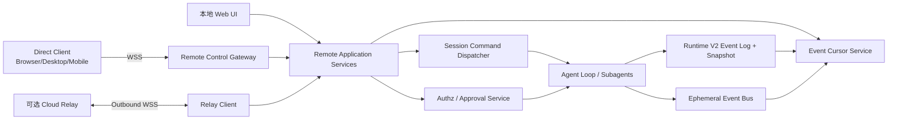

# SugarAgent Remote Control 适配方案

## 1. 结论

SugarAgent 适合采用一套“双通道、单控制内核”的 Remote Control 架构：

1. **Direct 模式**：借鉴 OpenClaw，由浏览器、桌面端或移动端通过同一条 WebSocket 控制平面直连本机 Gateway；远程网络优先走 SSH 隧道或 Tailscale/其他私网。
2. **Relay 模式**：借鉴 Claude Code，由本机 Agent 主动建立出站 WSS 连接，向可选 Relay 注册可用环境并领取远程任务；本机不开放公网入站端口。
3. **单控制内核**：Direct WebSocket、Relay 和现有本地 Web UI 都调用同一组 application service，禁止三套入口各自复制会话、审批和中断逻辑。

首个可交付版本应只实现 **Direct 模式**，并保留 Relay 接口。原因是当前 SugarAgent 已有 FastAPI、会话 CRUD、Runtime V2 事件日志、SSE 观察流、运行中 steer、中断和工具审批，Direct 模式主要是协议、安全与服务层重构；Relay 则还需要账户体系、设备注册、消息中继和服务端基础设施。

不建议直接把现有 FastAPI 端口绑定到 `0.0.0.0`。当前 HTTP 路由没有统一的调用方认证与授权边界，其中还包含环境配置、模型密钥配置、工作区文件访问、插件重载和工具审批等高权限接口。Remote Control 必须先形成独立、默认拒绝的 operator 控制面。

## 2. 分析基线

本方案基于以下本地代码快照：

- OpenClaw：`2026.3.14`，Git `4f00b3b534`
- Claude Code：本地 `claude-code-main` 源码归档，无 Git 元数据
- SugarAgent：Git `26608d3`

Claude Code 目录中的 README 将该目录标注为非官方泄露源码归档。因此本文只把它当作本地实现样本，不把其中的 Anthropic 私有 API、URL、Header 或事件格式当作可依赖的公开兼容协议。

## 3. 两种参考实现

### 3.1 OpenClaw：自托管 Gateway 控制平面

OpenClaw 的核心是一个长期运行、持有全部状态的 Gateway。Control UI、CLI、macOS/iOS/Android 节点都连接 Gateway WebSocket，Gateway 同时承载 HTTP 静态资源与 WS 控制平面。

主要特征：

- 默认只监听 `127.0.0.1:18789`，远程访问优先使用 SSH 端口转发或 Tailscale Serve。
- Control UI 直接连接 Gateway WS，没有独立的 WebChat 后端。
- 首帧必须是 `connect`，协议帧统一为 `req`、`res`、`event`。
- 服务端先发送 `connect.challenge` nonce；客户端提交角色、scope、共享认证和带 nonce 的设备签名。
- operator 和 node 是不同角色；operator 又分 read、write、approvals、pairing、admin scope。
- 新的远程设备必须配对；本地 loopback 连接可以自动批准。
- `chat.send` 非阻塞，立即返回 `runId`，后续输出走事件流。
- 有副作用的方法使用幂等键；配置写入还有 base-hash 并发保护。
- 工具执行审批绑定精确请求上下文，通过专门的 approval scope 处理。
- 远程直连前明确处理 TLS、证书 pinning、Origin allowlist、DNS rebinding、反向代理信任和速率限制。

相关实现证据：

- `OpenClaw/docs/web/control-ui.md`
- `OpenClaw/docs/gateway/remote.md`
- `OpenClaw/docs/gateway/protocol.md`
- `OpenClaw/docs/gateway/network-model.md`
- `OpenClaw/docs/gateway/security/index.md`
- `OpenClaw/src/gateway/method-scopes.ts`
- `OpenClaw/src/gateway/role-policy.ts`

它最值得 SugarAgent 复用的不是具体 TypeScript 代码，而是以下设计边界：

- 本地优先、默认不暴露公网。
- 一个有版本的控制协议覆盖请求、响应和事件。
- 设备身份、共享认证、角色和 scope 分层验证。
- session ID 只是路由标识，绝不是授权凭证。
- 控制 UI 是 operator 权限面，安全等级等同远程命令执行入口。

### 3.2 Claude Code：云端 Relay + 本地 Bridge

Claude Code Remote Control 的本地 CLI 不是等待公网客户端直连，而是主动向云端注册一个 environment，然后轮询/订阅工作。远程 Web 或 Mobile 创建 session 后，云端把 work 派发给对应 environment；本地 Bridge 领取 work，再启动真正的 Claude Code 会话进程。

主要链路：

1. 本地 Bridge 使用 OAuth 和 trusted-device token 注册 environment，上报机器名、目录、Git 分支、仓库和并发容量。
2. 云端返回 `environment_id` 和 `environment_secret`。
3. Bridge 轮询 environment work queue；work secret 中包含短期 `session_ingress_token`。
4. Bridge 在确认有容量和能够处理 work 后才 ack。
5. Bridge 为 session 启动独立 CLI 子进程，通过环境变量传递短期 session token；OAuth token不会传给子进程。
6. 子进程通过 WebSocket 或 SSE/HTTP 与 session ingress 通信，输出结构化 NDJSON。
7. 远程用户消息、interrupt、权限请求/响应都走 session 控制通道。
8. Bridge 对活跃 work 发 heartbeat；token 过期时让服务端重新派发并热更新子进程 token。
9. 支持 single-session、same-dir、worktree 三种 spawn mode，以及最大并发、会话超时和优雅/强制终止。
10. WebSocket 断线后指数退避重连，保留未确认消息并按 UUID 去重重放；能识别系统休眠导致的长时间断线。

相关实现证据：

- `Claude Code/src/bridge/bridgeMain.ts`
- `Claude Code/src/bridge/bridgeApi.ts`
- `Claude Code/src/bridge/sessionRunner.ts`
- `Claude Code/src/bridge/types.ts`
- `Claude Code/src/bridge/trustedDevice.ts`
- `Claude Code/src/bridge/bridgeMessaging.ts`
- `Claude Code/src/cli/transports/WebSocketTransport.ts`
- `Claude Code/src/remote/RemoteSessionManager.ts`
- `Claude Code/src/remote/SessionsWebSocket.ts`
- `Claude Code/src/utils/sessionIngressAuth.ts`

它最值得 SugarAgent 复用的设计是：

- 远程网络只需本机出站连接，不要求用户配置公网端口。
- environment credential、session credential、用户 OAuth credential 分离。
- work 采用 lease、ack、heartbeat、重派发语义，而不是“收到消息就默认成功”。
- session worker 可隔离、可限流、可超时、可优雅终止。
- 断线重连以消息 UUID、确认游标和去重保证至少一次传输下的业务幂等。

不应直接照搬的部分：

- Anthropic 私有 API 路径、Header 和 token 格式。
- 对 claude.ai OAuth、组织 UUID、feature flag 和内部 CCR 服务的依赖。
- 默认上传完整本机目录和 Git 元数据。SugarAgent Relay 应允许用户选择上报范围。

### 3.3 对比

| 维度 | OpenClaw | Claude Code | SugarAgent 建议 |
|---|---|---|---|
| 控制拓扑 | 客户端直连自托管 Gateway | 本机 Bridge 出站连接云端 Relay | Direct 先行，Relay 可插拔 |
| 状态所有者 | Gateway | 云端 session + 本地 worker | 本地 Runtime V2 为事实源 |
| 远程入口 | WS，同端口 HTTP | 云端 API/WS/SSE | 统一 WS 协议，HTTP 只做配对/bootstrap |
| 身份 | 共享 token/password + 设备签名/配对 | OAuth + trusted device + session JWT | 本地 device key + 配对 token；Relay 再叠加账户 token |
| 授权 | role + method scope | 账户权限 + session token + permission flow | operator scope + session ACL hook，默认单用户 |
| 事件恢复 | request/event protocol、历史查询 | UUID buffer、last confirmed ID、重连 | Runtime V2 durable seq + ephemeral event ID |
| 并发隔离 | 多 session，node/gateway 分工 | single/same-dir/worktree | MVP 多 session、同一全局 WORK_DIR；worktree 延后 |
| 审批 | 专用 approval scope，精确绑定请求 | `control_request/can_use_tool` | 持久化 approval state，绑定 tool call/input digest |
| 网络建议 | loopback + SSH/Tailscale | 出站 WSS | 两者都支持，禁止默认公网裸露 |

## 4. SugarAgent 当前基础与缺口

### 4.1 可直接复用的能力

- `app/webui.py` 已有 session create/list/get、message history、send、steer、interrupt、archive、branch 和 approval 路由。
- `/sessions/{id}/stream` 已把 Runtime V2 projection catch-up 和实时 event bus 结合，且先订阅再补历史，避免 query-then-subscribe 丢事件。
- `/runtime-v2/events` 和 `/runtime-v2/sessions/{id}/events` 已支持基于 `seq` 的事件补拉。
- `app/runtime_v2/event_log.py`、`gateway.py`、`projector.py`、`snapshot_store.py` 已形成 durable event + snapshot 基础。
- `app/session_event_bus.py` 已支持跨线程发布、订阅、有限 ephemeral replay 和 delta snapshot。
- `/chat` 已把 Agent 执行放入后台线程；浏览器 SSE 断开不会直接杀死仍在运行的会话。
- `/sessions/{id}/steer` 已有 `client_id` 幂等、持久化状态和 append/interrupt 两种语义。
- `/sessions/{id}/interrupt` 已能中断父会话、子 Agent 和 Runtime V2 active run。
- `app/runtime_v2/run_registry.py` 已有 run heartbeat、terminal state 和 interrupt flag。
- `app/runtime_v2/permission_manager.py` 已有 allow/deny/ask 的最小规则模型。

### 4.2 Remote Control 上线前必须补齐的缺口

1. **没有统一入口认证**：FastAPI 路由当前没有全局 operator 身份校验。
2. **路由层承担业务逻辑**：send、steer、interrupt、approval 的关键编排直接位于 `webui.py`，WS/Relay 无法安全复用。
3. **审批状态仅在内存中**：`tool_approval_gate.py` 使用进程内 Future；重启、断线或多进程部署会丢失 pending approval。
4. **运行状态部分依赖进程内字典**：Remote 客户端需要可恢复、可审计的明确 run lease 和 terminal reconciliation。
5. **两套序号语义**：Runtime V2 durable `seq`、UI projection index、event bus ephemeral `seq` 不能直接混成一个远程 cursor。
6. **没有设备配对和撤销**：不存在 device key、pairing request、device token rotation/revoke。
7. **没有 method scope**：能够查看会话的客户端也可能调用配置、插件、环境变量或文件操作接口。
8. **没有统一幂等账本**：steer 有 `client_id`，但 create/send/interrupt/approval 等 mutation 没有同一套 idempotency contract。
9. **全局工作区**：`WORK_DIR` 在模块加载时确定，工具均引用全局路径。当前不适合直接提供 Claude Code 式 per-session worktree。
10. **缺少远程网络硬化**：尚无 allowed origins、Host 校验、TLS 策略、设备挑战签名、API rate limit、remote audit log 和慢客户端背压策略。

## 5. 目标架构



架构约束：

- Runtime V2 是 durable session/run 状态的唯一事实源。
- event bus 只承载可丢弃的 live delta、keepalive 和临时进度。
- Direct、Relay 和本地 UI 不得互相通过 HTTP 回调；它们直接调用 service。
- 所有 mutation 先通过 authz、scope、schema、幂等检查，再进入同一 per-session dispatcher。
- 同一 session 同时最多一个前台 run；不同 session 可并发，但共享工作区风险必须显式显示。
- Remote Control 默认沿用单用户/单信任域模型，不宣称提供敌对多租户隔离。

### 5.1 建议新增模块

```text
app/
  control_plane/
    models.py              # 请求、响应、事件和错误模型
    services.py            # session/run/approval application service
    dispatcher.py          # per-session mutation 串行化与容量控制
    idempotency.py         # mutation 幂等账本
    event_cursor.py        # durable catch-up + ephemeral live merge
  remote_control/
    config.py              # direct/relay/bind/auth 配置
    protocol.py            # v1 frame schema 与版本协商
    websocket.py           # FastAPI WS endpoint
    command_router.py      # method -> service 与 required scope
    auth.py                # bearer/device challenge 验证
    devices.py             # pairing、token rotation/revoke
    audit.py               # 安全审计事件
    rate_limit.py
    relay/
      client.py            # 出站连接状态机
      protocol.py          # environment/work/lease 消息
      outbox.py            # 待确认消息和重放
```

现有 `webui.py` 最终应只保留参数解析、HTTP/SSE 编码和 service 调用。不要在第一阶段大拆整个文件；先只抽取 Remote Control 会调用的 send、steer、interrupt、approval、history 和 session list。

## 6. Direct 控制协议 v1

### 6.1 Endpoint

- WebSocket：`/api/remote/v1/ws`
- 配对 bootstrap：`POST /api/remote/v1/pairing/request`
- 本机批准/拒绝：只允许 loopback UI 或 CLI 调用
- 健康检查：`GET /api/remote/v1/health`，不返回会话、路径或密钥信息

Remote endpoint 不复用当前无认证的 `/sessions/*` 作为公开协议。现有路由可以继续服务 loopback UI，但一旦启用非 loopback bind，必须由统一认证中间件保护。

### 6.2 Frame

```json
{"type":"req","id":"req_uuid","method":"session.send","params":{},"idempotency_key":"op_uuid"}
{"type":"res","id":"req_uuid","ok":true,"result":{}}
{"type":"res","id":"req_uuid","ok":false,"error":{"code":"forbidden","message":"...","retryable":false}}
{"type":"event","event":"session.event","event_id":"evt_uuid","session_id":"...","payload":{}}
```

规则：

- `id` 只做一次连接内的 request/response 关联。
- 所有有副作用的方法必须提交 `idempotency_key`。
- 幂等键按 `(device_id, method, idempotency_key)` 去重；同键不同 payload digest 返回冲突。
- 帧有严格大小上限，建议请求 1 MiB、事件 2 MiB；大文件继续使用受控 upload API，不塞入 WS。
- 未知 method 默认拒绝；未知 event 可忽略，以便前向兼容。
- 错误码稳定，不把 Python traceback 发给远程客户端。

### 6.3 Handshake 与设备配对

1. Server 发送 `connect.challenge`，包含随机 nonce、协议版本和过期时间。
2. Client 发送 `connect`：client metadata、requested role/scopes、device id/public key、nonce 签名、可选 device token。
3. Server 验证 Origin、共享 bootstrap secret/device token、nonce、时间窗、设备公钥指纹和签名。
4. 新设备返回 `pairing_required` 并创建 5 分钟有效的 pending request。
5. 用户在本机 UI/CLI 批准后，服务端签发只显示一次的 device token；服务端只保存 token hash。
6. 后续连接仍需签 challenge，device token 只证明设备已获批准。

建议使用 Ed25519 设备密钥。私钥由客户端系统安全存储保存；浏览器端使用 WebCrypto 生成不可导出密钥。没有 secure context 时不允许远程设备注册。

### 6.4 Roles 与 scopes

MVP 只需要 operator 角色，并细分：

- `operator.read`：health、session list/detail/history/subscribe。
- `operator.write`：session create/send/steer/interrupt/rename/archive。
- `operator.approvals`：查看和解决工具审批。
- `operator.admin`：设备管理和 Remote Control 配置；不默认开放模型密钥、环境变量和插件管理。

授权规则：

- admin 可包含其他 scope，但必须显式授予。
- write 可以隐含 read；approvals 不隐含 write/admin。
- 未分类 method 按 admin 处理或直接拒绝，不能默认放行。
- session ID 只用于路由。未来如支持多用户，再增加独立 session ACL，不改变协议结构。

### 6.5 MVP method surface

| Method | Scope | 语义 |
|---|---|---|
| `system.health` | read | 最小健康状态和协议版本 |
| `session.list` | read | 轻量会话列表，不扫描完整历史 |
| `session.get` | read | session snapshot、active run、cursor |
| `session.history` | read | 分页历史，限制单页大小 |
| `session.subscribe` | read | 订阅一个 session，可带 durable cursor |
| `session.unsubscribe` | read | 取消订阅 |
| `session.create` | write | 创建会话 |
| `session.send` | write | 非阻塞启动 run，立即返回 run ID |
| `session.steer` | write | 复用既有 append/interrupt 和 `client_id` 语义 |
| `session.interrupt` | write | 按 session/run 中断 |
| `session.rename` | write | 重命名 |
| `session.archive` | write | 归档/取消归档 |
| `approval.list` | approvals | 查询当前 pending approval |
| `approval.resolve` | approvals | allow/deny，绑定 request digest |
| `device.list/revoke/rotate` | admin | 设备管理 |

首版明确不开放：`/api/env`、模型 API key、任意配置写入、插件安装/重载、本机 path picker、`open-workspace-file`、Runtime 修复接口和任意内部 debug RPC。

## 7. 事件、重连与背压

### 7.1 两类事件不能混用 cursor

远程 envelope 应明确区分：

- `durability: "durable"`：来自 Runtime V2 event log 或稳定 UI projection，带 `runtime_seq` 或 `projection_index`，支持重连补拉。
- `durability: "ephemeral"`：LLM delta、临时工具输出、keepalive，带连接级 `event_id`，不承诺完整重放。

订阅流程：

1. 客户端发送 `session.subscribe({session_id, after_runtime_seq, after_projection_index})`。
2. 服务端先建立 live subscription，再读 durable catch-up，复用当前 `/sessions/{id}/stream` 已验证的顺序。
3. 服务端发送 `session.snapshot`，声明当前 run、latest cursor 和是否存在 gap。
4. 依序发送 catch-up durable events，再切入 live。
5. 客户端按 durable cursor 去重；ephemeral delta 可按 `run_id + react_iter + tool_call_id + stream_seq` 合并。

如果 cursor 已超出保留范围，返回 `cursor_expired` 并要求客户端重新获取 history snapshot，不能静默缺事件。

### 7.2 慢客户端

- 每连接和每 subscription 使用有界队列。
- durable 事件不得静默丢弃；队列满时断开慢客户端并返回可恢复 cursor。
- ephemeral delta 可以合并为 snapshot，沿用 `session_event_bus.py` 的 delta accumulation 思路。
- 单连接限制订阅数量、每秒 mutation 数和并发 history 请求数。
- ping/pong 30 秒，读空闲超时只触发重连，不改变 run 状态。

### 7.3 Run 语义

`session.send` 必须非阻塞：

```json
{"run_id":"...","status":"started","session_id":"..."}
```

同一个 idempotency key 重试时：

- run 仍在执行：返回 `in_flight` 和原 run ID。
- run 已结束：返回 `completed` 和原 run ID。
- payload 不同：返回 `idempotency_conflict`。

客户端断开不应中断 Agent run。只有显式 `session.interrupt`、本地策略、进程退出或超时才会结束 run。

## 8. 工具审批改造

当前 `tool_approval_gate.py` 的 Future 可以继续作为单进程唤醒机制，但不能再作为状态事实源。应新增 Runtime V2 事件：

- `approval_requested`
- `approval_resolved`
- `approval_cancelled`
- `approval_expired`

`approval_requested` 至少持久化：

- `approval_id`
- `session_id`、`run_id`、`tool_call_id`
- `tool_name`
- 安全裁剪后的 input preview
- 完整 input 的 hash/digest
- `requested_at`、`expires_at`
- 风险原因和建议 scope

`approval.resolve` 必须同时提交 `approval_id` 和服务端给出的 digest。已经解决、过期、run 已终止或 digest 不匹配时拒绝。审计中记录决定设备、scope、时间与 allow/deny，但不记录原始 secret。

这样浏览器刷新、Remote 客户端重连或服务进程重启后，都能恢复 pending approval；进程内 Future 只负责把 durable decision 投递给正在等待的 tool coroutine。

## 9. Relay 模式设计

Relay 是第二阶段能力，协议应与 Direct method/event 复用同一业务 payload，但增加 environment/work 生命周期。

### 9.1 本地出站连接

- 本机 `RelayClient` 主动连接 `wss://relay/...`。
- 注册信息默认只包含 instance ID、显示名、Agent 版本、协议版本、容量和 capability。
- 工作区绝对路径、Git remote、分支和机器名均改为 opt-in；Git URL 必须去除 embedded credential。
- Relay credential 只允许注册/领 work；session credential 只允许访问单一 session；用户账户 token 不下放给 Agent run。

### 9.2 Work 状态机

```text
queued -> leased -> acknowledged -> running -> completed|failed|interrupted
                 \-> lease_expired -> queued
```

规则：

- 本机先验证 work、容量和 session 幂等状态，再 ack。
- `work_id`、`session_id`、`delivery_attempt` 和短期 session token 都要验证。
- active work 定时 heartbeat；heartbeat 失败不立即重复启动 session。
- 重新派发时通过 `session_id` 和 durable run 状态判定是刷新 token、恢复观察，还是启动新 run。
- outbound 消息使用本地 outbox；收到 server ack 后删除。至少一次传输由 message UUID 和幂等账本去重。

### 9.3 Worker 隔离

MVP Relay 不应直接复制 Claude Code 的子进程/worktree 模式，因为 SugarAgent 的工具路径基于全局 `WORK_DIR`。建议演进顺序：

1. 先在现有进程内复用 `SessionCommandDispatcher`，限制全局并发和单 session 并发。
2. 将 `WORK_DIR`、session repository、tool policy 和模型 profile 收入显式 `ExecutionContext`，消除模块级全局依赖。
3. 再引入 per-session worker process。
4. 最后实现可选 Git worktree，并在 UI 明确初始 session 是否仍使用主工作区。

在完成第 2 步前，Relay UI 必须显示“多个会话共享同一工作区，可能互相影响”。

## 10. 网络与安全基线

### 10.1 默认策略

- 默认仍监听 loopback。
- 推荐远程方式：loopback + SSH tunnel，或 loopback + Tailscale Serve/等价私网 HTTPS 代理。
- 直接 LAN/tailnet bind 必须配置长随机 bootstrap token，并完成设备配对。
- 公网暴露只允许 `wss://`；不提供关闭认证的 convenience flag。
- Relay 只走出站 TLS，不开放本机新端口。

### 10.2 Browser 安全

- 非 loopback 必须配置精确 `allowed_origins`，禁止默认 `*`。
- 校验 `Origin`、`Host` 和受信代理列表，防 DNS rebinding 和伪造 forwarded header。
- UI 使用同源 HTTPS；设备私钥要求 secure context。
- 如果继续提供 cookie session，mutation HTTP API 必须有 CSRF token；WS 仍需应用层 challenge。
- token 不放 query string；一次性 bootstrap 数据优先放 URL fragment 或人工输入。
- 设置 CSP、frame-ancestors 和 no-store，Remote UI 禁止被第三方 iframe 嵌入。

### 10.3 Secret 与审计

- device token、relay token 落盘只保存 hash 或系统安全存储引用。
- API 响应、事件、审计、debug log 统一走 secret redaction。
- history 与 tool input 有大小上限；超大内容返回 placeholder/blob reference。
- audit 记录 connect、pair、revoke、scope denial、send、interrupt、approval 和 admin 操作。
- audit 文件独立于模型上下文，不能被 Agent 当作普通会话消息读取。

### 10.4 威胁模型

首版声明为个人 Agent 的单信任域：通过验证的 operator 被视为拥有该 SugarAgent 实例的操作权限。scope 是最小权限和误操作防护，不是敌对租户之间的强隔离。若未来支持团队或 SaaS，多租户身份、session ACL、workspace/OS 隔离、quota 和审计保留必须另立项目。

## 11. 配置草案

```yaml
remote_control:
  enabled: false
  direct:
    enabled: true
    bind: loopback          # loopback | tailnet | custom
    host: 127.0.0.1
    port: 8192
    allowed_origins: []
    require_device_pairing: true
    bootstrap_token_ref: env:MYAGENT_REMOTE_BOOTSTRAP_TOKEN
    trusted_proxies: []
  relay:
    enabled: false
    url: wss://relay.example.invalid/v1/agent
    credential_ref: keyring:myagent-relay
    instance_name: SugarAgent
    capacity: 2
    expose_machine_name: false
    expose_workspace_path: false
    expose_git_metadata: false
  limits:
    max_connections: 8
    max_subscriptions_per_connection: 8
    max_frame_bytes: 1048576
    max_history_page_items: 200
    mutation_rate_per_minute: 120
```

配置加载后必须有 fail-closed 校验：非 loopback bind 若缺认证、Origin allowlist 或 TLS/受控私网声明，拒绝启动 Remote Control，而不是打印 warning 后继续。

## 12. 分阶段实施计划

### Phase 0：控制内核重构

目标：不改变现有 UI 行为，把可复用业务逻辑从 `webui.py` 抽出。

- 新增 `SessionCommandService` 和 per-session dispatcher。
- 抽取 list/get/history/send/steer/interrupt/approval。
- 为 create/send/interrupt/approval 引入统一幂等接口。
- 将 approval request/decision 写入 Runtime V2。
- 给 service 补单元测试，现有 HTTP/SSE 路由改为薄适配器。

验收：现有前端回归测试全过；浏览器断开后 run 继续；同一 session 并发 send 只启动一次；approval 刷新后可恢复。

### Phase 1：Direct Remote Control MVP

- 新增 WS v1 frame、method router、schema validation。
- 实现 challenge、device key、pairing、token hash、revoke。
- 实现 read/write/approvals/admin scopes。
- 实现 session snapshot、history、subscribe、send、steer、interrupt、approval。
- 实现 durable cursor catch-up、ephemeral merge、有界队列和重连。
- UI 增加 Remote Control 设置、pending device 审批和已配对设备管理。

验收：通过 SSH tunnel 或私网 HTTPS 从第二台设备完成新建会话、发送、流式观察、运行中 steer、审批、interrupt 和断线恢复。

### Phase 2：安全硬化与可运维性

- allowed origins、Host/trusted proxy、rate limit、frame limit、audit。
- TLS reverse proxy 与 Tailscale/SSH 配置文档。
- token rotation、设备最后活动、异常登录告警。
- fuzz/schema tests、慢消费者、重复消息、cursor expiry、服务重启测试。
- 添加 `remote doctor` 诊断，不输出 secret。

验收：非 loopback 无认证配置启动失败；越权 method 默认拒绝；重放 challenge、伪造 Origin、过期 token、慢客户端和重复 mutation 均有确定行为。

### Phase 3：Relay MVP

- 定义独立于供应商的 Relay protocol。
- 实现 environment register、work lease/ack/heartbeat/requeue。
- 实现本地 outbox、消息 UUID、server ack、指数退避和休眠恢复。
- Relay 复用 Direct method/event payload 与同一 application service。
- 默认最小 metadata，上报项逐项 opt-in。

验收：本机无公网入站端口时，远程客户端仍可创建/控制 session；Relay 重启、网络抖动和 token 刷新不会重复启动 run。

### Phase 4：Worker 与 worktree 隔离

- 引入显式 `ExecutionContext`，移除工具链对全局 `WORK_DIR` 的硬依赖。
- 实现 per-session worker process、优雅终止、超时和 crash reconciliation。
- 实现 same-dir/worktree 策略、容量限制和 worktree 回收。

验收：两个并发 worktree session 不互相覆盖文件；异常退出后无僵尸 worker 和遗留 worktree；恢复时不会把同一 work 派发两次。

## 13. 测试矩阵

至少覆盖：

- 协议：握手版本、未知 method、非法帧、超大帧、request correlation。
- 认证：新设备、批准、拒绝、过期、撤销、rotation、nonce 重放、签名不匹配。
- 授权：每个 method 的最小 scope；未分类 method 默认拒绝。
- 幂等：网络重试、同键同 payload、同键不同 payload、并发 duplicate send。
- 事件：订阅前后并发 append、cursor 补拉、ephemeral 合并、断线重连、cursor expiry。
- Run：客户端断开、显式 interrupt、子 Agent interrupt、服务退出、stale heartbeat。
- Approval：断线、刷新、进程重启、过期、重复 resolve、错误 digest、run 已终止。
- 背压：慢消费者、队列满、多个订阅、大 history、大 tool output。
- 网络：Origin、Host、forwarded headers、loopback、SSH tunnel、TLS proxy。
- Relay：lease expiry、ack 丢失、heartbeat 丢失、work 重派发、outbox 重放、token refresh。
- 工作区：共享目录风险提示，以及未来 worktree 的隔离和清理。

## 14. 建议的首个开发切片

第一批代码只做以下闭环，不急于接入真实移动端或云 Relay：

1. 抽取 `SessionCommandService`。
2. 把 tool approval 改为 Runtime V2 durable state + 内存 waiter。
3. 新增 loopback-only `/api/remote/v1/ws`，使用临时静态 token，先实现 `session.list/get/subscribe/send/interrupt`。
4. 用一个最小测试客户端验证断线重连和幂等 send。
5. 再加入 challenge、device pairing 与 scope，把静态 token 降级为 bootstrap credential。

这个切片能最早暴露真正困难的部分——现有 HTTP 路由与 Agent loop 的耦合、durable/ephemeral 事件对齐和运行幂等——同时不会过早把复杂度投入云基础设施。

## 15. 最终决策建议

- **采用** OpenClaw 的本地 Gateway、统一 WS 控制协议、设备配对、角色/scope 和 loopback-first 安全模型。
- **采用** Claude Code 的出站 Relay、environment/work lease、分层 token、ack/heartbeat/requeue 和消息重放思想。
- **保留** SugarAgent 的 Runtime V2 作为本地事实源，不引入第二套会话数据库。
- **先做** Direct MVP 和 application service 重构。
- **后做** Relay、独立 worker 和 worktree。
- **不做** 直接公网暴露现有 FastAPI API、把 session ID 当权限、把审批只存在内存、或复制 Anthropic 私有协议。
